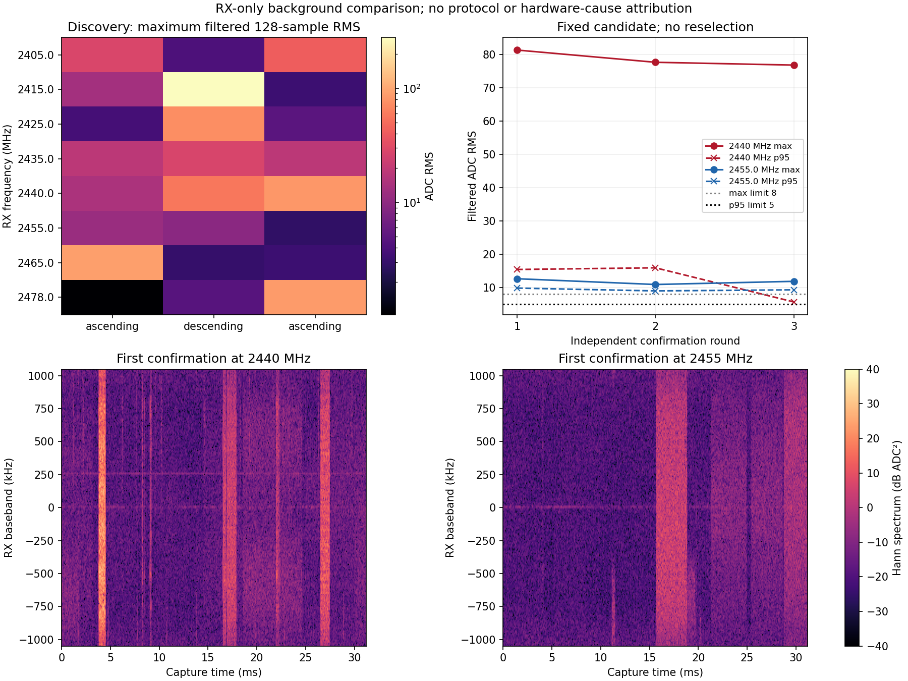

# 背景频率对照：2455 MHz较轻，但独立确认未达门槛

基线5c23cab。复核旧保留IQ后，按[执行前计划](B210_BACKGROUND_PLAN_2026-09-07.md)
完成30次纯接收。**背景具有明显的时间变化和频率差异；2455 MHz相比2440 MHz
的强突发有所减轻，但不能宣布已经找到合格的安静频点。** 本轮没有TX或模型。
完整统计、身份/hash和恢复见[审计](B210_BACKGROUND_AUDIT_2026-09-07.json)。

## 结果

8点各测3次，严格按预登记最大值/p95/频率排序，只选一次2455 MHz。发现阶段
该点三次滤波后最大128点RMS为11.60 ADC，p95最坏3.99；但别的频点也曾短时
很安静，例如2478 MHz在后续轮次出现强突发，不能用单次最小值保证安静。
随后独立6次交替确认如下，所有结果保留，没有失败后改选。

| 确认轮次 | 2440 MHz滤波后p95 / 最大RMS | 2455 MHz滤波后p95 / 最大RMS |
| --- | ---: | ---: |
| 1 | 15.41 / 81.37 | 9.82 / 12.63 |
| 2 | 15.92 / 77.69 | 8.97 / 10.90 |
| 3 | 5.65 / 76.85 | 9.30 / 11.85 |

单位均为ADC RMS。2455 MHz三次峰值约比2440 MHz低16–17 dB，但其三次p95都
超过5、最大值都超过8，**独立候选确认失败**。这既不是新发射时10dB停发门
通过，也不是调制SNR、错误率或生产校准。比较非同时采集，频率和时间不能完全
分离，不能据此确定某种无线协议、干扰设备或P201硬件故障。



图下方按预定第一对确认显示全部31.2ms；2440 MHz可见短时宽带能量升高，
2455 MHz仍有持续数毫秒的较弱宽带活动。谱图未解码任何协议。事件区间由
128点RMS>20合并，约60.95us分辨率，不能当作精确包长或长期占空比。
原始每点65535/512段与固定FIR后65279/510段（各末段127）均完整计入。

旧九份保留IQ也只读复核。峰值段DC占比低，能量分布较宽，和此前单频LO问题
不同；旧门失败保持。AGX/NX读取到的当前控制Wi-Fi均5805MHz/channel161/80MHz，
所以“控制SSH本身就在2440MHz”没有当前配置支持；仍不能排除其他2.4GHz环境
信号或强带外信号对接收机的影响，未停止网络或改IIO tracking。

## 实机与软件验证

P201 RX1/RX0/A_BALANCED、manual gain40、2.1MS/s/BW1.5MHz、settle500ms固定。
2405/2415/2425/2435/2440/2455/2465/2478MHz发现三轮升/降/升，确认顺序为
2440/2455、2455/2440、2440/2455。30×262140=7864200 bytes，等于预算；无重试。
B210源进程在前置探测中不存在，本单元未启动源；模型/warmup/训练/test读取0。

96项软件测试通过，包括完整尾部、宽带突发/DC/带外单音、固定发现分组与候选
排序、独立确认失败不改选、native物理身份/质量/plan/meta冲突及哈希变化；保留目录存在时在任何无线调用前拒绝重复采集。
所有30份数据清理前均重新计算hash和统计，重算的候选与确认逐字段复现；
最终审计保留全部30份统计与hash，只有六份确认原始IQ继续保留。

各次均执行真实恢复并确认对应P201 generation路径不存在；最终Controller健康、
sdrd PID17136/hash77d98a005305a4b7531fc3f133e9b4af521e60b065b29fcc304b4c7db80c45ae
保持。RX恢复5985999996Hz/30720000sps/BW30000000/manual gain60/A_BALANCED，
scan/buffer全0；无服务部署、FPGA/BOOT或NX推理。recognizer_available=false、
独立标签0、名称provisional与epoch-10/FP16/RF-v1冻结状态保持。

## 后续边界

本单元完成的是背景对照工具和一次独立确认，合格背景仍未完成。2455 MHz可以
作为下一独立受控试验的候选，但必须重新验证实际源/背景裕量和固定模型窗，
不能把这次失败扫描称为准入。可在明确有限预算下研究信号余量/干扰减轻，保留
原始与修复IQ同源对照；不调旧门槛、不挑旧好片段、不宣称识别改善。

## 保留与清理

按AGENTS.md最小证据规则，仅保留六份独立确认的IQ/report/meta/plan用于复查；
旧3.3MB证据包原样保留，不复制或删除。新保留文件的用途、确切路径、source/
request/session、大小/hash及手动删除方法见
[证据登记](B210_BACKGROUND_EVIDENCE_2026-09-07.json)。发现阶段24份IQ和构建、
测试、缓存、重复审计与日志等在封存统计/hash后精确清理；完成情况以审计cleanup
字段为准，保留证据不被标记成已删除。用户已有语料/应用结果未触碰。

新保留24个owner只读文件，共1591391 bytes（约1.6 MB）；原始IQ占1572840 bytes。
发现IQ、构建、测试、缓存和冗余输出共370392439逻辑bytes（约370 MB）已清理，
另一次重复运行保护回归的确切测试根也已清理。30个P201 generation路径确认
不存在；没有NX采集副本。新六份确认清理后重算复现，旧53文件证据包也再次
完整复核，没有增加旧目录文件或修改旧数据。

```bash
PYTHONDONTWRITEBYTECODE=1 OPENBLAS_NUM_THREADS=1 python3 \
  /home/jetson/sdrharness/jetson-agx/sdrharness/scripts/diagnose-b210-background.py --verify-retained
```

这条命令仅复查六份确认原始数据并重算保存的发现统计排序；24份发现原始IQ已
删除，不能将其说成还能逐点回放。手动删除当前证据的精确命令在登记中，删除
后需同步更新状态；旧本振修复包和应用结果不在该命令范围内。
