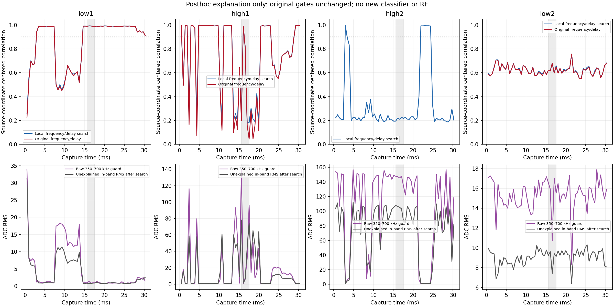

# 失败组误差分解：简单相位/频差/时延不足以解释，宽带污染是排查重点

基线5a726d8；按[后验方法登记](B210_FAILURE_DECOMPOSITION_PLAN_2026-09-07.md)，
只读分析既有ABBA证据。没有新增RF、模型/warmup、dataset/test读取或生产修改。
原low1成功与其余三组失败全部保持，详情见
[有界审计](B210_FAILURE_DECOMPOSITION_AUDIT_2026-09-07.json)。

## 主要结论

**在本轮搜索范围内，失败不能只用每块一个相位、增益、固定频差或延时解释。**
每个1024块允许中心CFO±2kHz/125Hz步长、全部1024整数lag、再以.125点细化，
仍无法恢复大部分坏窗口与源的对应关系。源带之外350–700kHz能量也同时升高，
支持把宽带污染作为下一步硬件/空口对照的重点，而不是直接做相位补偿。

原固定4096点模型窗口拆成四块，后验结果如下：

| 组 | 搜索后四块相关 | 搜索并允许局部复增益后未解释的调制能量 |
| --- | --- | --- |
| low1 | .9895 / .9924 / .9918 / .9895 | 1.51%–2.09% |
| high1 | .2363 / .9891 / .8100 / .1782 | 94.4% / 2.17% / 34.4% / 96.8% |
| high2 | .1955 / .2204 / .2109 / .2277 | 94.8%–96.2% |
| low2 | .6209 / .6187 / .6799 / .5976 | 53.8%–64.3% |

此处先解旋到源坐标并去块均值，只比较调制分量，分母是中心化功率；它与上一
单元在旋转载波坐标计算的相关和全信号残差比例不同，不能直接互换。这些处理
只用于计算诊断指标，没有修改原始IQ、RF-v1预处理、模型输入或旧准入门。
未解释能量包含干扰、噪声和模型未覆盖的失真，不能全部叫做噪声或错误率。

low2即使仅允许最优相位旋转，四块剩余比例仍约61.6%/62.4%/53.8%/64.3%；再
加增益、频差和延时搜索也改善有限。high1与high2坏块的剩余更大。此结论不排除
任意快变相位、非线性或其他接收过程，只否定已测试的简单变换足以解释失败。

## 频带外活动和相位

原固定模型窗口的350–700kHz双侧保护频带RMS：low1约.82–1.36 ADC，high1约
.92–139.55，high2约145.52–148.01，low2约10.75–17.05。该频带避开±175kHz源带
及约+254kHz本振线，不是把本振线算进背景。原始Hann谱按N*sum(window²)归一。
同一采集内，保护频带与搜索后带内剩余的log RMS相关分别.981/.959/.982/.566。
这是同期能量变化的描述，不能由相关系数认定某个发射设备、无线协议或硬件故障。

low1/high1高相关块的相对相位约−.013…+.319和−.020…+.254rad，说明相位变化
仍然存在；但好块调制相关依然很高。low2没有达到本轮相位显示条件的块，不把
它在低相关时算出的相位读数用于校时或跟踪。没有跨坏块unwrap，也没有校准时钟。



局部完整搜索后，low1/high1/high2/low2分别有43/32/7/0个块相关≥.9；八份停发
对照共496块均未达到.9，最大值约.293。这只是本包后验相似度显示规则，不是
新准入门、概率置信度或可靠硬件参数保证。high2短暂的高相关区间说明源可能在
污染间隙中可见，不能挑这些块替代原固定窗口；高能量坏块的“最佳lag/CFO”不
可用于宣称掉样或频率跳变。原1/4固定门通过状态和16窗ID0结果均未重算为成功。

## 验证与数据边界

每份采集分析raw offset1024…63488的62个完整1024块，共12份×62=744块。
原固定模型窗恰为其中4块；两端未纳入局部块搜索的样本仍由原保留包的全长统计
覆盖，不声称62块就是65535点。所有块及停发对照都保留数值，没有删坏块。

6项合成测试通过：纯相位、增益与非相干能量、已知1375Hz频差/31.375点延时、
同谱错源、保护频带排除LO以及零/非法输入。新分析只读原封存包，并完整重算
核对；558个可用固定参考块的正交能量恒等式最大误差3.48e−15，误差随相位/
增益拟合单调不增，搜索相关不低于固定整数对齐（浮点容差1e−12）。
指标使用原NumPy1.26.4环境；系统Matplotlib只画保存数值。日志中的“相位可显示”
和“高相关”字段仅为描述性标志，不赋予独立可信标签。

原67文件/约4.1MB保留包未改写或复制，本轮不增加IQ留存。只保留本脚本、测试、
登记/审计及图，临时根b210-failure-decomp-907p内的测试和绘图缓存在完成后清理，
情况见审计cleanup。模型/warmup/RF操作0，独立标签0、名称provisional、
recognizer_available=false、epoch-10/FP16/RF-v1及部署状态保持。

下一步优先做输入隔离对照，区分经天线进入的污染与终端状态仍存在的接收链路
问题；已向用户询问50Ω SMA终端负载是否可用，未收到设备信息前不假定已具备。
不以新的数字拟合冒充物理根因或稳定修复，不继续盲目加幅度/重复模型。


只读复现命令（重新计算诊断，不运行RF或分类器）：

```bash
PYTHONDONTWRITEBYTECODE=1 OPENBLAS_NUM_THREADS=1 \
  /home/jetson/sdrharness/local-assets/amc-eval/runtime/venv/bin/python \
  /home/jetson/sdrharness/jetson-agx/sdrharness/scripts/diagnose-b210-failure-decomposition.py --verify
```

输入仍为上一单元的67个只读文件，保留/删除方式沿用其原登记。本单元没有新
原始证据包；分析临时目录已核对后删除，确切字节数和路径记录在审计cleanup。
验证进程未导入Torch，确认没有顺带加载识别模型。
