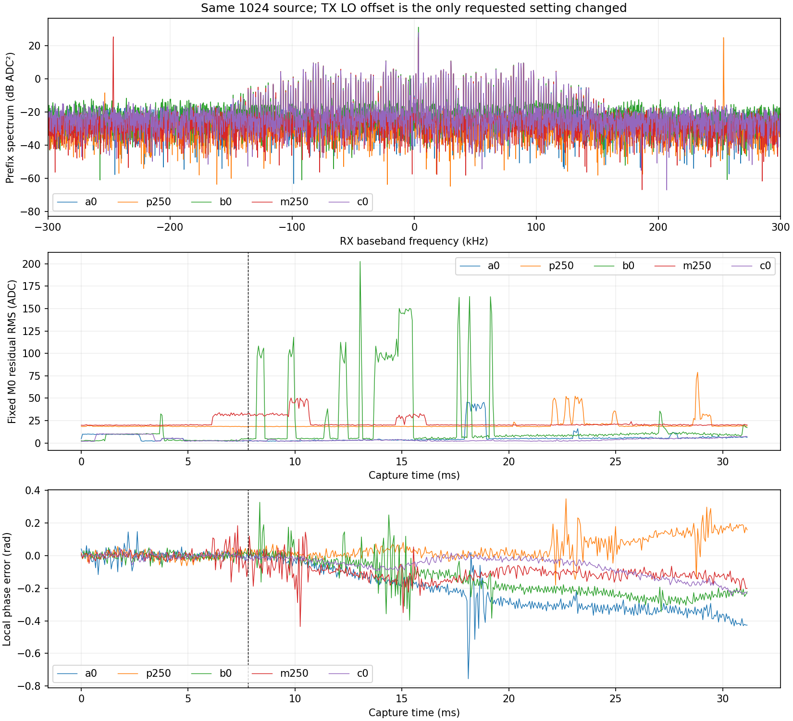

# LO 偏移实收：主要载波失真定位到发射端 LO 相关泄漏

基线73bee1d；按[执行前计划](B210_LO_OFFSET_PLAN_2026-09-06.md)完成
0/+250 kHz/0/−250 kHz/0五组同一1024点源对照及单音。执行跨至北京时间
2026-09-07，文件沿用登记日期。原始IQ/hash、完整2560个128点统计段、各组
native报告和恢复证据见[有界审计](B210_LO_OFFSET_AUDIT_2026-09-06.json)。

## 已定位的原因

**此前较大的源载波截距主要来自随B210发射LO移动的额外单频分量，符合发射端
LO泄漏/载波馈通。** 这已超出仅凭模型拟合的猜测：仅改变TX LO offset，目标源
频率、源hash、采样率、增益、带宽和天线保持；异常线随正负LO偏移移动，回零后
重复出现。不能仅凭本次结果定位到B210板上某个元件或宣称硬件损坏。

| 顺序 | TX LO偏移 | M0源中心额外分量幅度（ADC） | 分离出的LO线幅度（ADC） | 实测LO线相对源载波（Hz） |
| --- | ---: | ---: | ---: | ---: |
| a0 | 0 | 19.4214 | 与源中心重合，不另拟合 | — |
| p250 | +250000 | 0.1191 | 18.1957 | +249999.83 |
| b0 | 0 | 17.8607 | 与源中心重合，不另拟合 | — |
| m250 | −250000 | 0.1230 | 19.7574 | −250003.89 |
| c0 | 0 | 19.5004 | 与源中心重合，不另拟合 | — |

正负偏移组的LO线相对停发前/后同频带高48.48/34.50 dB和55.55/26.29 dB；
两个搜索峰均在登记±1 kHz范围内部，距预期−0.17/−3.89 Hz。M0源增益幅度
205.16…212.41接近，归一化的额外分量从0.0856…0.0941降到约0.00058，约43 dB。
四列M2重新区分源、源中心截距、RX固定DC和移动LO线，结论一致：源中心截距
0.1182/0.0833，移动线18.20/19.76。源的真实非零均值始终保留。

UHD4.1.0.5-3工具hash
fe3aebc556c16a5065d63d4e6ef8f02ef277ac01dcf250a35dec58b84eceb5cf，支持
--lo-offset；对应上游tune_request实现RF=target+offset、DSP自动补偿。
日志逐组核验请求offset和有效TX 2440 MHz、2.1 MS/s/BW1.5 MHz/gain70。
现有工具未独立打印实际物理LO回读；表中移动证据来自P201实收频谱。
偏移也改变源在TX模拟滤波器内的位置，所以幅度小变化不唯一归因于LO泄漏。

图上方是各组前16384点Hann频谱（非PSD/SNR），目标源留在中心附近；两条强线
移到±250 kHz附近。中下图保留所有样本对应的128点统计，不挑好片段。

## 仍存在的差异与解释边界

- 停发背景仍有突发，五组停发前/后最大128点RMS分别为31.66/45.56、57.88/153.64、
  147.49/149.04、10.47/147.94、34.52/58.61 ADC单位。b0发射中也有强突发，
  固定M0后段残差RMS45.96。不能把所有失真归于LO泄漏，也不能仅凭IQ区分
  环境干扰和接收链路瞬态。
- 各组M0保留原始域预测，未包含移动LO列，偏移组残差因此仍约22.03/23.59。
  M2包含LO列后，前段残差3.63/11.79，后段12.29/13.29。突发和时变相位仍在；
  这不是偏移让链路更差或已经恢复原始信号的结论。
- 所有参数仅以前16384点估计，五组中心化相关中位数0.9849…0.9959，相位
  RMSE和残余频差门均通过；CFO为3415.17…3489.36 Hz。这是跨次变化，不是
  对某一振荡器稳定度的测量。局部相位仍随时间变化，不能认定频差只有一个常数。
- 审计沿用每组M0参数区生成的探索事件线。偏移组未建模LO抬高该事件线，
  **不同组事件计数不能直接比较成背景发生率**；每次采集也只有约31.2 ms。
- 旧四行源的已知源加/去偏置探索曾使聚合ID0↔18，但当时来源门失败。此轮确认
  了主要载波分量来源，不能追溯修复该失败或证明全部误分类均由它造成。
  本轮模型/warmup=0，没有新的准确率结论。

下一独立修复验证应先使LO泄漏离开有效接收信号带，或在独立诊断中采用有依据的
抑制方法，并验证源保真度/背景门，再做同源原始与实收模型比较。当前±250 kHz
只是分离诊断，泄漏仍落在1.5 MHz接收带内；直接沿用RF-v1送模型不会自动消除它。
不能把已知源拟合系数、事后挑窗或临时去均值直接部署成生产预处理。

## 软件、实机及交付

82项软件测试通过：原76项、新版本有限FIFO/LO越界与版本拒绝、正负双频辨识、
停发同频线拒绝归因、后段不影响频率/系数、零偏移重合列与非有限输入拒绝。
原始source hash和8192-byte payload与前次完全一致；仅读取同一train行102400。
每次20480完整1024单位、20971520点、167772160 FIFO bytes，五次均正常退出。
UHD标记依次SSS/SS/SSS/SS/SS，未带时间戳；不能声称全部空口样本无序列事件。

单音同bin停发差48.90/49.10 dB；18份RX共4718520 bytes，均通过原native
质量、RX1/RX0/A_BALANCED身份、request/session/sequence、SigMF与恢复检查。
没有重试/改变矩阵，也未更改P201或AGX生产部署。固定epoch-10/FP16/RF-v1、
数字ID可信、名称provisional、独立标签0和recognizer_available=false保持。

最终Controller observe online/healthy，P201 sdrd PID17136/hash
77d98a005305a4b7531fc3f133e9b4af521e60b065b29fcc304b4c7db80c45ae未变；恢复
原RX LO5985999996/rate30720000/BW30000000/manual gain60/A_BALANCED，scan/buffer
全0。18个P201 generation路径、全部NX发射进程/FIFO确认不存在。封存摘要逐字段
复现和全部hash复核后，精确删除登记的7个AGX/6个NX根目录（含IQ、源副本、构建
和绘图缓存），均确认不存在；测试control根也不存在。用户既有语料/结果未触碰。
审计cleanup.verified=true，checklist仅勾选已定位的载波项，相位/背景与修复待验证。
