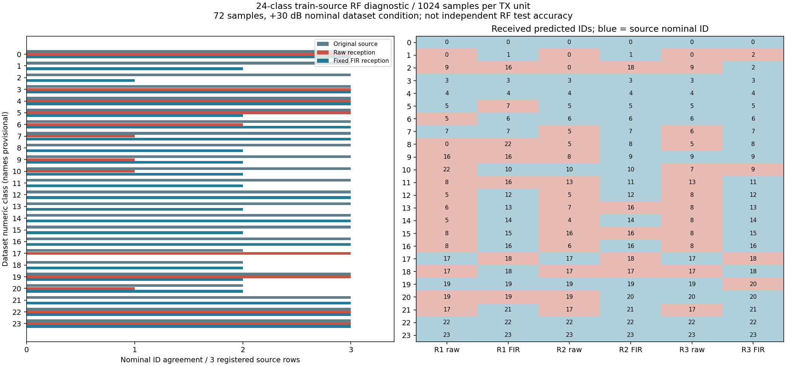

# 24 类三样本 B210/P201 对照验证 — 2026-09-07

按用户要求完成 **24 个数字类别 × 每类 3 条独立选择的训练行 = 72 条**，
每条只循环一个 1024 点单元；三轮按预先固定的不同次序覆盖全部类别。
本轮为工程诊断交付，不是独立 RF 准确率验收或生产识别部署。

## 结果

| 输入 | 与数据集标称数字 ID 一致 | 分母 |
| --- | ---: | ---: |
| 原始源（原始行重复四次，RF-v1） | 69 | 72 |
| 同源固定 FIR 对照 | 69 | 72 |
| 原始实收 | 30 | 72 |
| 固定 FIR 实收 | 56 | 72 |

原始源与 FIR 源的 72 个聚合预测 ID 全部相同。实收滤波后有 31 条从标称
不一致变一致，另有 5 条反向变化，净改善 26 条。5 条反向变化为
`r0c05`、`r0c17`、`r1c17`、`r2c17`、`r2c19`，未从统计中删除。
原始源正确的 69 条中，raw RX 保持一致 29 条，FIR RX 保持一致 56 条。
这些是有限训练源的标称 ID 对照计数，不能外推为独立空口测试准确率。

原完整诊断门为 **51/72**；通过组的 raw/FIR 标称一致为 **26/51、46/51**，
未通过或不可用组为 **4/21、10/21**。背景门保持原值，但没有用它屏蔽
这轮的有限诊断预测；失败标记没有被实验 top-1 改写成生产 classified。
67 条能计算固定块，60 条通过来源相关/残差、56 条通过两个背景余量，
两者和滤波条件同时满足的为 51 条。

5 条来源方法不可用：ID17 的三条，以及 `r0c18`、`r1c18`。
后验只读检查发现它们原始源 DC 功率占比分别为
99.184%、99.317%、99.783%、99.304%、99.746%，原 99% **总功率**带宽
方法返回 0 Hz，被既有来源比较器拒绝；不是接收字节失败或已证明来源不符。
`r2c18` 带宽为 3000 Hz、DC 占比 98.936%。保留该方法局限，没有在看到预测后
更换带宽定义、重新挑窗或补发。相关性高也不等于模型必定正确：完整门通过但
FIR 标称不一致的 5 条中，`r0c20` 原始源已为 ID19；另外四条为
`r0c11`、`r0c05`、`r1c13`、`r2c19`，仍需单独检查。

这轮支持“收发链路变化和预处理影响明显”，不能将所有剩余错误归为背景噪声，
也不能将固定窄带 FIR 宣布为通用修复。下一诊断应优先检查上述四条来源门通过
但实收预测改变的样本，以及 ID17/18 的强 DC 来源关联方法；使用保留证据即可
先分析，不需要马上追加发射。文本调制名仍 provisional，不推断这些 ID 的物理名称。



三次预测按轮 1/2/3 排列；全部显示，未按置信度、来源门或结果筛选。

| 标称 ID | 原始源三次预测 | raw RX 三次预测 | FIR RX 三次预测 | 完整诊断门 |
| --- | --- | --- | --- | --- |
| 0 | 0/0/0 | 0/0/0 | 0/0/0 | 3/3 |
| 1 | 1/1/1 | 0/0/0 | 1/1/2 | 2/3 |
| 2 | 2/2/2 | 9/0/9 | 16/18/2 | 1/3 |
| 3 | 3/3/3 | 3/3/3 | 3/3/3 | 3/3 |
| 4 | 4/4/4 | 4/4/4 | 4/4/4 | 3/3 |
| 5 | 5/5/5 | 5/5/5 | 7/5/5 | 2/3 |
| 6 | 6/6/6 | 5/6/6 | 6/6/6 | 2/3 |
| 7 | 7/7/7 | 7/5/6 | 7/7/7 | 3/3 |
| 8 | 8/8/8 | 0/5/5 | 22/8/8 | 1/3 |
| 9 | 9/9/9 | 16/8/9 | 16/9/9 | 2/3 |
| 10 | 10/10/10 | 22/10/7 | 10/10/9 | 2/3 |
| 11 | 11/11/11 | 8/13/13 | 16/11/11 | 3/3 |
| 12 | 12/12/12 | 5/5/8 | 12/12/12 | 1/3 |
| 13 | 13/13/13 | 6/7/8 | 13/16/13 | 3/3 |
| 14 | 14/14/14 | 5/4/8 | 14/14/14 | 2/3 |
| 15 | 15/15/15 | 8/16/8 | 15/16/15 | 1/3 |
| 16 | 16/16/16 | 8/6/8 | 16/16/16 | 2/3 |
| 17 | 17/18/17 | 17/17/17 | 18/18/18 | 0/3 |
| 18 | 18/17/18 | 17/17/17 | 18/17/18 | 0/3 |
| 19 | 19/19/19 | 19/19/19 | 19/19/20 | 3/3 |
| 20 | 19/20/20 | 19/19/20 | 19/20/20 | 3/3 |
| 21 | 21/21/21 | 17/17/17 | 21/21/21 | 3/3 |
| 22 | 22/22/22 | 22/22/22 | 22/22/22 | 3/3 |
| 23 | 23/23/23 | 23/23/23 | 23/23/23 | 3/3 |

## 预注册、身份与执行证据

- [预注册](B210_MULTICLASS_PLAN_2026-09-07.md)；
  [固定 72 行清单](../jetson-agx/sdrharness/config/amc/b210-multiclass-907u.json)，
  SHA256 `8d873847234bb48d4235348a6f3ae543d3f881c61ba2390ca018e6da7e5d7d32`。
  只解压 train.npy 并验证既有 train hash；只读取选中的 X/Y/Z 行并严格验证
  one-hot ID、+30 dB、形状及有限值。整库 hash 引用既有资产登记，核验尺寸；
  没有扫描整库、读取 locked test、训练或重新比较精度。
- NX `wheeltec` / B210 serial `2508504` channel0 TX/RX；P201 RX1/RX0/A_BALANCED
  接用户新双频天线。2455 MHz、TX LO +250 kHz、gain70、peak .2，
  RX gain40、2.1 MS/s、BW1.5 MHz。40 dB 是诊断条件，未冒充冻结生产 profile 的50 dB。
  TX FIFO 写入每条20,971,520点，完整1024单元；没有落盘整段循环波形。
- 3 tone + 72 RML 组全部完成，225 个65,535点 ci16 capture，
  原始 RX 总计58,981,500字节，2250.848秒墙钟时间；开始时空闲809,427,173,376字节。
  每组前/中/后停发对照、单 daemon、无丢样/溢出/削顶、哈希、SigMF、request/session、
  radio restoration 和 NX 停发均通过原生校验。3 tone 门全部通过。
- 72 份 UHD 日志保留 untimed 标记：57×SSS、12×SS、1×SSSS、1×SSSSSS、1×SSU。
  这些不能证明整段空口连续，也不能对应到特定 RX 坏窗。
- 全部样本在模型前验证固定 FIR 源保真：最小功率保留0.994633816，
  最大归一化失真0.005020428。所有72条满足预注册候选条件；保留滤波引起的预测回退。
- 固定 offset32768 的连续4096点，原始源不作接收拟合、相位/增益补偿或有利窗口搜索；
  RF-v1 共享RMS/四窗/full logits/mean-logit，冻结 epoch010、FP16 autocast + FP32 weights。
  1152 实验窗 + 2 warmup；完整模型/profile/preprocess hash、每个输入hash与所有logits见
  [审计](B210_MULTICLASS_AUDIT_2026-09-07.json)。数字ID可信，输出均为未校准诊断。
- 本机已安装 Spark 尚未接共享 gate，先确认空闲，再有界暂停 PID1150 进行本次
  GPU 推理；104.386秒后恢复，同PID重新可查询且空闲，700秒兜底恢复 watchdog 已回收。
  异常恢复有注入测试。特征私有 Mamba 租约获取/释放各1次；没有改生产服务配置。
- P201 sdrd 保持 PID11547/hash
  `83a661a892b8ab71de3f4e7d64064c9c65030623dc7245eb3d3a1420a696ba4f`；
  临时编译 Controller hash
  `b4db3a34b4a58171eace00c89924d8d79fc4e419ab12652cfa9141525338f9af`，未替换安装服务。
  旧 recovery CLI 不认识 rx_input 的既有问题仍单列，不在本提交修复。

## 验证与数据清理

29项测试：finite TX 15、multiclass 11、margin回归3。覆盖合法版本5完整有限FIFO、
EOF/篡改/配置越界拒绝、train-only读取和选行、严格标签、背景失败诊断仍可用、
宽带FIR不适用、失败/缺失分母、未知文件/FIFO清理拒绝和GPU暂停异常恢复。
测试摘要/hash与精确清理记录保存在证据包 `cleanup.json`；无用户结果或旧证据删除。
全量保留包 replay 会重算来源/背景/模型输入与聚合一致性，不重发、不再次运行模型。

已删除 **1453 个临时文件、376,968,293 逻辑字节**，
包括整个本单元target、Triton/CUDA/绘图缓存、GPU gate、测试数据和重复日志/分析副本。
这是逻辑文件字节，不等同于测得物理空间回收。NX 75组目录删除、P201 225 个派生临时
路径不存在均再次核验。最终P201只读批量检查首次长命令断连，改为每批20路径复核通过；
未发生新RF操作。所有特征RX/TX/推理/恢复watchdog进程结束，Spark恢复。

按 AGENTS.md 第10/11条保留 **1268 个证据文件**，逻辑字节
**72,075,060**，去硬链接重复后的唯一inode字节 **62,465,220**
（约59.57 MiB）。[完整库存](B210_MULTICLASS_EVIDENCE_2026-09-07.json) 登记逐文件
路径/大小/SHA256、精确76个根目录和source/capture/request/session/model身份。
保留完整有限SigMF包是严格原生seal重放所需；原始源与发射缩放源分别证明模型输入和
实际TX内容，重复manifest为硬链接，无额外完整RX或长TX副本。结果/logits只在Git审计中
保留一份，旧包保持原样。

重放（不访问硬件、不加载模型）：

```bash
cd /home/jetson/sdrharness
PYTHONDONTWRITEBYTECODE=1 OPENBLAS_NUM_THREADS=1 \
  local-assets/amc-eval/runtime/venv/bin/python \
  jetson-agx/sdrharness/scripts/summarize-b210-multiclass.py --verify-retained
```

人工决定删除这轮保留IQ时，运行以下命令；它只接受本轮固定根目录和未变化的
文件库存。删除后IQ逐点重放不可用，Git中的清单/审计/图表保留。

```python
from pathlib import Path
import hashlib, json, shutil
repo = Path('/home/jetson/sdrharness')
record = json.loads((repo/'docs/B210_MULTICLASS_EVIDENCE_2026-09-07.json').read_text())
base = Path('/var/tmp/sdrharness-dev')
expected = {base/'b210-multiclass-907u'}
expected |= {base/f'b210-multi-tone{r}-907u' for r in range(3)}
expected |= {base/f'b210-multi-r{r}c{c:02}-907u' for r in range(3) for c in range(24)}
assert {Path(p) for p in record['roots']} == expected
assert all(p.resolve() == p and p.is_dir() for p in expected)
assert {str(p) for root in expected for p in root.rglob('*') if p.is_file()} == {f['path'] for f in record['files']}
for item in record['files']:
    p = Path(item['path'])
    assert not p.is_symlink() and p.resolve() == p
    raw = p.read_bytes()
    assert len(raw) == item['bytes'] and hashlib.sha256(raw).hexdigest() == item['sha256']
for root in sorted(expected):
    shutil.rmtree(root)
assert all(not p.exists() for p in expected)
```

V1b独立known-RF/OOD标签、V2温度/拒识、V3名称映射/locked-test准入和生产部署均未完成，
`recognizer_available=false`。没有新增P201 TX、FPGA/BOOT或NX推理。
