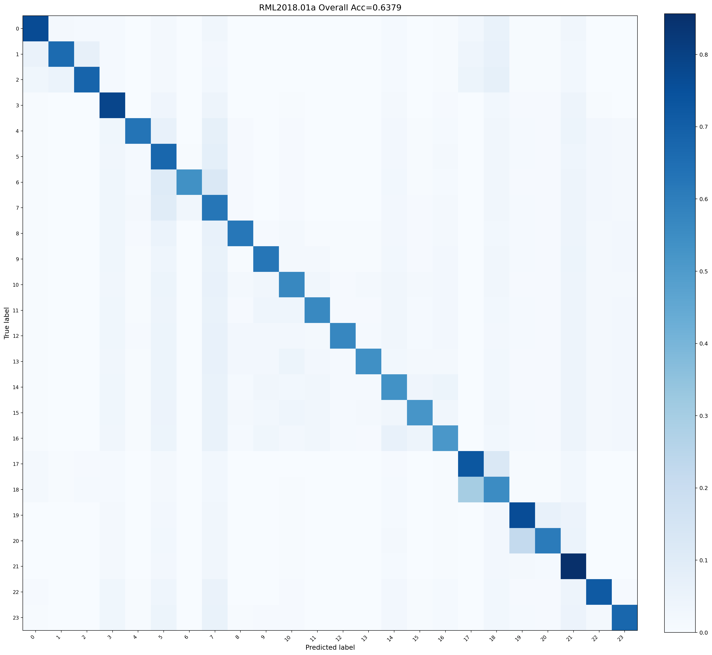
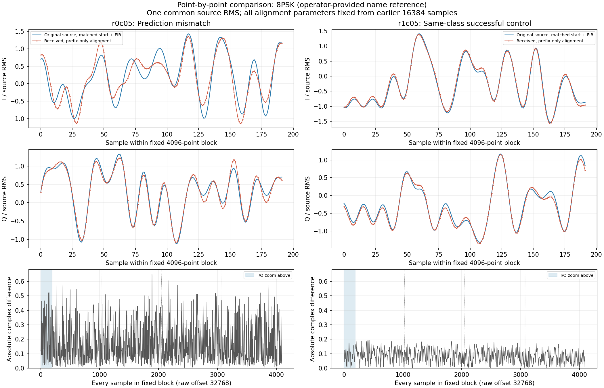
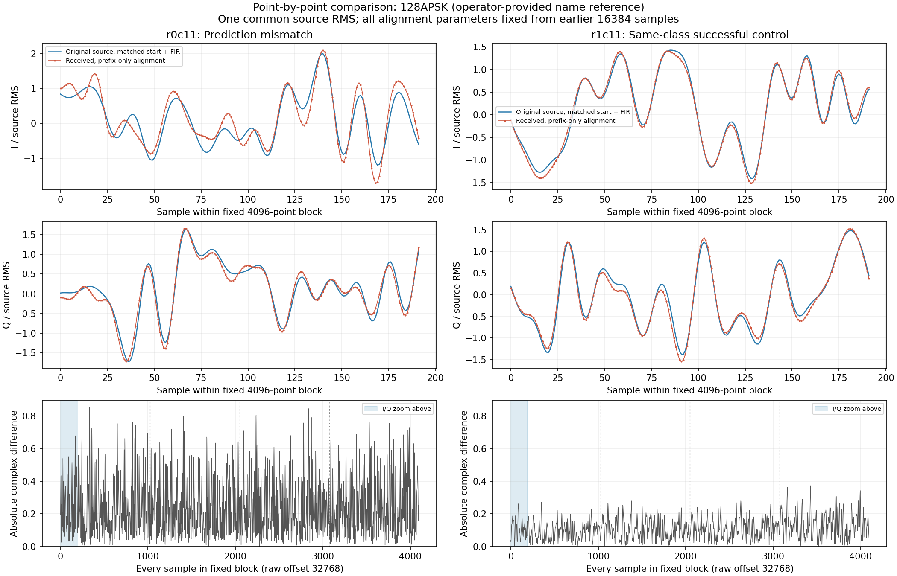
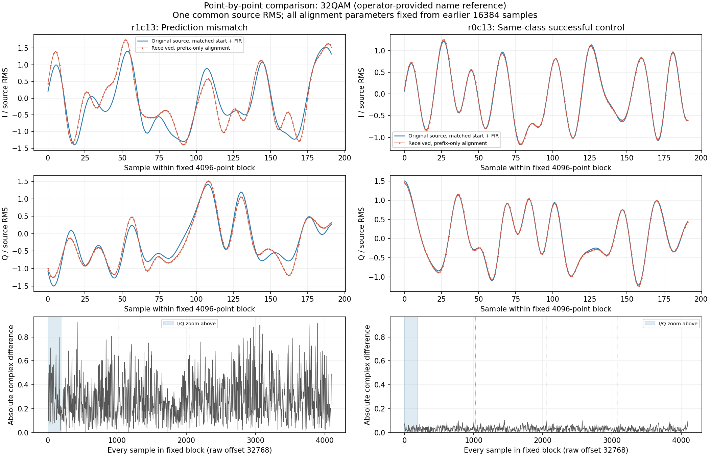
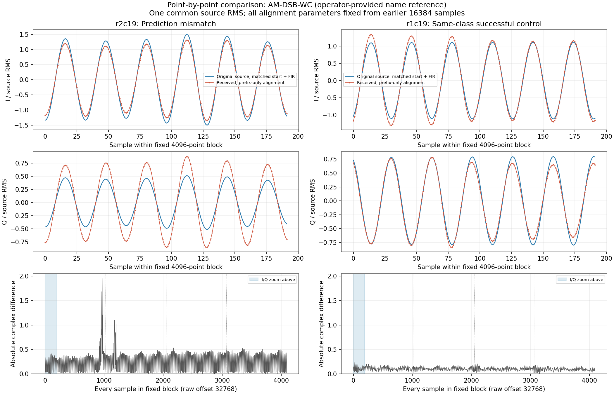

# 多类实收剩余错误、逐点 IQ 与源端基线核对 — 2026-09-07

本轮复用7623fd6保留包，完成12条源/RX反事实模型对照、6条强DC来源方法诊断、
逐点I/Q图，以及4090历史验证集混淆矩阵/标签生成代码核对。
**没有新增发射、接收、数据集读取、训练、完整精度实验或生产配置部署。**
这是一项诊断交付，尚未证明硬件根因或可部署的通用修复。

## 用户问题的核对结果

1. RML2018.01A一条为1024个复数点，即I/Q各1024个值。
   HDF中的1024×2与模型的2×1024只是布局不同；本轮发射单元没有扩大。
   多类离线源对照将同一行重复四次，以通过四窗接口；重复不会增加独立信息。
2. 上轮72条原始源全部标称+30dB，69/72=95.833%。三条错误是
   `r0c20:20→19`、`r1c17:17→18`、`r1c18:18→17`，发射前已经存在。
   不能归因为空口，也不能仅凭小样本断言模型退化。
3. 历史FP16的98.80316%是SNR>=4dB、验证集、四条不同来源行共享RMS后mean-logit
   聚合的结果。与这次训练行单条重复的人口和信息量不同；已核对统计方式，
   但**没有通过新大评测证明这一区别能解释全部三条错误**。不重跑完整精度实验。
4. 用户提供24类对应表，本轮只作为有来源的诊断名称参照：
   17/18=带/抑制载波单边带AM，19/20=带/抑制载波双边带AM；
   源端三条错误都落在这两对。截图路径/hash与完整表见审计。
   项目旧classes.txt顺序与此不同；未改冻结标签文件或正式V3a状态。
5. 4090旧D8 seed44验证矩阵确实有同样混淆：17→18为2008/15881，
   18→17为4822/16048，19→20为1069/16081，20→19为3478/15891。
   这是**微调前D8、全SNR、validation**历史关系，不是当前epoch010/+30dB错误率。
   CSV和图的坐标都是0–23；生成代码在class_names缺失时回退数字，所以矩阵本身
   不能提供物理名称证据。当前RF-v1训练的labels.json也明确只保存数字。
   未打开test数据或结果文件，未修改4090仓库、模型或进程。



远端矩阵路径：
`/data/lzc/mamba/results_package/d_series_after_b90/runs/rml2018a/amc_mamba_d8/d8_weight_tied_2018a_b128_seed44_nw8/`。
CSV hash `9ae93cc2048942181d7dd450d7f81facbf01442b49d2d48cf4f89fd7312a61ab`；
图hash `3c6b80389d9d54759ffc37ad1296b9ba7c871052a9eae5c92ce3cf2f5a6c4c71`。
读取时mamba HEAD为`0ea879a8d285269435ebcf198e4729ed656a1392`。
上游[issue25](https://github.com/radioML/dataset/issues/25)同样记录classes.txt顺序争议，
并有社区引用论文排列的建议；未把社区评论或模型预测升级成正式标签事实。

## 已固定并执行的模型对照

按[预登记](B210_RESIDUAL_PLAN_2026-09-07.md)，取ID5/11/13/19的所有三条，
包含4条目标错误与8条同类成功对照。仅从前16384点估计整数lag、频差和
复线性信道`y=(h*s[n-lag]+b)*exp(j*w*n)+d`，比较仍为原offset32768的4096点。
不拟合模型窗口、不按模型输出搜索、保留源自身均值。9组×12条×4窗=432实验窗，
加2warmup；冻结epoch010/FP16 autocast、FP32权重、RF-v1共享RMS/full-logit不变。

| 样本 | 原始源 | FIR RX | 源加频差/相位 | 源加完整拟合信道 | RX去频差 | RX再去相位 | RX再去额外偏置 | 剩余功率比例 |
| --- | ---: | ---: | ---: | ---: | ---: | ---: | ---: | ---: |
| r0c05 | 5 | 7 | 5 | 5 | 7 | 7 | 7 | 4.727% |
| r0c11 | 11 | 16 | 11 | 11 | 16 | 16 | 16 | 8.518% |
| r1c13 | 13 | 16 | 13 | 13 | 16 | 16 | 16 | 10.815% |
| r2c19 | 19 | 20 | 19 | 19 | 20 | 20 | 20 | 9.529% |

源起点移位、源常相位对照也全部保持原始ID。8条成功对照在全部变换中保持正确。
24个原始源/FIR RX基线的logits与上次逐值完全一致（最大绝对差0）。
因此：**这些样本的简单起点、恒定频差/相位、前段拟合的额外偏置，不足以解释错误**。
不能据此排除时变相位、采样时钟差、非线性、IQ镜像、其他干扰或这些因素组合。
四条错误的剩余功率约4.7–10.8%，成功对照约0.13–2.22%；此残差包含未建模失真，
**不是独立测得的SNR**。

## 逐点 I/Q：原始源与实收的差异

用户要求逐点比较后追加纯显示/数值检查，无新模型操作。
图中蓝线是原始源按固定lag和相同FIR处理后的波形，红线是实收去前段估计的频差、
相位与额外偏置后的波形。二者共用源RMS单位，不分别拉伸幅度来掩盖误差。
上两行固定显示模型块前192点，红色点标记每个采样；底部显示全部4096点误差，
涵盖完整四个1024窗，纵轴不裁掉峰值。右列为同类成功对照，避免只展示失败。

- ID5/8PSK：出错样本有局部波形偏离；仅去恒定相位无法消除。四窗原预测
  `7,7,7,5`，额外偏置/相位对照后为`7,5,7,5`，mean-logit仍为ID7。
- ID11/128APSK：四窗都预测ID16；去频差/相位/偏置仍全部为16。
- ID13/32QAM：原四窗`16,15,16,16`，完整对照后`16,15,15,16`，聚合仍为16。
- ID19/带载波双边带AM：逐点图有局部突发和I/Q幅度关系变化。四窗为
  `20,20,19,19`，后两窗局部复增益拟合后未解释比例约0.1%，前两窗约5.08%、2.08%。
  每窗logit(20)-logit(19)依次为14.392578、8.65625、−7.265625、−8.5625，
  平均仍为+1.805176，所以两窗判回19并不使mean-logit聚合自动变为19。
  这里的局部复增益只作后验误差描述，从未用于新模型输入或改写上次门。






名称均引用用户本次截图，正式映射仍待独立核验。

## 强 DC 来源方法的边界

ID17/18六条另计算去均值谱的99%带宽，只用于来源诊断；模型IQ的DC仍保留。
原五条总功率带宽0Hz问题不再阻止诊断拟合，六条候选prefix均可求解，
中心化带宽分别为126/17/171/165/201/134kHz；prefix相关范围0.332–0.932。
因此避免0Hz数值拒绝并不等于可靠来源识别已经通过。强DC情况下总功率残差也
可能掩盖调制细节，原上轮qualification与模型结果保持，不把候选接入生产。
本轮没有对ID17/18重新推理或按候选结果冻结拒识门。

## 验证、恢复与清理

17项测试：既有multiclass11项回归 + 新6项，覆盖前段估计不读取后段、
已知合成信道/源均值保留、强DC与常量/非有限拒绝、完整成功对照选择、
保留包准备过程中禁止打开HDF5/ZIP，以及既有GPU暂停异常恢复。
首版合成测试误把滤波和混频当作精确可交换，差2.49e-5；已按固定FIR通带
误差界校正测试预期，未修改数据、模型或真实结果以迎合测试。
全部模型输入/聚合、逐点图数组hash和1268个旧证据文件的重放通过。
Spark空闲暂停78.877秒后恢复，恢复watchdog回收，私有GPU租约释放。

删除整个`/var/tmp/sdrharness-dev/b210-residual-907v`：
**366个临时文件，22,412,710逻辑字节**，
含测试/缓存、绘图NPZ、下载副本及重复JSON。没有新增保留IQ，旧包库存/哈希未变，
用户语料与结果未删除。所有有限结果/参数/logits/图hash/来源/清理摘要见
[审计JSON](B210_RESIDUAL_AUDIT_2026-09-07.json)。清理后可直接重放，无需重建临时根：

```bash
cd /home/jetson/sdrharness
PYTHONDONTWRITEBYTECODE=1 OPENBLAS_NUM_THREADS=1 \
  local-assets/amc-eval/runtime/venv/bin/python \
  jetson-agx/sdrharness/scripts/diagnose-b210-multiclass-residual.py --verify
```

本轮结论是保留否定证据并继续定位剩余扰动，不是修复完成。
下一独立诊断可用现有点对点残差检查时变/分数采样延迟及I/Q镜像；物理空口与内部
来源隔离仍需合适50Ω负载或经过衰减的同轴对照。不得无衰减直接连接TX/RX。
V1b/V2/V3/A1均不因本轮完成而勾选，recognizer_available=false。
