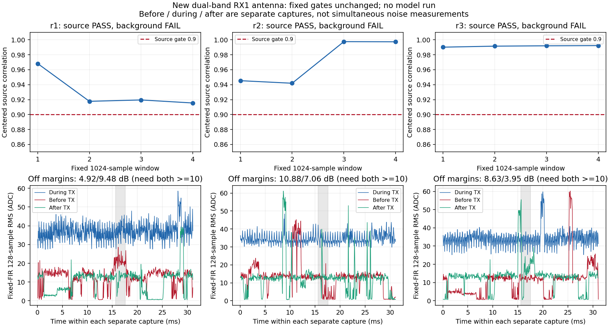

# 新天线接回RX1：三组固定窗口源匹配通过，背景门失败，分类未测

基线b23fe92，按[预登记计划](B210_RX1_NEW_ANTENNA_PLAN_2026-09-07.md)执行。
用户确认新2.4/5GHz双频天线接回P201 RX1；本次不再操作RX2选择。
完整决策指标及全量中间分析的可复现hash见
[审计](B210_RX1_NEW_ANTENNA_AUDIT_2026-09-07.json)，原始证据路径、hash及人工
删除方法见[库存](B210_RX1_NEW_ANTENNA_EVIDENCE_2026-09-07.json)。

## 本次结果

一个tone参考及r1/r2/r3三个相同幅度RML组全部完成，每组有停发前/发射中/
停发后三次采集。原固定offset32768起的四个1024点窗口中，三组的相关系数
均≥.9，残差比例均≤.2；固定FIR的LO抑制均超过94dB。但每组至少一个停发
功率余量不足10dB，故原工程验证条件为0/3通过，模型/warmup均未运行。

| 组 | 四窗相关范围 | 残差功率比例 | 相对停发前余量 | 相对停发后余量 | 原完整门 |
| --- | --- | ---: | ---: | ---: | --- |
| r1 | .9155–.9682 | .1521 | 4.92dB | 9.48dB | 失败 |
| r2 | .9419–.9975 | .0595 | 10.88dB | 7.06dB | 失败 |
| r3 | .9901–.9922 | .1054 | 8.63dB | 3.95dB | 失败 |

这不等于“识别失败”，因为本轮没有分类输出；也不能把0/3完整门通过率当
准确率。其他预定义heldout块的情况也保留，没有挑选较好窗口替代固定块。



图中三条时间曲线来自各自独立采集，横轴是每次采集内的相对时间。灰区只是
相同样本offset，不表示三条曲线同时发生。

## 相关系数和背景门分别说明什么

相关系数比较接收波形与已对齐源预测的中心化形状，并经过归一化；它检查
源匹配，不能单独代表背景绝对强度。背景门比较固定FIR/固定4096点块的
发射中功率与两次停发功率，要求二者余量都≥10dB，约为功率10倍。

**背景门用于约束本次是否足以作为合格收发/识别验证证据，不是模型运行的
数学必要条件。** 它帮助避免把环境中本来存在的强活动算作目标源贡献，也
限制把不够干净的RF试验直接归因于模型。但分时背景可能随时间改变，门可能
偏保守；这些余量不是同时测得的接收SNR，不能与数据集标称+30dB等同。

源匹配较高而背景门失败的IQ仍有诊断价值。若开展这类输入的诊断推理，应
单独登记“源匹配通过/背景门失败/仅诊断”的条件和解释边界，不能把推理输出
回写为原验证通过，更不能作为生产classified或独立标签。本轮保持原先登记
的推理开关，所以结论准确表述为**分类未测**。保留包支持后续离线诊断，无需
再次发射才能读取这批IQ。

## 背景与历史对照

六份RML停发对照经固定FIR后的128点RMS中位数为11.74–13.61 ADC，最大值
28.60–61.16 ADC；短时波动仍在。原2455MHz同幅.2的low1/low2四份停发对照
中位数为.75–1.08 ADC，但也曾有17.57–129.46 ADC峰值。新配置下发射中总
接收幅度较高，停发幅度也较高，不能仅凭总功率增加判定有效信噪比提高。

历史对照的天线、采集时间和sdrd版本都不同。此处只有历史描述，不是同时间、
同软件、同几何位置的天线A/B因果试验；也不是RX1/RX2同天线对照。没有定位
外部协议、损坏器件或噪声的物理来源，50Ω负载对照仍待设备到位。

## 运行与验证

全部在2455MHz、P201 RX1/RX0/A_BALANCED、gain40dB、settle500ms采集，每份
65535个ci16_le点、262140字节，总计12份/3,145,680字节。RML仍为原train
row102400的单个1024点、幅度.2、20480次重复，2.1MS/s、BW1.5MHz、B210 TX
gain70、LO偏移+250kHz；tone参数按计划。未重开数据集或locked test。

源沿用原v4波形合同与hash，新天线/实验身份单独写入antenna-context，不改写
旧源或旧采集包。B210 serial2508504、NX主机/用户wheeltec已核对。P201运行
sdrd hash `83a661a892b8ab71de3f4e7d64064c9c65030623dc7245eb3d3a1420a696ba4f`，
本轮没有修改服务。使用源码构建的Controller，避开已记录的旧恢复CLI字段
兼容问题；没有把该既有问题标为修复。

12次原生报告均通过字节数、身份、health、无已报告短块/溢出及削顶检查，
每次恢复通过；最终也核对两路gain/mode/port及公共参数一致。NX发射进程/FIFO
退出、12个P201瞬时路径及4个NX暂存根均确认消失。

UHD三组无时间戳末尾标记为SSS、SSS、SSU。r3的U已保留，不能把它对应到
某个RX固定窗，也不能因软件写满有限样本就宣称空口全程连续。这不改变已测
固定窗的指标，也不构成其背景失败原因的证据。

31项相关测试通过，覆盖原波形血缘/中心与RX身份、有限发送、固定FIR及失败
条件跳过模型、背景统计/尾部和原生报告绑定。首次调用漏设TMPDIR，8个fixture
在创建数据前报配置错误；设置确切feature目录后31项通过。复现使用原
NumPy1.26.4环境，全量中间分析hash和保存的决策指标均重算一致；无新RF或
模型调用。未改旧门、冻结epoch-10/FP16/RF-v1或生产不可用状态，独立标签0，
文本名称仍provisional。

## 证据与清理

保留55个只读文件，逻辑3,275,554字节，包内按inode去重3,259,170字节；包括
完整三组成功源匹配/失败背景及tone参考，能复现此次结论。源payload硬链接
复用，不额外复制原始来源。原始RX IQ仍在Git外，目录未声称删除。

清理689个非证据文件，逻辑大小合计358,002,943字节，包括构建、测试、缓存、
冗余日志和约2.6MB的全量中间JSON；该合计含构建硬链接，不是物理释放空间
测量。Git仅保存约束/有界审计/图和完整中间分析hash，能从保留IQ重算。NX/P201
副本已清理，无新增Apport报告；旧IQ包、USB资料盘、用户附件和应用结果不动。

只读复现：

```bash
PYTHONDONTWRITEBYTECODE=1 OPENBLAS_NUM_THREADS=1 \
  /home/jetson/sdrharness/local-assets/amc-eval/runtime/venv/bin/python \
  jetson-agx/sdrharness/scripts/validate-b210-new-antenna.py --verify-retained
```
