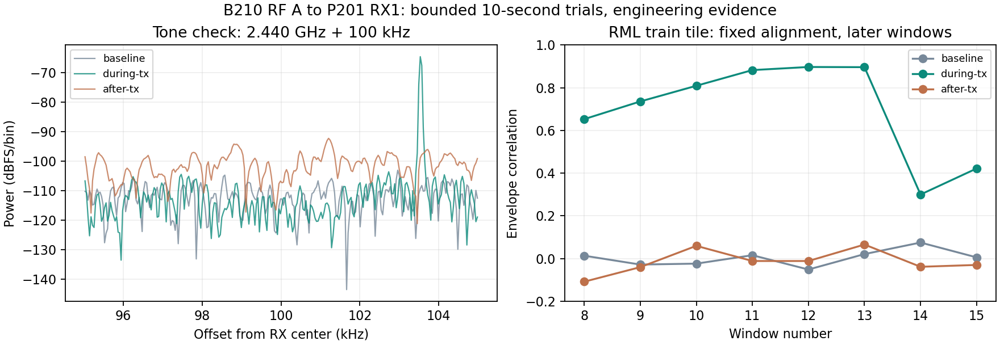

# NX B210 → P201 RX1：2.440 GHz 延长回放验证

## 结论

用户确认天线仍在 B210 RF A/TX-RX 与 P201 RX1，并授权延长发射或复用历史
方案重试。本轮先将历史 +100 kHz 单音搬到 2.440 GHz、发射 10 秒，再以相同
70 dB TX gain / 数字峰值 0.2 回放指定 RML2018A train 片段 10 秒。
**本次单音链路和指定 RML2018A 片段的空口传输得到工程证据确认。**

这是指定四个训练样本的信号源辨识，不是全数据集分类、误码率、独立 known-RF/OOD
验收或生产准入。`recognizer_available=false`；未运行模型、读取 locked test 或
创建独立 RF 标签。P201/Planner 仍无发射动作，NX 不承担推理。

## 参数、预算与设备

| 项目 | 单音诊断 | RML2018A 回放 |
| --- | --- | --- |
| B210 LO | 2.440 GHz | 2.440 GHz |
| 波形 | SINE，+100 kHz 偏移 | 4,096-sample train tile 循环 |
| B210 rate / bandwidth | 2.5 MS/s / 500 kHz | 2.1 MS/s / 1.5 MHz |
| TX gain / amplitude | 70 dB / 0.2 | 70 dB / 复数峰值 0.2 |
| 有限发射量 | `--nsamps 25000000`，名义 10 秒 | 21,000,000 样本，名义 10 秒 |
| P201 rate / bandwidth / gain | 2.5 MS/s / 1 MHz / 50 dB | 2.1 MS/s / 1.5 MHz / 50 dB |
| P201 settle / capture | 500 ms / 65,535 ci16 | 500 ms / 65,535 ci16 |
| 对照 | 停发前、发射中、停发后 | 停发前、发射中、停发后 |

本单元总 RX 上限及实收均为 **1,572,840 字节**，六次捕获；每次 262,140 字节、
1,000 ms capture timeout。两次 TX 总名义时长 20 秒；加上上轮三个一秒试验，
本会话已记录总名义时长 23 秒。RML FIFO 输入 168,000,000 字节，但仅在 NX
暂存一份 32,768-byte tile，不生成十秒 IQ 文件。

NX 为 `wheeltec@192.168.50.220`，UHD `4.1.0.5-3`，B210 serial `2508504`，
USB 3.0，RF A / TX-RX / channel 0（FE-TX2）；复用已核验 A7-100T 运行镜像。
P201 固定 RX1/RX0/A_BALANCED，由既有 SDRD `17136` 控制。Controller 复用 S5
候选二进制的既有 `sweep` 入口；哈希见审计，不把这次测试算成 S5 验收或提交 S5。

## 单音证据

序列 190/191/192 分别为停发前、发射中、停发后。预期偏移 +100 kHz，
发射中全谱最强峰为 **+103,532.46 Hz**，对应独立测得的频差 **+3,532.46 Hz**。

| 同一观测频点 | 停发前 | 发射中 | 停发后 |
| --- | ---: | ---: | ---: |
| 功率 dBFS/bin | -109.317 | -64.519 | -98.838 |

该峰相对停发前/后分别提高 **44.799 / 34.319 dB**，高于发射中频谱中值
**52.454 dB**。这复现了历史单音辨识方式，所有本轮发射频率都在 2.4 GHz 频段。

## RML2018A 片段证据与限制

沿用上轮明确的 train 全局行 `102400,102401,102403,102404`，数字 ID 0，名义
SNR +30 dB，文本名称 provisional。只读取已核验 `train.npy` 和这四行 X/Y/Z。
拼接的是四条独立数据片段，不能虚构其原始连续物理会话或原始物理采样率。
复数峰值从上轮 0.1 提至 0.2，其余样本内容不变；tile SHA-256：
`c95ac58c1fd91ef4da992622dbdf70a9bc5884d0941419083451473a052f534e`。

序列 193/194/195 分别为停发前、发射中、停发后。原始宽带周期判据仍未通过：
发射中周期相关只有 0.0571，原 `waveform_detected=false` 保留，不改阈值制造通过。
但原始循环包络匹配中位数为 0.5634，多个窗口重复对齐到 1,710-sample lag。

随后作**后验工程诊断**：从发射 tile 自身的 99% 频谱能量得到 ±125 kHz 范围，
使用单独单音测得的 3,532.46 Hz 频差，分析时对 source/RX 使用相同带限；仅以前
七窗的最佳 lag 中位数确定对齐，将同一个 lag=1710 用于后八窗和两个停发对照。
这不是独立验收划分，也不声称后八窗在此前分析中从未被查看。

| 后八窗固定 lag 包络相关中位数 | 停发前 | 发射中 | 停发后 |
| --- | ---: | ---: | ---: |
| 相关系数 | 0.00938 | **0.77241** | -0.02077 |

发射中各窗最佳 lag 匹配的中位数为 0.83714，两个停发对照为 0.13845/0.12502。
单音启停和 source-specific 匹配共同支持“指定 RML train 片段到达 P201 RX1”。
干扰仍存在，个别窗口相关降低；不把它解释成纯净接收标签或模型识别正确。
这些 DDC/带限仅属于离线诊断，**没有改写冻结 RF-v1 preprocess 或模型输入**。

## 测试与已知限制

8 项无 RF 测试通过：既有 FIFO/GO/篡改/`-O` 拒绝，十秒精确样本数/尾部哈希、
非注册样本数拒绝，以及确定性合成信号的 lag/CFO 匹配、噪声负例和单音同 bin 对照。
Python 语法与 diff 检查通过。没有重跑完整精度实验、训练或打开 locked test。

两个 UHD 工具均正常退出；RML 实际 feed 耗时 9.96585 秒，所有接收窗口零
丢样/溢出/削顶/timeout，health 与固定 RX 身份通过。日志末尾仍有 `S` 标记，
保留为未解释的 UHD 异步标记，**不声称全程 TX 无序列事件或无误码连续传输**。

所有数字、源码/工具/日志/IQ 哈希和恢复证据见
[有界审计 JSON](NX_B210_RML_2440_EXTENDED_AUDIT_2026-09-06.json)。
上轮低增益/短时未确认结果完整保留于
[原验证记录](NX_B210_RML_2440_VALIDATION_2026-09-06.md)，未被覆盖。

## 恢复与清理

每次 RX 均恢复到原采集服务暂停后的基线：LO 5,985,999,996 Hz、30.72 MS/s、
30 MHz、manual 60 dB、A_BALANCED，全部 scan/buffer 关闭，SDRD PID 未变。
该 LO 是恢复接收设置，不是本轮发射频率。原采集服务保持此前授权的正常暂停。

本轮精确目录为 AGX/NX 各自的
`/var/tmp/sdrharness-dev/b210-2440-long-20260906/`。保留有界证据后删除两端临时
IQ、FIFO、测试数据和绘图缓存，确认 NX 发射进程退出及 P201 六个精确 generation
目录不存在。最终清理确认见审计 `cleanup`；用户原语料、结果和 S5 开发目录保留。
