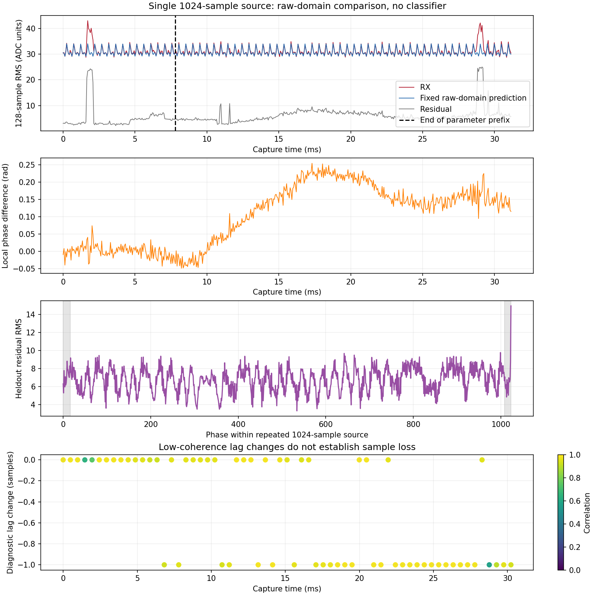
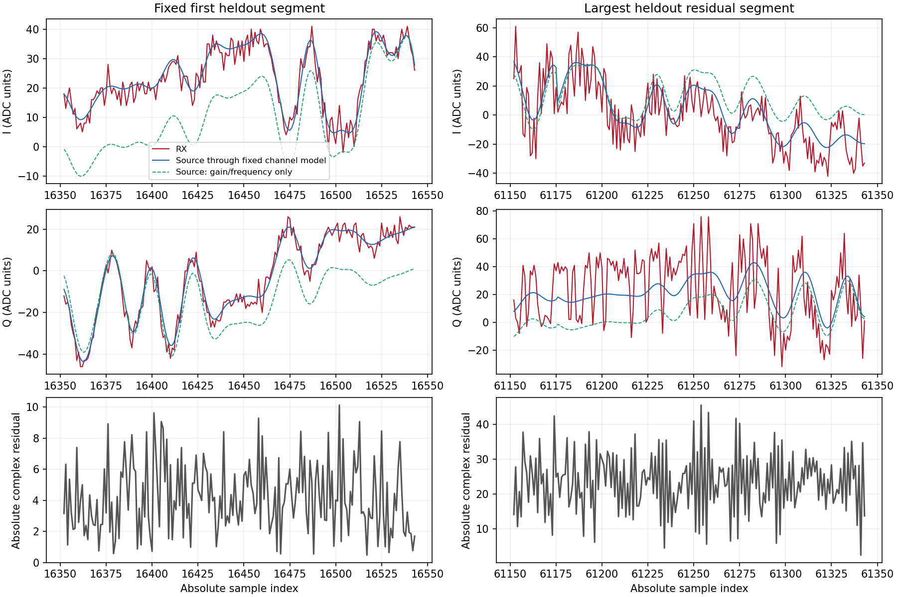

# 单1024点源逐点对照：背景突发、载波相关分量与相位变化

基线 `3e1d3d17fe2ba7edf68cde6b71bf7c6bdd824dd7`。按用户要求把单条1024点样本
作为新发射默认，完成一次2.440 GHz B210→P201实收及全部65535点对照。见
[执行前计划](../evidence/B210_1024_POINTWISE_PLAN_2026-09-06.md)和
[有界审计](../evidence/B210_1024_POINTWISE_AUDIT_2026-09-06.json)。没有运行分类模型。

## 找到的具体差异

1. **本次停发背景也有强扰动。** 同一14.05794 ADC单位的128点RMS事件线下，
   停发前/后分别47/17段超线，最大RMS约144.46/149.34。发射中固定预测残差有
   16段超线，其中后段8段。这些是各31.207 ms短采集的观测，不能当长期发生率；
   也不能仅凭停发状态区分现场干扰与P201接收瞬态。
2. **拟合出的载波相关额外分量较大。** M0鲁棒拟合中，随源载波旋转的截距幅度
   19.9165 ADC单位，约为缩放后源RMS的0.853倍；接收坐标固定DC幅度仅0.07785。
   各LS/鲁棒/FIR拟合的该分量接近，提示稳定差异不只有随机噪声。但它是已知源
   通道模型的分量，不能直接等同于B210本振泄漏或某个硬件故障。
3. **存在时变相位差。** 固定128点段的局部相位差约−0.0483至+0.2542 rad，
   随时间平滑变化并叠加突发；不能把这些残差全部解释为AWGN。
4. **未发现明显持续的整数样本滑移。** 63个完整1024块中60个相关≥0.8，其
   独立最佳lag只在759/760间切换。后验峰值插值显示相对固定lag约−0.477至
   −0.536点，主要在半采样位置附近；不支持把整数0/−1切换直接说成掉样。
   表观时延斜率约−1.52 ppm、拟合RMSE0.024点，仅为诊断估计；滤波和相位
   失真也能移动相关峰，不是时钟校准结果。

本轮把问题缩小到了具体波形差异，尚未定位到某个硬件部件，也不衡量“某种调制
本来难识别”。这里只使用一条train源反复发送，重复次数不是独立准确率样本数。

## 原始与逐点放大图

放大图左列固定在第一个后段128点区间，右列按冻结预测的最大后段残差选择，
中心区间为sample61184…61311，两侧各扩32点。红线是实际RX，绿虚线是仅做
固定增益/频率对齐的原始源，蓝线再加入已拟合载波分量和接收DC。不能把蓝线
接近红线解释为原始源未经改变；绿蓝之间的差异正是需要排查的部分。

全部65535个点生成并核对CSV：原始源相位、I/Q、实收I/Q、预测、残差、幅度差及
相位差（预测幅度过低时留空）。CSV序号连续，实收整数逐点匹配，舍入最大误差
约7.04e−8 ADC单位。另保留全部512个128点统计段，最后一段127点；没有丢弃尾部
1023点来改善结果。逐点CSV/IQ是本单元暂存，Git只保留图、统计与hash。
CSV中的源是实际发送的统一缩放序列；与数据集原行的对应关系由行号、原始hash
和缩放系数保留，没有对源再去DC或滤波。

## 对齐与通道拟合

只以前16×1024原始点估计参数：循环lag760，tone频差+3456.16846 Hz，源参考
剩余频差−70.19889 Hz，总频差+3385.96957 Hz；前段中心化相关中位数0.98241，
加权相位RMSE0.00848 rad。相位速率仍存在2050.78125 Hz的混叠周期。

预测的是未带限原始RX，不用全长FFT或后段数据改变参数。源真实非零均值保留，
同时估计源增益、载波坐标截距和接收坐标DC；普通LS与固定6轮鲁棒LS均报告。

| 通道诊断 | 前段残差RMS | 后段残差RMS | 后段残差/接收功率 |
| --- | ---: | ---: | ---: |
| M0：单复增益及两个坐标的截距，LS | 6.97446 | 6.87506 | 0.04812 |
| M0：同上，鲁棒LS | 6.97459 | 6.88683 | 0.04829 |
| M1：固定9 taps及两个截距，LS | 6.81892 | 6.68666 | 0.04552 |
| M1：同上，鲁棒LS | 6.81952 | 6.69537 | 0.04564 |

这些比例是固定通道预测的残差功率，不是识别错误率或SNR。小型FIR对后段的额外
改善有限；不能因前段可拟合而宣称修复。M0/M1归一化设计矩阵condition约2.75/182.62。

按源周期折叠的后段残差，边界±16点RMS约7.187，其余约6.877，平均比值1.045；
周期尾部phase1023有局部峰值约14.965。该局部特征值得保留，但不能认定整体异常
都由1024边界产生。整数lag从未应用回主预测；后验峰值插值单独存档，原分析逐
字段复现，没有根据它重算/修正残差或准入门。

## 1024发射与有限实机证据

新导出默认single-row，旧四行仅通过显式`--legacy-four-row`复现。实际使用train
行102400，标称ID0/SNR+30 dB；原始IQ SHA256
3c2c5d5606a7d1a8721511afddd49ca8c2183968d59b38a4e099754646cf0922；
缩放系数0.07039332889300712，8192-byte payload SHA256
c8e3d54629eb7dde75e6a49554090f570522e7b438d2602dce85a18cd1d771f9。
源自带的数据集噪声也随序列发射，不另加软件噪声。残差包含新增噪声及未解释的
通道变化，不等于全部噪声；+30 dB不当作实收SNR。

B210 serial2508504、RF A/TX-RX/channel0、2.440 GHz、gain70/peak0.2；单音为
+100 kHz/2.5 MS/s/BW500 kHz/25000000点，单行RML为2.1 MS/s/BW1.5 MHz、
20480个完整1024单位，共20971520点，名义约9.98644秒。UHD主机spb1024，FIFO
实际馈送167772160 bytes，feed约9.96145秒。末尾有`SSS`标记且无对应时间戳，
不能宣称全部空口样本无序列事件，也不能将其直接与某个残差段关联。

P201固定RX1/RX0/A_BALANCED、manual gain40，各启停前/中/后65535 ci16。单音RX
2.5 MS/s/BW1 MHz，RML RX2.1 MS/s/BW1.5 MHz；中心均2.440 GHz。六次共1572840
bytes，等于登记上限。单音启停同bin差50.9501/49.0190 dB、谱中值差46.2368 dB。
六份native质量/身份、SigMF/request/session/sequence、IQ/hash封存和恢复均通过。
本轮同时改变了源片段和主机spb，跨次变化不能单独归因于1024设置。

76项软件回归通过，新增完整单位/非法单位及hash保护、已知时延/两坐标偏置/FIR、
脉冲、样本滑移、前后段隔离和全尾部覆盖、插值不虚构固定时延漂移。导出CLI
默认1024、显式旧模式及互斥检查另通过，未因此再次打开数据集。图和diff审查通过。

P201最终observe healthy，sdrd PID17136/hash
77d98a005305a4b7531fc3f133e9b4af521e60b065b29fcc304b4c7db80c45ae保持，恢复原
RX LO5985999996/rate30720000/BW30000000/manual gain60/A_BALANCED，scan/buffer
全0。所有发射始终2.440 GHz；NX发射进程/FIFO及六个P201临时路径已确认不存在。
AGX/NX本单元b210-pointwise-906k和b210-pointwise-tone-906k根目录均已核对后
精确删除并确认不存在，包含原始IQ和逐点CSV；删除前所有封存hash复核一致。
测试目录b210-control-test-400566及b210-control-test-401693也确认不存在；
审计cleanup.verified=true，用户已有语料和应用结果未触碰。

分类模型/warmup=0，未训练模型或打开locked test；RF-v1四窗合同、epoch-10/FP16、
名称provisional、独立标签0、recognizer_available=false及生产服务保持。下一独立
诊断应使用相同1024源、只改变一个收发条件，优先核查载波相关分量和相位变化的
来源，并继续带停发背景对照；不直接把这些拟合系数部署成生产补偿。
