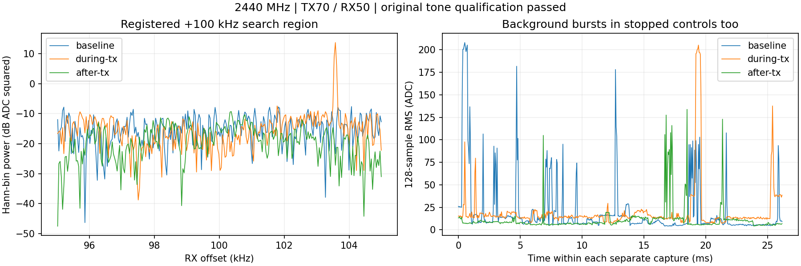

# 换天线后2440MHz单音通过原工程门

用户报告“我换了天线”并要求重试，具体更换端/型号未报告，沿用原端口及此前有限室内发射条件。
按[预登记](../evidence/B210_2440_ANTENNA_CHANGE_PLAN_2026-09-10.md)执行一次，与上一轮相同参数。
**本次确认测试单音，原三项20dB门全部通过。** 背景突发仍存在；本次成功证明当前接法下
2440MHz单音可见性，不证明天线因果、调制保真、来源标签完整或模型识别可用。
原失败记录保留，不追溯改写。当前TX已停发，接收状态已恢复。

## 参数与结果

TX2440MHz/+100kHz SINE、rate2.5MS/s、BW500kHz、gain70dB、ampl0.2、25000000样本/名义10秒，
B2102508504 RF A/TX-RX channel0；gain70不等于70dBm。RX1/RX0/A_BALANCED、2440MHz、
rate2.5MS/s、BW1MHz、manual50dB、settle500ms，前/中/后各65535ci16点，共786420字节、
78.642ms非连续采样。point1000ms、Controller15秒、runner120秒、远端timeout35秒+2秒强停。
采前AGX809244856320字节可用，逐段检查。没有改变增益、重发或追加采样。

| 判据 | 本次dB | 原要求dB |
| --- | ---: | ---: |
| 发射峰对停发前同一bin | 37.037 | ≥20 |
| 发射峰对停发后同一bin | 40.902 | ≥20 |
| 发射峰对发射谱中位数 | 35.889 | ≥20 |

+100kHz±5kHz登记区域内峰位+103570.611Hz。该峰支持单音链路通过，频偏约+3.57kHz仅为
本次FFT估计，没有独立频率计/时钟校准；原分析保守频率验证标志保持false，不能宣称CFO已校准。
上轮同参数差值23.119/10.777/17.921dB未通过；本轮通过，但换天线、更换接触/位置及环境
随时间变化未分离，不能断言旧天线损坏或确定是哪个部件改善。

| 阶段 | 原始128点RMS中位数ADC | 最大ADC |
| --- | ---: | ---: |
| 停发前 | 9.138 | 208.133 |
| 发射中 | 14.063 | 205.324 |
| 停发后 | 7.855 | 133.873 |

停发最大值甚至高于发射中，说明总体RMS最大值不能替代频谱单音启停对照。
RMS含最后不足128点的块，ADC/FFT差值不是校准dBm。



三条时间曲线分别来自各自窗口，不是同步时间轴。UHD实际freq/rate/gain一致、LO locked、
正常退出；BW500000数值为Hz，错误MHz标签沿用旧解释。尾部无时间戳S保留，不能声称
整个名义10秒连续输出；单音通过也不补充连续性/模型证据。

## 检查与清理

基线677bb4a，无源码修改或部署；复用已验证runner/分析，不重复无关单元测试。
三段原生报告/SigMF字节、样本、RX身份、request/generation/sequence、health/timeout及零报告
drop/overflow/clipping通过。generation1789024368252–1789024368254，sequence1431–1433。
原venv中分析精确重放通过。系统Python绘图首次逐值完全相等断言失败；原数值文件未改写，
绘图改为逐文件hash和passed一致、三项余量绝对误差≤1e-10dB后成功，目视检查通过。
这是跨Python/数值库的绘图容差，不改变20dB门；原venv精确重放在绘图后再次通过。

预检/后验NX身份wheeltec/wheeltec、USB2508504空闲；P201唯一sdrd5909、43110唯一监听、
配置/启动脚本及Controller/daemon/UHD哈希不变。每段两路gain/mode/port、公共LO/rate/BW、
全部scan/buffer轮询恢复，最终全快照一致、health正常、三个P201瞬时目录消失。
TX owner/child退出，NX本轮空目录rmdir并确认消失，AGX本轮runner/Controller子进程退出。
不运行模型/训练/locked test，recognizer_available=false，无新socket或生产部署。

[库存](../evidence/B210_2440_ANTENNA_CHANGE_EVIDENCE_2026-09-10.json)保留18文件823363字节，
其中IQ786420字节；另Git内PNG273087字节。逐文件SHA-256、源/请求/会话与人工删除命令已登记。
显式删除4文件123432字节（三个空日志与字体缓存）及空scratch，无NX副本，旧证据保持。
执行wrapper仅为审计保留，不用于重放。

只读重放：现有venv python -B，PYTHONDONTWRITEBYTECODE=1、OPENBLAS_NUM_THREADS=1：

```python
import importlib.util, json
from pathlib import Path
p = Path('/home/jetson/sdrharness/jetson-agx/sdrharness/scripts/analyze-b210-3500-tone.py')
s = importlib.util.spec_from_file_location('analysis', p)
m = importlib.util.module_from_spec(s)
s.loader.exec_module(m)
m.ROOT = Path('/var/tmp/sdrharness-dev/b210-2440-antenna-change-20260910g')
assert m.prepare(70, 50, 2440000000)[0] == json.loads((m.ROOT / 'analysis.json').read_text())
```
