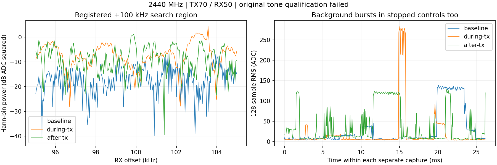

# 切回2440MHz，TX70/RX50：背景突发明显，原单音门未通过

用户要求再切回2.4GHz，选择历史成功频点2440MHz，沿用已接双端弹簧天线和TX70/RX50。
按[预登记](../evidence/B210_2440_RETURN_PLAN_2026-09-10.md)执行一次名义10秒单音，现已停发。
**三段传输/恢复通过，原单音工程门仍未通过，未复现历史合格单音结果。**
不能把这次等同于完全没有信号到达；候选峰不足以完成来源确认。

TX2440MHz/+100kHz SINE、rate2.5MS/s、BW500kHz、gain70dB、ampl0.2、25000000样本，
B2102508504 RF A/TX-RX channel0。RX1/RX0/A_BALANCED、2440MHz、rate2.5MS/s、BW1MHz、
manual50dB、settle500ms，停发前/中/后各65535ci16点，共786420字节/78.642ms非连续数据。
point1000ms、Controller15秒、runner120秒、远端35秒timeout+2秒强停。实际采前可用809249431552字节。

| 阶段 | 128点RMS中位数ADC | 最大ADC |
| --- | ---: | ---: |
| 停发前 | 8.968 | 138.493 |
| 发射中 | 5.428 | 283.245 |
| 停发后 | 12.654 | 128.506 |

预期+100kHz±5kHz内候选位于+103570.611Hz，相对停发前/后同bin差值23.119/10.777dB，
相对发射中谱中位数17.921dB。原门要求三项都≥20dB，仅第一项通过，所以保持失败。
其+3570.611Hz与历史频差接近只是线索，不视为已验证CFO或确认来源。
相同gain/BW下，本次2440MHz停发背景比上一轮3500MHz的停发数据更强、突发更明显；
这是分时有限采样比较，不能归因于已解码Wi-Fi、证明硬件故障或概括整频段长期环境。



图中时间为三段各自窗口内时间，不是同步时间轴。停发也有强突发，单看最大幅度不能判断
收到测试信号。RMS包含最后不足128点的块，ADC/FFT差值均非校准dBm，gain70不等于70dBm。
UHD实际频率/采样率/增益一致、LO locked、正常退出；BW500000数值单位Hz，MHz标签错误
沿用旧解释。尾部无时间戳S保留，未证明整个名义10秒连续输出或精确覆盖RX采样窗口。
没有自动追加发射、降低门或恢复模型。

## 实现和检查

基线7577e3a。原2440MHz收发runner不改，分析prepare增加显式expected_center_hz，
仅2440MHz/TX70/RX50新回放组合；旧3500MHz默认及数值不变，新schema区分2440MHz记录。
5项源匹配/合成控制测试通过、旧默认3500MHz精确重放通过；本轮三段原生报告/SigMF的
字节/样本/身份/generation/request/sequence、健康/timeout、零报告drop/overflow/clipping通过，
数值重复计算完全一致。sequence1428–1430，generation1789023496345–1789023496347。
绘图首次venv缺matplotlib失败，无RF操作；改用现有系统Python绘图成功并通过同一数值重放，
未安装包或改环境，已目视检查图例/坐标和三段显示。

每次核对唯一sdrd5909及43110监听、配置/启动脚本、原Controller/daemon/UHD哈希、
空闲RX/NX USB，前后NX身份wheeltec。三段两路gain/mode/port、LO/rate/BW、scan/buffer
逐次轮询恢复，最终全快照一致、health正常、同PID/哈希；三个P201瞬时目录消失。
TX owner/child退出、NX本轮空目录rmdir并确认消失、AGX runner/Controller子进程退出。
无生产制品部署、模型/训练或新socket。

[库存](../evidence/B210_2440_RETURN_EVIDENCE_2026-09-10.json)保留18文件/822734字节，
其中IQ786420字节；另Git内PNG263126字节。含计划、执行审计、IQ/报告/元数据/日志/
分析及绘图脚本，哈希/身份/人工删除命令已登记。显式清理4文件/123432字节
及空scratch，合成测试自动删除3文件786420字节（随机子目录名未记，最终scratch消失），
共7文件/909852字节。无NX副本，不修改旧证据。
执行wrapper仅为审计保留，不能用来重放。

只读重放使用现有venv python -B、PYTHONDONTWRITEBYTECODE=1、OPENBLAS_NUM_THREADS=1：

```python
import importlib.util, json
from pathlib import Path
p = Path('/home/jetson/sdrharness/jetson-agx/sdrharness/scripts/analyze-b210-3500-tone.py')
s = importlib.util.spec_from_file_location('analysis', p)
m = importlib.util.module_from_spec(s)
s.loader.exec_module(m)
m.ROOT = Path('/var/tmp/sdrharness-dev/b210-2440-return-20260910f')
assert m.prepare(70, 50, 2440000000)[0] == json.loads((m.ROOT / 'analysis.json').read_text())
```
