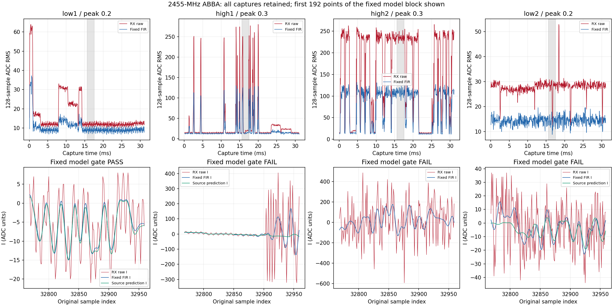

# 2455 MHz同源对照：一组通过固定门并识别为ID0，全矩阵仍失败

基线a53ea8c；按[执行前计划](../evidence/B210_2455_MARGIN_PLAN_2026-09-07.md)完成一次单音和
0.2/0.3/0.3/0.2幅度ABBA实收。**low1通过固定来源与背景门，其原始源、滤波源、
原始实收、滤波实收均预测ID0且各自四窗一致。** 另外三组失败，不挑换窗口，
没有提高幅度就能稳定识别或完整矩阵通过的结论。完整证据见
[审计](../evidence/B210_2455_MARGIN_AUDIT_2026-09-07.json)。

## 固定窗口与模型结果

全部沿用offset32768的4096点，源参考只以前16384原始点估参，固定FIR不依赖
源参考系数。门值保持四窗相关≥.9、预测残差功率≤.2、停发前后裕量均≥10dB，
另需LO抑制≥40dB和源功率保留≥99%。旧绝对安静门失败没有回写。

| 组 | 峰值 | 固定四窗相关范围 | 残差功率比例 | 停发前/后裕量dB | 模型门 |
| --- | ---: | ---: | ---: | ---: | --- |
| low1 | .2 | .99558–.99680 | .01386 | 20.60 / 17.75 | 通过 |
| high1 | .3 | .17563–.99580 | .92836 | 16.75 / 37.00 | 失败 |
| high2 | .3 | 不可可靠估计 | — | — | 参数区来源门失败 |
| low2 | .2 | .74000–.83327 | .41581 | 18.22 / 8.90 | 失败 |

high2参数区相关中位数.14638、相位拟合RMSE.91624rad，未达到原.3/.3门，因此
没有通道预测或模型放行。该组另保留不依赖对齐的全长原始/FIR统计，不用事后
对齐替换失败。可对齐三组的LO频带抑制分别95.15/95.14/95.19dB。
其预定11个后段块分别5/11、1/11、0/11通过；high2这些来源指标不可用，而非
11个新测试均已执行。没有选其中好块替换固定模型窗口。

| low1输入 | 聚合ID | 四窗ID |
| --- | ---: | --- |
| 循环对齐原始源 | 0 | 0,0,0,0 |
| 同FIR源 | 0 | 0,0,0,0 |
| 原始实收IQ | 0 | 0,0,0,0 |
| 固定FIR后的实收IQ | 0 | 0,0,0,0 |

实际16个实验窗+2个warmup，GpuLease获取/释放各1次，持有约13.66秒。
各输入四窗推理总时间约146–149ms；完整384个window logits及各mean logits保留，
输入hash、均值与argmax重新核对。模型仍是epoch-10 checkpoint
 a3c3e41ba9732171d65b023d7d9f1d334d88b7ca28be3d939b0536878c168054，
CUDA FP16 autocast、FP32常驻权重、RF-v1共享RMS/四窗mean-logit；未训练或开test。

这些是同一条train样本的有条件工程结果，不是16个独立样本的准确率。原始实收
也已经ID0，因此不能说本轮是FIR单独将ID18改成ID0。LO分离/换频后的链路能在
合格条件下得到与源一致的结果，但幅度升高的改善没有得到ABBA复现支持。
名称provisional、独立标签0、recognizer_available=false；没有生产classified、
生产温度/拒识阈值或服务部署变化。



图上方保留每组全有效65279点的RMS；下方固定取模型窗口最前192点，没有挑
好片段。绿色h/CFO源预测仅用于诊断画图，未进入模型输入。high2不画不可用的
源预测。强突发/时变相位仍存在；12份RML原始I/Q均未达到12-bit削顶码，native
质量检查也通过，不能把这些来源失败直接说成ADC削顶或某种协议干扰。

## 版本化合同和实机

version4只开放2455MHz/.2或.3/+250kHz；旧合同默认2440MHz限制保持。
B210 serial2508504、A/TX-RX/channel0、gain70、2.1MS/s/BW1.5MHz；目标2455MHz，
请求LO2455.25MHz。0.3通过float32×1.5由已有8192-byte源派生，父级hash和有效
幅度比例记录完整；实际峰值.3000000161，小于登记上限.300001。无新数据集访问。
.2/.3 payload分别c8e3d54629eb7dde75e6a49554090f570522e7b438d2602dce85a18cd1d771f9
和4210142a62664b856a1ea9716e520b7e50c8a0c5167a4930b3d235161e6885d1。

四次各20480完整1024单位/20971520点/FIFO167772160 bytes，feed约9.9613–9.9616秒，
全部正常结束。UHD标记依次SSSSSS/SSS/SSS/SSSS，无时间戳，不能映射到某个RX窗
或声称空口没有序列事件。单音停发同bin差29.62/55.42dB，谱中值差45.85dB。
15次RX共3932100 bytes，等于计划界限，全部RX1/RX0/A_BALANCED、gain40、质量/
request/session/sequence/SigMF与恢复通过。无重试，不增加发射时间或参数。

101项软件回归通过，含新幅度/父级/哈希/有限FIFO、旧频率默认拒绝新中心、错误
RX/混合频率与独立派生逐样本检查。分析/模型和可复现准备均使用amc-eval venv
NumPy1.26.4；系统NumPy1.21.5/Matplotlib仅绘制已封存原始IQ和保存的拟合参数。
它不重新决定模型门；两个旧保留包仍用原系统环境复查，结果保持。

## 保留、清理与后续

本单元保留复查ABBA（含失败组）、单音参考和模型输入必需的最小封存包；完整
路径、用途、大小/hash及删除方法见
[证据登记](../evidence/B210_2455_MARGIN_EVIDENCE_2026-09-07.json)。没有额外保留模型张量，
它们可由封存IQ按固定规则重建；同幅度源副本硬链接。NX/P201副本、构建、测试、
缓存和重复日志精确清理，完成状态和字节数见审计cleanup。用户旧证据及应用
结果不删除。下一步聚焦强突发和时变相位下的重复可靠性；先复查保留失败证据，
不继续盲目增加幅度、不追溯改门槛，也不将一组成功当作生产准入。


最终Controller observe online/healthy，P201 sdrd PID17136/hash
77d98a005305a4b7531fc3f133e9b4af521e60b065b29fcc304b4c7db80c45ae未变；RX恢复
5985999996Hz/30720000sps/BW30000000/manual gain60/A_BALANCED，scan/buffer全0。
全部15个P201 generation路径与5个NX根目录不存在，TX进程/FIFO已停止，GPU锁
额外检查可获取并释放。推理时段未发现新建/改写外部Triton或Torch缓存文件。

保留67个owner只读文件，逻辑4095134 bytes、同幅度源硬链接后独立内容4078750
bytes（约4.1MB）；不依赖旧保留包的文件路径也能重建本次模型输入。构建、测试、
绘图缓存和重复中间结果共356859383逻辑bytes（约357MB）已清理。原3.3MB和
1.6MB证据包未改写，全部保留路径/文件hash及本轮输入重建再次复核通过。

只读复查命令（不重新发射或运行模型）：

```bash
PYTHONDONTWRITEBYTECODE=1 OPENBLAS_NUM_THREADS=1 \
  /home/jetson/sdrharness/local-assets/amc-eval/runtime/venv/bin/python \
  /home/jetson/sdrharness/jetson-agx/sdrharness/scripts/validate-b210-2455-margin.py --verify-retained
```

删除时仅使用本包证据登记中的六个确切根目录，并同步标记原始回放不可用；
该命令不包含旧保留包、用户语料或应用结果。
