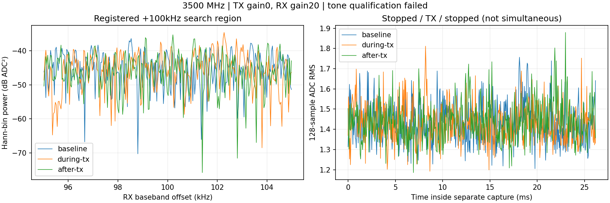

# 3500MHz弹簧天线单音：收发流程结束，低增益信号判定未通过

用户明确将实验改到3.5GHz，说明当前室内可以发射，并确认P201与N210均接
宽频弹簧天线；中断后又明确要求继续。按[本轮登记](../evidence/B210_3500_TONE_PLAN_2026-09-10.md)
只执行一次低增益单音及停发前/发射中/停发后三份对照。**传输与恢复完成，
但单音工程门未通过，尚不能确认已收到测试单音。** 没有自动提高增益重试。

## 参数与结果

外部设备仍为UHD B210 serial2508504、RF A/TX-RX、channel0（FE-TX2）；
P201为RX1/RX0/A_BALANCED。物理接法按用户报告为空口弹簧天线，无同轴
直连；天线型号、距离、3.5GHz驻波和输出功率未测，不能把gain0当成0dBm。

TX中心3500MHz、SINE偏移+100kHz，名义RF单音3500.1MHz；rate2.5MS/s、
BW500kHz、gain0dB、幅度0.2、请求25000000样本/名义10秒。UHD实际freq、
rate、gain数字回读符合请求，LO locked，进程正常退出。示例程序将带宽
数值500000后面误印“MHz”，其`--bw`帮助定义为Hz，原日志完整保留，
不能把它解释成500000MHz真实带宽。末尾保留无时间戳`SS`标记，未证明
整个发射窗口无间断，也不能把该标记准确对应到RX采样窗口。

RX中心3500MHz、2.5MS/s、BW1MHz、manual20dB、settle500ms，每份65535点
ci16_le、262140字节，三份合计786420字节、78.642ms分散样本。前后停发
背景都低，但发射中也几乎相同。

| 阶段 | 原始128点RMS中位数 | 原始128点RMS最大 | 总功率dbfs（Controller原值） |
| --- | ---: | ---: | ---: |
| 停发前 | 1.429 | 1.757 | −63.064 |
| 发射中 | 1.421 | 1.811 | −63.108 |
| 停发后 | 1.432 | 1.879 | −63.043 |

沿用+100kHz±5kHz内搜索、同一观测FFT bin与两个停发对照比较，以及相对
发射中谱中位数的原20dB单音门，不降低阈值。候选峰位于+102273.594Hz，
相对停发前/后分别17.622/12.465dB，相对谱中位数11.363dB，三项均未达到
20dB。由于判定失败，这个峰和+2273.594Hz差值不能视为已验证的单音/CFO。
不能将一个噪声区搜索极大值解释为“已经收到了，只是很弱”。



单音函数遗留的dbfs归一化参考32768，只用相同参考下的差值做工程门；
图示使用ADC²尺度。它们均不是校准的RF输入dBm。本次不能判断3.5GHz
不可用、天线不适配、发射功率是否足够或具体硬件故障；这些原因尚未分离。
当前足以说明在所登记参数下没有获得合格单音证据，后续调制保真/模型
试验不能把这次当成已通过链路。

## 实现、检查与实际边界

源码基线d9625a3。在既有runner增加仅限3500MHz/tone/RX20/TX0的入口；
该频率不接纳RML或其他增益，旧2440/2455MHz合同和默认值保持。新增严格
NX SSH选项、双路射频快照及恢复轮询，空闲检查覆盖43110与30431。
原已安装`sdr-agent`和sdrd不升级，P201仍仅接收；没有模型或训练调用。

5项既有合成单音/源匹配控制测试及3项新增范围测试通过，覆盖3500MHz仅
低增益单音、拒绝RML/相邻未登记频率/其他增益、旧合同保持。实际三次
原生报告和SigMF的字节/样本/身份/generation/request/sequence/健康/timeout、
零已报告drop/overflow/clipping均通过，单音数值精确重放通过。没有新增
取消/失败注入或模型验收；无Rust改动，不做无关构建/Clippy。

采前AGX809875648512字节可用。NX身份前后均wheeltec，测试前无发射进程或
USB占用，后验再次确认USB空闲。P201始终唯一PID5909，sdrd哈希保持
`83a661a892b8ab71de3f4e7d64064c9c65030623dc7245eb3d3a1420a696ba4f`，
Controller哈希`24b8340dd5c56bcf643a44e1eadbd11450e3b5e528d2ec72dc26103e9f23e25f`。
三次两路gain/mode/port及LO/rate/BW、全部scan/buffer均轮询恢复，最后完整
快照与初始一致，health通过；三个P201临时路径消失。NX TX owner/child已
退出，远端空工作目录已rmdir并确认不存在，没有残留发射。

```bash
PYTHONDONTWRITEBYTECODE=1 OPENBLAS_NUM_THREADS=1 \
  local-assets/amc-eval/runtime/venv/bin/python -B \
  jetson-agx/sdrharness/scripts/analyze-b210-3500-tone.py --verify
```

## 保留与清理

[库存](../evidence/B210_3500_TONE_EVIDENCE_2026-09-10.json)登记
`/var/tmp/sdrharness-dev/b210-3500-spring-20260910a/`下15文件、816510字节。
包括三份IQ共786420字节、SigMF元数据、原生报告、exclusive attempt receipt、
完整操作/前后验审计、UHD日志及未通过的单音分析。库存逐文件保存SHA-256、
字节、source/session/request/sequence、profile/预处理和精确人工删除命令。
不复制训练波形、旧IQ或权重，不覆盖旧3.5GHz之外的封存实验。

显式清理4文件共123432字节（三个空stderr日志和字体缓存），scratch及子
目录确认消失。另有3份合成测试IQ共786420字节由TemporaryDirectory删除；
其随机子目录名未单独留存，最终scratch为空后删除。显式与测试合计删除
7文件/909852字节，不把内存数组计入。NX不保留副本，新socket0，旧证据不动。
本次交付是有限试验及记录完成，单音资格仍未通过，不提升recognizer_available。
