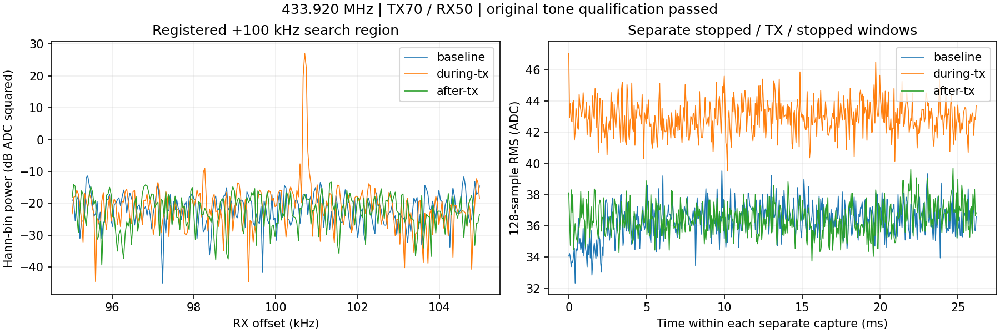

# 433MHz天线、433.920MHz单音通过：背景较平稳

用户说明此前失败的3.5/2.4GHz试验使用标称70MHz–6GHz宽频弹簧天线，随后报告换433MHz天线并要求试验。
按其避开2.4/5GHz背景的意图，选择历史433.920MHz，执行前说明频率/参数，依
[预登记](../evidence/B210_433920_ANTENNA_PLAN_2026-09-10.md)只发一次，现已停发。
具体天线更换端/型号未报告，原端口和室内条件沿用。**原单音门三项全部通过。**

## 参数与结果

B2102508504 RF A/TX-RX channel0，TX中心433.920MHz、SINE+100kHz，名义RF434.020MHz，
rate2.5MS/s、BW500kHz、gain70dB、ampl0.2、25000000样本/名义10秒。P201仅
RX1/RX0/A_BALANCED、433.920MHz、rate2.5MS/s、BW1MHz、manual50dB、settle500ms，
前/中/后三段各65535ci16点，共786420字节、78.642ms非连续数据。point1000ms、Controller15秒、
runner120秒，远端timeout35秒+2秒强停。实际采前AGX可用809244237824字节，逐段检查。

| 单音判据 | 本次dB | 原要求dB |
| --- | ---: | ---: |
| 对停发前同一bin | 44.621 | ≥20 |
| 对停发后同一bin | 44.269 | ≥20 |
| 对发射谱中位数 | 54.756 | ≥20 |

登记+100kHz±5kHz内峰为+100709.545Hz，约+710Hz只是FFT频差估计，未独立校准CFO。
通过证明当前单音可见性，不证明调制保真/模型可用、全频段长期安静或天线因果。

| 阶段 | 128点RMS中位数ADC | 最大ADC |
| --- | ---: | ---: |
| 停发前 | 36.444 | 39.530 |
| 发射中 | 42.934 | 47.071 |
| 停发后 | 36.417 | 39.701 |

相较上一轮2440MHz换天线试验停发最大208.133/133.873ADC，本次窗口内无类似强突发，
曲线更平稳；但停发中位数36.4高于上一轮9.138/7.855，因此不能说整体背景功率更低。
频率、天线和时间均改变，未经噪声系数/输入功率校准，ADC尺度不能直接换算dBm。

事后只读检查整个窗口复均值，停发直流功率占比约0.0030%/0.0012%，去均值RMS
36.366/36.490ADC，与原RMS36.366/36.490近乎相同，不能把较高RMS归因于直流偏置。
±500kHz内排除±10kHz后最强停发Hann bin为0.093/0.125ADC²，发射中单音bin为
513.287ADC²；这只是登记的事后分量检查，不是对背景来源/固定杂散/热噪声的完整分类。
派生记录为background-components.json，不改变原资格门。



三条时间曲线为各自窗口内时间。UHD实际freq/rate/gain一致、LO locked、正常退出，
BW500000数值为Hz（日志MHz文字错误沿用旧解释），尾部无时间戳S保留。
没有证明整个名义10秒连续输出，gain70不是70dBm。没有自动追加发射/提升增益。

## 实现与检查

基线70c4c74，原runner新增仅显式433.920MHz tone/TX70/RX50，拒绝RML、错增益、未指定TX
和相邻未登记频率；旧默认保持。分析prepare增加该频率和独立schema，不修改旧结果。
12项paired/边界测试、5项源匹配/控制测试通过；旧3500MHz默认精确重放通过。
本轮三份原生报告/SigMF字节/样本/身份/request/generation/sequence、health/timeout及零报告
丢样/溢出/削顶通过。sequence1434–1436，generation1789025376950–1789025376952。
原venv分析精确重放通过；系统Python绘图核对同文件hash/通过标志及三项差值≤1e-10dB后通过，
仅绘图使用跨数值库容差，不降低原20dB门；图例/坐标目视检查完成。

预后验NX身份wheeltec/wheeltec、USB2508504空闲，P201唯一sdrd5909、43110监听、持久配置/脚本、
原Controller/daemon/UHD哈希核对。三段两路gain/mode/port、公共LO/rate/BW、全部scan/buffer
逐次轮询恢复，最终全快照一致、health正常、三个P201路径消失；TX owner/child退出，NX空目录
rmdir且消失，AGX runner/Controller子进程退出。无生产部署/模型/训练/locked test或新socket。

[库存](../evidence/B210_433920_ANTENNA_EVIDENCE_2026-09-10.json)保留19文件824423字节，IQ786420字节；
另Git内PNG324782字节。计划/执行审计/原始数据/报告/元数据/日志/分析/派生及绘图脚本均有
哈希、source/request/session和人工删除命令。显式清理4文件123432字节及空scratch，测试自动
删除8文件786433字节（随机子路径未記，最终scratch消失），共12文件909865字节，无NX副本。
旧证据不改写。宽频天线70MHz–6GHz标称不等于全频段良好匹配，当前证据仍不能判定旧天线损坏。

只读重放：现有venv python -B，PYTHONDONTWRITEBYTECODE=1、OPENBLAS_NUM_THREADS=1：

```python
import importlib.util, json
from pathlib import Path
p = Path('/home/jetson/sdrharness/jetson-agx/sdrharness/scripts/analyze-b210-3500-tone.py')
s = importlib.util.spec_from_file_location('analysis', p)
m = importlib.util.module_from_spec(s)
s.loader.exec_module(m)
m.ROOT = Path('/var/tmp/sdrharness-dev/b210-433920-antenna-20260910h')
assert m.prepare(70, 50, 433920000)[0] == json.loads((m.ROOT / 'analysis.json').read_text())
```
