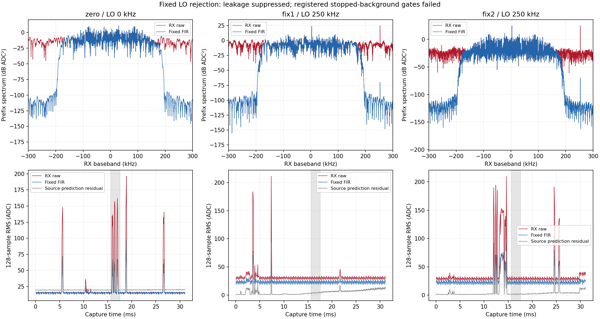

# 本振泄漏在工程输入链路中已抑制，背景门仍失败

基线f7171ae；执行[登记计划](../evidence/B210_LO_REJECTION_PLAN_2026-09-07.md)。**已实现并
实测验证+250 kHz TX LO分离和AGX固定FIR的泄漏抑制**，两次实收谱功率抑制
94.63/94.75 dB，零偏移负对照约0 dB。修复的是当前窄带工程信号的输入污染；
B210仍会在偏移LO位置辐射该分量，没有宣称硬件元件修好或生产RF-v1已修改。
完整有界记录见[审计](../evidence/B210_LO_REJECTION_AUDIT_2026-09-07.json)。

## 修复实现与直接证据

复用原1024点发射合同和有界收发Runner，不另建存储/无线控制体系。
目标信号固定2440 MHz、B210实际请求LO2440.25 MHz，源IQ/采样率/功率不变。
AGX用257-tap、cutoff175 kHz、Kaiser beta8的固定实对称FIR，两端各舍128点，
保留原始offset。没有去均值、重采样、源参考偏置扣除或按分类结果调整参数。
系数SHA256 d0e12014bedae088b71366497299adc3a1be0a45cf622e9cbb346d4ea0c8c8be。

设计响应140 kHz内最大幅度偏差0.00006723，210 kHz以上最差阻带−86.48 dB。
实际单1024源经相同滤波保留99.9066%功率，归一化波形失真功率0.00083486，
复杂均值差0。原始源hash与上次完全一致，只访问同一train行102400，不读test。

| 固定组 | LO偏移 | 实收LO频带抑制 | 固定4096点的四窗相关范围 | 源预测残差功率比例 |
| --- | ---: | ---: | ---: | ---: |
| zero | 0 | 0.000089 dB | 0.2253…0.3204 | 1.13281 |
| fix1 | +250 kHz | 94.6330 dB | 0.99902…0.99917 | 0.03071 |
| fix2 | +250 kHz | 94.7478 dB | 0.99747…0.99785 | 0.005715 |

谱抑制用参数区内部相同Hann窗、预期LO±500 Hz求和，受有限窗/数值噪声限制，
不是射频发射功率计或dBc测量。源预测仅用前16384个原始点拟合的复增益和CFO，
未用后段或扣掉拟合偏置。相关为各1024点中心化复相关，比例是固定预测残差，
不是误分类率或经过校准的SNR。zero含源中心泄漏与背景扰动，不宣称组间全部
差异均由滤波造成；同一次fix的前后谱对照和zero负对照直接证明分离/抑制作用。



全部65279个有效样本保留在对应统计中，每组510个128点段（末段127），未挑段。
另保留每组预定11个后段4096点块。图灰区是执行前固定的offset32768…36863。
滤波有限halo不回用于参数估计，模型输入源仅按已固定整数lag循环对齐。

## 未通过的背景门与模型跳过

fix1/fix2的固定实收块虽然和源高度相关，但停发前同offset的滤波功率分别比
发射中还高0.93/4.47 dB，未满足发射中比停发前后均高10 dB的登记门。
停发后裕量为11.76/28.10 dB；zero的来源、残差和停发前门也失败。
全段11块按同一规则分别只有0/3/4块通过，全部结果保留，不能挑这些通过块
替代固定模型窗，也不能把3/11或4/11说成准确率。

因此三组固定模型窗均未准入，本轮**模型/warmup=0**。执行了严格准备复核和
空集合跳过路径，没有加载模型，没有新的分类改善结论。冻结epoch-10、FP16
及FP32权重、RF-v1四窗共享RMS均未更改；独立标签0、名称provisional、
recognizer_available=false，生产服务未部署这套工程FIR。

剩余问题是间歇背景/接收扰动及相位变化。本轮滤波修复不能消除落在源频带内的
干扰；下一独立单元先定位/减轻背景，并预登记新的固定模型对照，旧失败保持。
该175 kHz低通仅适合本次已验证窄带源，不能用于任意未知调制/带宽，不能用一条
train源的成功滤波替代RF-v1生产预处理的重新验证。

## 实机、软件和清理

单音一次，随后zero/fix1/fix2各一次RML，不重试；总12次65535 ci16，3145680
bytes，等于登记上限。固定RX1/RX0/A_BALANCED、gain40，RML2.1MS/s/BW1.5M；
每次RML20971520点/20480完整1024单位/FIFO167772160 bytes，均正常结束。
所有native质量/身份/SigMF/hash/请求与session绑定及恢复通过。单音停发差与
UHD无时间戳事件标记保存在审计，不把FIFO完成说成无空口序列事件。

89项软件回归通过，覆盖固定DC/频带保真、分离LO抑制/零偏移负例、有限halo和
原始坐标、坏输入、固定窗失败不加载模型、准备篡改拒绝及原有有限TX/身份验证。
新增acquire入口把同样已在本次RF前执行的源/FIR预检固化为启动前硬门。
清理前所有sealed准备逐字段复现；独立FFT卷积核对9份RX共587511个滤波样本，
最大绝对差1.15e−13 ADC单位。单音停发差51.57/44.37 dB；三次RML均有无时间戳
SSS标记，原样保留，不虚构与RX突发的时序关系。

最终Controller observe online/healthy；sdrd PID17136/hash
77d98a005305a4b7531fc3f133e9b4af521e60b065b29fcc304b4c7db80c45ae未变。RX恢复
5985999996Hz/30720000sps/BW30000000/manual gain60/A_BALANCED，scan/buffer全0。
4个NX根目录/所有TX进程/FIFO及12个P201 generation路径已删除或确认不存在。

## 用户要求保留的最小诊断证据

用户在本单元清理前明确允许保留必要的问题诊断证据，并要求记录、清理其余数据，
随后要求写入项目agent规则。已更新根AGENTS.md第8/10/11条。此次没有把保留误报
成目录已删除：保留53个文件，逻辑3272399 bytes，源payload三条封存路径硬链接
到同一8192-byte文件后，独立文件内容3256015 bytes（约3.3 MB）；均设为owner只读。
保留原路径避免破坏native/SigMF/父级封存绑定，不另建应用存储或额外IQ副本。

保留范围是zero/fix1/fix2各停发前/中/后IQ、单音频差参考和严格复查必需的
report/meta/source/TX记录，另留一个矩阵seal。它们支撑已完成泄漏抑制和未解决
背景门的复查，避免为下一次分析重新发射。同一矩阵的失败对照也保留。
完整路径、用途、source/capture/request/session、大小/hash和手工删除命令见
[证据登记](../evidence/B210_LO_REJECTION_EVIDENCE_2026-09-07.json)。用户原有语料和结果未动。

构建、测试、绘图缓存、prepared副本、运行暂存等共356821446逻辑bytes（约357 MB）
已清理；未保留NX/P201副本。五个AGX根目录只剩登记文件，清理后再次逐文件校验
hash并完整重算sealed诊断，结果复现。复查命令不发射、不加载模型、不写临时IQ：

```bash
PYTHONDONTWRITEBYTECODE=1 OPENBLAS_NUM_THREADS=1 python3 \
  /home/jetson/sdrharness/jetson-agx/sdrharness/scripts/repair-b210-lo-leakage.py --verify-retained
```

诊断结束且用户决定删除时，登记中的manual_delete_command只指向这五个确切根
目录；执行后需同步标记原始证据不再可回放，保留Git中的有界结果/hash记录。
