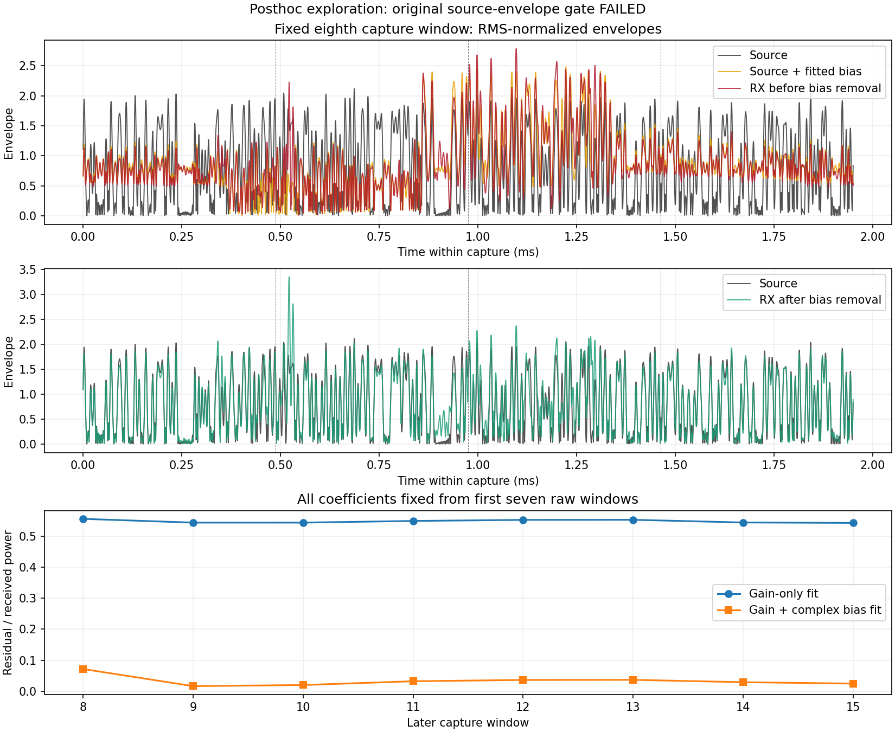

# B210/P201 复偏置双向探索（来源门失败）

基线4bb14681154e3884449c0af228ab01999ac6e490。见[原预登记及模型前范围变更](../evidence/B210_RX_AFFINE_PLAN_2026-09-06.md)、
[有界审计](../evidence/B210_RX_AFFINE_AUDIT_2026-09-06.json)。**原定合格双向验证未完成；工具、
有限实机执行和明确标记的后验探索完成。** 不把后验结果重写成预登记通过。

## 结果与限制

| 固定第8窗输入 | 四窗实验ID | 聚合ID | 未校准概率 |
| --- | --- | ---: | ---: |
| 带限对齐源x | 0/0/0/0 | 0 | 0.999961 |
| 源纯增益/相位h*x | 0/0/0/0 | 0 | 0.999907 |
| 源加复偏置h*x+b | 18/16/18/18 | 18 | 0.997866 |
| 原始实收 | 9/1/2/18 | 18 | 0.631345 |
| 实收tone CFO+带限 | 18/0/2/18 | 18 | 0.980646 |
| 再补偿剩余频差的实收y | 18/16/18/18 | 18 | 0.975136 |
| 去偏置实收y-b | 0/0/2/2 | 0 | 0.706405 |

出现了与复偏置假设一致的双向变化：源增加拟合b后，聚合ID0→18；实收减去同一b后，
聚合ID18→0；纯h增益/相位源仍为0。加偏置源与实收y的四窗ID也一致。
这不等于完整修复：去偏置后仍有两个窗口为ID2；概率未校准；本轮来源门未通过；
h/b依赖已知train源，不能当成未知信号的通用补偿或定位到某个硬件部件。

固定系数在后8窗的残差/接收功率中位数：无偏置模型0.54655，复增益+偏置模型
0.03083；去中心化复相关中位数0.99738。残差不是独立AWGN信噪比。固定第8窗
归一化包络5%分位：源0.03875、加偏置源0.24515、实收y约0.24915、去偏置后0.06975。
图展示完整4096点而非只选看起来最好的子窗。

## 来源门失败及明确范围变更

单音三对照通过：同bin发射中比两个停发对照高52.002/63.289 dB，高于谱中值
60.817 dB，测得tone频差+3456.16846 Hz。RML固定包络lag776，后8窗中位数
**0.339667<0.5**；最大停发绝对值0.003654，差值0.336013。原0.5/0.2/0.3工程
门仍判失败，没有降低阈值。15窗最佳lag均为776也不能替代原失败判据。

默认路径因此只生成源/原始实收/tone带限实收三组准备记录，没有执行它们的模型
推理。看到来源失败和可计算的前段复偏置后，在首次模型调用前明确追加“后验探索”
范围，工具必须显式传`--exploratory-source-failure`。原默认准备记录及hash保留，
另存exploratory准备/结果，`source_control_passed=false`及
`qualified_bidirectional_validation=false`贯穿JSON、图和本文。

本次变更只允许观察原预算内的七组，不放宽RF质量、剩余频差、矩阵条件或生产门。
共用exclusive inference-started receipt，验证第二次默认推理会在加载模型前拒绝；
因此实际总计28实验窗+Backend固有2次warmup，没有额外三组或结果驱动重发。
来源包络门对复偏置场景是否适用需要下一轮预先登记、独立执行；不能倒改本轮资格。

## 参数估计与双向对照的方法

模型输出前固定：只截取前7×4096个**原始**样本，独立做tone移频、source频带FFT
带限、lag和相位斜率估计。后段原始数据没有经过全长FFT反向影响拟合系数，测试
已验证任意修改后段时整个估计记录不变。完整65535点的对应变换只用于后段验证
及模型输入生成，绝不回用于参数估计。

前7窗复相关约0.668–0.674，相位拟合RMSE0.02010 rad，剩余频差−83.64945 Hz，
通过0.2相干/0.2 rad/±200 Hz的已登记估计门。相位斜率仍有512.6953125 Hz混叠
周期，依赖已知source与unwrap假设，不称为通用盲CFO估计。

对前段剩余频差补偿后，最小二乘估计`y=h*x+b`：

- h≈−50.862887+159.237090j，b≈14.263808−6.589397j，单位从源fc32映射到ADC数值；
- 设计矩阵condition≈10.738，b幅度约为h*x源RMS的0.943倍；
- 同时独立拟合无偏置基线h0，保持所有系数不变评估后8窗。

b是独立截距，**没有直接减去接收均值**；源自身真实非零均值保留。源反向组h*x+b
不含实收残差，是明确合成的反向试验；实收y-b仍含未被偏置解释的真实残差。
同一capture内前段拟合/后段验证不等于独立dataset split、V1b标签或类别覆盖。

所有组固定取第8窗offset28672，共享RMS/顺序四窗、冻结epoch-10、FP16 autocast+
FP32权重、FP64 mean-logit后softmax。前段估计和输入hash先保存，推理前重算一致。
原失败准备及探索准备都保留，最终代码重算的七组hash逐一匹配真实推理；系统
NumPy/Matplotlib绘图也逐一验证相同hash。GPU租约约61.51秒，1次获得/释放，
180秒进程上限，正常退出；没有训练或完整精度实验。

## 有限RF执行与验证

仅两个注册burst：NX+B210 serial2508504，RF A/TX-RX/channel0，LO2.440 GHz，
TX gain70/peak0.2。tone为+100 kHz/2.5 MS/s/BW500 kHz/25000000样本；RML为
2.1 MS/s/BW1.5 MHz/21000000样本，各名义10秒，RML FIFO实际168000000 bytes。
UHD正常退出但仍保留末尾S标记，不声明无序列事件。

P201固定RX1/RX0/A_BALANCED、gain40；tone RX 2.5 MS/s/BW1 MHz，RML RX
2.1 MS/s/BW1.5 MHz，中心2.440 GHz。各启停前/中/后65535 ci16，settle500ms、
timeout1000ms，六次共1572840 bytes，等于上限；无削顶/丢样/溢出/timeout/身份错误。
每次记录计划/空间/目录/直接stop并恢复原RX状态，未追加发射或改变射频参数。

复用同四条train行102400/102401/102403/102404，tile hash仍为
c95ac58c1fd91ef4da992622dbdf70a9bc5884d0941419083451473a052f534e；未读新行或locked test。
源IQ本身已带数据集生成时的噪声，四条样本Z标签均为标称+30 dB；本轮发射只做
统一幅度缩放，没有额外软件加噪。数据集原SNR、叠加实际射频链路后的总SNR和
拟合残差不是同一个量，不能将实收继续标为+30 dB。
40 dB及已知源补偿不符合现有生产实收合同，未伪造50 dB元数据、写生产DTO或应用库。
数字ID可信、名称provisional、独立标签0、recognizer_available=false；50 dB/V1b/V2/
V3/A1不勾选。

35项无RF软件测试通过，新增复偏置恢复且保留source均值、固定系数后段残差、
原始后段不影响估计（包括FFT）、病态/非有限拟合拒绝、准备被改动时禁止推理、
探索模式保留来源失败且不能绕过其他估计门。已有TX测试使用fake UHD，无额外发射。
Python AST、diff和图像审查通过。

P201 sdrd PID17136/hash77d98a005305a4b7531fc3f133e9b4af521e60b065b29fcc304b4c7db80c45ae
不变，恢复RX LO5985999996/rate30720000/BW30000000/manual gain60/A_BALANCED，
全部scan/buffer为0。原RX LO只用于恢复，TX始终2.440 GHz。NX进程/FIFO与六个
P201 transient确认不存在；最终审计cleanup.verified=true。

已在AGX和NX分别精确删除本单元b210-affine-906f、b210-affine-tone-906f两目录，
核对路径无符号链接、无占用进程且删除后不存在；测试临时目录
/var/tmp/sdrharness-dev/b210-control-test-391093也确认不存在。删除前全部保留证据hash匹配。
保留有界原失败/探索证据、图和hash；不留Git IQ/tensor/完整logits，不删用户语料/
应用结果，不改变生产服务或其他项目已暂停的采集。
