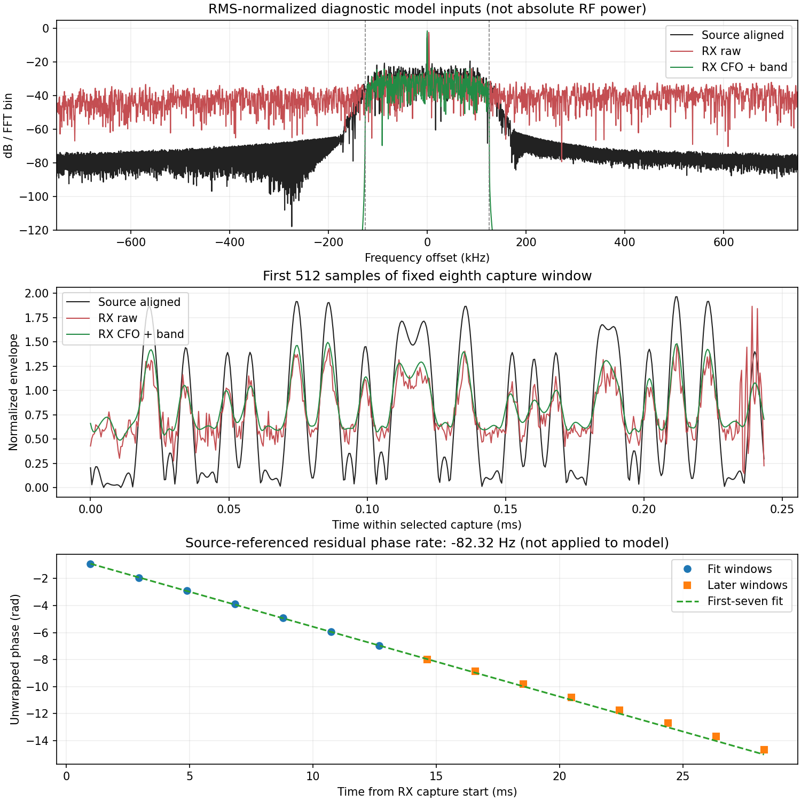

# B210/P201 实收保真度与补偿对照验证

基线cf03ed696c5f53eab025af353ba973019f830c7e；[预登记及补充说明](../evidence/B210_RX_FIDELITY_PLAN_2026-09-06.md)，
[有界审计](../evidence/B210_RX_FIDELITY_AUDIT_2026-09-06.json)。本单元完成有限实收、源关联、
原始/补偿模型比较和只读后验相位诊断；没有找到已验证的识别修复。

## 主要结果

**原始实收再次得到ID18，仅CFO补偿、仅带限和两者组合均未改变聚合ID。**
源的原始及带限对照都得到ID0。以下概率全部未校准：

| 固定第8个4096窗的输入 | 四窗ID | 聚合ID | 未校准概率 |
| --- | --- | ---: | ---: |
| 对齐源 | 0/0/0/0 | 0 | 0.999967 |
| 对齐源带限 | 0/0/0/0 | 0 | 0.999944 |
| 实收原始 | 17/18/18/18 | 18 | 0.948179 |
| 实收仅CFO补偿 | 17/17/18/18 | 18 | 0.959997 |
| 实收仅带限 | 18/18/18/18 | 18 | 0.998485 |
| 实收CFO+带限 | 18/18/18/18 | 18 | 0.997768 |

预登记的固定相位组被跳过：CFO+带限后的前7窗direct整体复相关幅值仅0.0942，
低于0.2门，不能用不稳定的跨窗常量相位估计强行生成该组。实际只运行24个实验窗，
并非28个；Backend仍只有固有2次warmup。

这次比“预测不一致”多了两个具体线索：

- source自身99.0%功率在±125 kHz内，实收仅约68.4%在这个频带内（完整65535点），
  约31.6%在外；这不是外部信号类型标签，也不是AWGN信噪比。但去掉该频带外成分
  仍未恢复ID0，因此带外功率占比本身不足以解释全部问题。
- 固定4096点、各自共享RMS归一化后，源包络5%分位为0.0208，实收为0.3972，
  CFO+带限后仍为0.5180；相应95%分位为1.7407/1.6654/1.5585。低幅段明显抬高，
  源与补偿实收的归一化复均值幅度为0.3521/0.7097。这提示应检查额外载波/复偏置、
  包络对比度和链路非线性，不能仅按白噪声处理；还不能据此断言具体硬件根因。

## 源关联与相位诊断

新tone观测得到+3418.020905 Hz频差，而非直接复用上次+3532.46 Hz。
单音发射中同bin比两个停发对照高86.181/53.070 dB，高于当时谱中值51.215 dB，
通过既有20 dB门。RML固定lag2749，后8窗固定lag包络相关中位数0.854151，最大
停发绝对中位数0.008820，差值0.845331，通过0.5/0.2/0.3工程源关联判据。

使用raw或对应带限源周期序列，对每个实收路径分别做direct/conjugate复标量
最小二乘`y=h*x`，只用前7窗估计h，保持不变评估后8窗。CFO+带限路径的direct
后8窗复相关幅值中位数0.8151，conjugate为0.3550；原始实收相应仅0.0224/0.0791。
这些相关都不是身份/标签准入，也没有按结果选择共轭模型或转换I/Q。

模型结果后才补充相位变化统计，**未修改任何已准备模型输入或追加推理**。
对CFO+带限路径每4096窗估计复系数，第一批7窗各自相关约0.824–0.834，但合并
七窗常量相位拟合很差。只用这七个系数的展开相位拟合直线，得到源参考剩余相位
速率约−82.3205 Hz，前段相位RMSE0.0192 rad，后8窗预测RMSE0.2409 rad。

这解释了为什么单窗相似而跨窗固定相位不稳定，也提示独立tone测频不能直接等同
RML片段的最终相位速率。估计具有512.6953125 Hz的整周期混叠歧义，并依赖已知
source和unwrap假设；不能称为通用盲CFO估计或已验证LO误差。该剩余速率没有施加
到本轮模型输入，剩余速率/载波偏置补偿仍需下一独立验证，不宣称已修复。

## 有限RF与模型执行

只有两个注册burst：B210 serial2508504、RF A/TX-RX/channel0、LO2.440 GHz、
TX gain70/peak0.2。tone为+100 kHz、2.5 MS/s、BW500 kHz、25000000样本；RML为
2.1 MS/s、BW1.5 MHz、21000000样本，各名义10秒。RML FIFO feed168000000 bytes。
两个UHD工具正常退出，日志仍保留末尾`S`，不声称全程无TX序列事件。

P201固定RX1/RX0/A_BALANCED、gain40；tone RX rate2.5 MS/s/BW1 MHz，RML RX
rate2.1 MS/s/BW1.5 MHz，中心均2.440 GHz。两组各启停前/中/后65535 ci16，
settle500ms、timeout1000ms，共1572840 bytes，等于预登记上限。六次捕获无
削顶/丢样/溢出/timeout/身份错误。每次打印计划/空间/路径/stop并恢复实际原状态。

复用同四条train行102400/102401/102403/102404，未读取新行或locked test。
source tile hash仍为c95ac58c1fd91ef4da992622dbdf70a9bc5884d0941419083451473a052f534e。
完整原始IQ保留到本单元分析结束；第8窗offset28672在模型输出前固定，不能按
预测挑选。CFO来自独立tone，带宽来自source自身，lag及h来自前7窗；后8窗不是
独立dataset split或V1b样本。

对完整65535点做离线CFO/FFT带限再截取中部4096点，FFT保留DC，不重采样。
复用相同共享RMS/顺序四窗、冻结epoch-10、FP16 autocast/FP32权重、FP64 mean-logit。
先保存source-only准备JSON和六个模型输入hash，推理前重算并逐字段比对；原始
实收模型输入也与未经变换的ci16切片normalize结果逐字节一致。GPU租约约62.07秒，
1次获得/释放，180秒外层上限，进程正常退出。绘图用系统NumPy/Matplotlib，六个
重算输入hash也逐一匹配实际推理输入；图仅展示归一化输入，不是绝对RF功率。

这是40 dB、未硬件候选调谐的实验记录。离线变换未进入生产RF-v1，没有伪造50 dB
CaptureMetadata、生产DTO、classified或应用归档。数字ID可信、文本provisional，
独立标签0，recognizer_available=false；50 dB/V1b/V2/V3/A1仍未完成。

## 测试和清理

29项无RF软件测试通过，新增保真度测试覆盖：带内外功率和带外单音抑制、CFO
往返/DC保留、前7窗独立拟合及后段相位变化的残差、direct/conjugate区分、非法
形状/功率/频差拒绝、准备记录被改动时禁止加载模型、剩余相位速率拟合与后段验证。
已有FIFO测试使用fake UHD，不计为额外RF发射。Python AST、diff检查及图像审查通过。

P201 sdrd PID17136/hash77d98a005305a4b7531fc3f133e9b4af521e60b065b29fcc304b4c7db80c45ae
不变；恢复RX LO5985999996、rate30720000、BW30000000、manual gain60、A_BALANCED，
所有scan/buffer为0。这个LO是原RX设置恢复，TX始终只有2.440 GHz。NX子进程/FIFO
和六个P201临时路径已确认不存在。最终精确清理已验证（审计`cleanup.verified=true`）。

仅清理AGX/NX `/var/tmp/sdrharness-dev/b210-fidelity-906e/` 与
`/var/tmp/sdrharness-dev/b210-fidelity-tone-906e/` 及测试临时目录，保留bounded审计/
图像/hash；不在Git存IQ、tensor或完整logits，不删除用户语料、应用结果或改变
其他项目已暂停的采集和生产服务。
