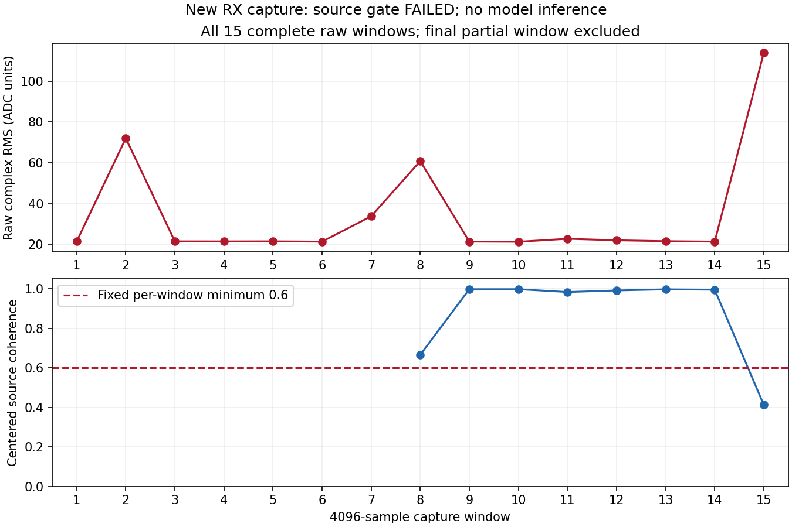

# B210/P201固定v4实收：出现短时扰动，来源门失败，未运行模型

基线 `9e656f1a5851d1b10f13ac00a118d6ad1215c5a4`。见
[执行前登记](../evidence/B210_V4_LIVE_PLAN_2026-09-06.md)、
[有界审计及六份接收证据](../evidence/B210_V4_LIVE_AUDIT_2026-09-06.json)。

六次接收的质量/身份/字节与恢复检查完成，固定v4已接入真实输入封存和推理前门。
**本次v4来源门失败，合格复偏置双向验证未完成；实际模型窗和warmup均为0。**
没有修改门槛、删除异常窗口、后验放行或追加发射。

## 本次观测

单音启停门通过：发射中比两个同bin停发对照高53.6896/37.9343 dB，高于谱中值
65.5255 dB；独立tone频差+3608.75868 Hz。

RML前7窗的固定v4拟合为lag2418、剩余频差−79.74709 Hz、相位RMSE0.03098 rad、
最小前段相关0.48041，估计门通过。源自身99%半带宽125 kHz，去DC有效bin数约16.75。
固定后8窗相关如下：

| Capture窗 | 固定v4同源相关 |
| --- | ---: |
| 8（原定模型窗） | 0.665742 |
| 9 | 0.997284 |
| 10 | 0.997361 |
| 11 | 0.982974 |
| 12 | 0.991052 |
| 13 | 0.996604 |
| 14 | 0.994859 |
| 15 | **0.412561** |

中位数0.992955通过，但第15窗低于固定各窗0.6下限。31个错源最大相关0.467455，
最差同源减最强错源裕量−0.054895也失败。停发对照最大相关0.086774、条件阈值
范围0.137367–0.264162，停发门通过；条件噪声相位假设仍未被认定为现场事实。
旧包络门单独保留，0.336019<0.5也失败；不能以新旧结果的有利部分拼成通过。

门失败后只补充固定原始窗的RMS/峰值及相邻重复度，无新拟合或参数搜索。多数窗
原始RMS约21 ADC单位，第2/8/15窗约71.98/60.79/113.82；第8窗峰值约656.93，
第15窗与前一窗的原始重复相关仅0.18446。图保留全部15个完整窗，末尾4095点
不参与既定来源验证。它支持“存在短时大功率扰动”，不确定扰动来自外界、B210
发射流或P201接收瞬态，也不能据此计算调制识别准确率。

UHD正常退出但末尾有`S`；该标记没有与异常窗对应的时间戳，不能直接认定因果。
后续应先做有界停发背景/时域扰动对照并核对发射流时序，再预登记新来源与偏置
复验；本次不能通过重复发送或挑选较好窗口继续模型比较。

## 有限实机与绑定

仅两个已登记burst，NX+B210 serial2508504、RF A/TX-RX/channel0、LO2.440 GHz、
TX gain70/peak0.2。tone为+100 kHz、2.5 MS/s、BW500 kHz、25000000样本；RML为
2.1 MS/s、BW1.5 MHz、21000000样本。各名义10秒，RML实际馈送168000000 bytes，
feed约9.966秒，正常结束并停止子进程。

P201固定RX1/RX0/A_BALANCED、manual gain40；tone接收2.5 MS/s/BW1 MHz，RML
接收2.1 MS/s/BW1.5 MHz；中心均2.440 GHz。各启停前/中/后65535 ci16，六次共
1572840 bytes，等于上限。native报告无丢样、溢出、削顶、timeout或身份错误；
这不排除报告未覆盖的瞬态干扰。每次记录有限计划/空间/目录/直接stop并恢复状态。

复用同四个train行102400/102401/102403/102404，原tile哈希保持
c95ac58c1fd91ef4da992622dbdf70a9bc5884d0941419083451473a052f534e。源本身标称
SNR+30 dB，仅幅度缩放，没有新增软件噪声或读取新行/locked test。

新工具严格关联六份native report、父link、request/session/generation/sequence、
固定RX身份、SigMF实际字节及rate/BW/gain元数据，封存IQ/meta/report/source/TX
结果hash。最终重算seal和准备逐字段一致。真实失败输入的推理入口负例在模型
加载前拒绝，没有创建GPU租约、inference marker或结果文件。七组预算全部未使用。
这也保留了生产`recognizer_available=false`、独立标签0、名称provisional；40 dB
不冒充50 dB合同，不更新V1b、校准、locked test或生产准入状态。

## 软件验证、恢复和清理

64项软件测试通过，新增8项覆盖六份真实格式报告的绑定基础、错误RX身份、
request/session/质量/恢复冲突、错误gain元数据和符号链接、原始hash篡改、失败
来源/准备变更在模型前拒绝，以及固定窗口短时功率升高的统计。既有模型只复用
有限推理执行器源码，没有运行模型。Python AST、diff与图像检查通过。

最终P201只读observe为healthy，sdrd PID17136、哈希
77d98a005305a4b7531fc3f133e9b4af521e60b065b29fcc304b4c7db80c45ae不变；恢复
RX LO5985999996/rate30720000/BW30000000/manual gain60/A_BALANCED，scan/buffer
全0。原RX LO仅用于恢复，所有发射均为2.440 GHz。NX发射进程/FIFO及六个P201
transient均已确认不存在。

本单元AGX/NX的b210-v4-live-906j和b210-v4-tone-906j两个根目录均已精确删除并
确认不存在，删除前全部封存/保留证据hash匹配；测试目录b210-control-test-396570
与b210-control-test-397144也确认不存在，审计cleanup.verified=true。
保留有界审计/图/hash，不保留IQ、tensor
或完整logits进Git，不删除用户语料或应用结果，不改变生产服务或已暂停的其他采集。
