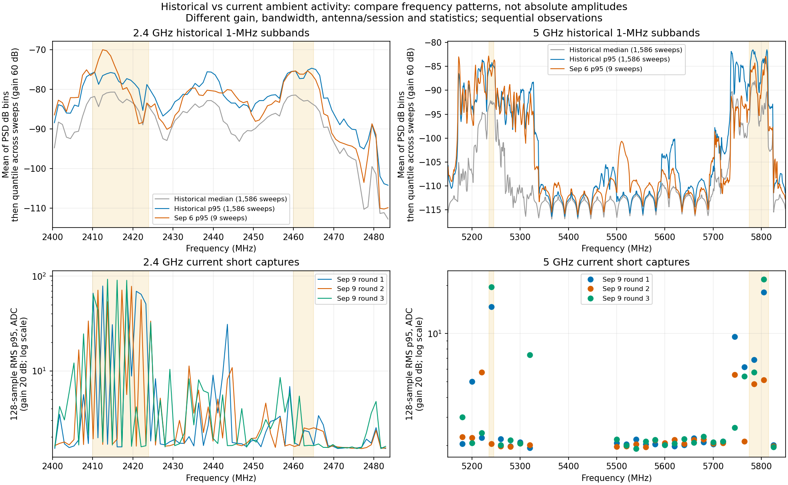
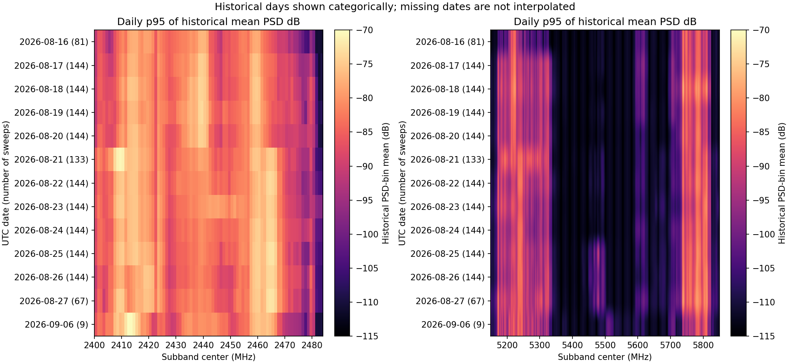

# Agent历史宽频记录与当前背景：频段分布大体对应，不能等同幅度或来源

用户要求读取AGX `/home/jetson/agent` 中以前宽频、长时间扫频记录，检查是否
与当前背景相符。此次只读历史元数据/特征CSV和当前封存摘要，RF/model/
训练/locked-test调用均0，未启动旧Agent采集器或修改旧工程源码/数据。

**结论：频段层面大体对应，5GHz尤其明显；每个峰和活跃宽度并不完全相同。**
历史5.2GHz和5.8GHz较活跃，中间大部分区域较低，与当前5240/5745/5785/5805MHz
短时活动和5.5–5.6GHz低背景相符。最近9月6日的2.4GHz强区约2411–2415MHz，
与当前2410–2424MHz活动区重合；历史还在2438–2440、2460–2465MHz有较强
活动，而本次短扫描这些位置更弱。不能把这一差异抹掉或说全频谱完全重合。

## 找到的数据及完整性

主目录：`/home/jetson/agent/data/datasets/realtime_100_6000_A_20260816T111550Z_600s_256kfft/`。
实际读取1586个唯一run，4758文件共4920782868字节（metadata JSON、subband CSV、
frame CSV各1586），不是抽几张旧图。范围100MHz–6GHz，每轮219个宽频窗口，
名义周期600秒。最早2026-08-16T10:26:28.312961Z，最晚2026-09-06T04:06:49.257884Z。
有记录的UTC日期为8月16–27日及9月6日，共13天；其间缺口不插值成连续记录。
逐日轮数为81/144/144/144/144/133/144/144/144/144/144/67/9。

SQLite索引只含1583轮；主目录另外合并了早期3轮，故以1586份实际JSON/CSV
为分析集合，并验证run_id唯一。数据库仅用只读immutable连接核对schema和
计数，无写入。未重复读取旁边旧小目录内的同名3轮以避免重复计权。

全部CSV有9725352行子带记录、347334行帧记录，已有quality_flags均为空。
这只说明旧记录未设置这些flags，不替代当前采集合同中的零溢出/削顶实测。
只汇总2400–2484MHz的84个1MHz子带和5150–5850MHz的700个子带；2.4GHz
最末子带为2483–2484MHz，属于边界近似，不用于核心强区判断。

旧窗口重叠导致每轮6132行对应5900个唯一子带。先在每个物理run/子带内
对重叠记录取中位数，再跨run取p50/p95；所选区域共折叠44408条重叠记录，
避免给它们重复计权。所选区域无缺失、无非有限值或不合格覆盖行。

## 为什么只比较频率分布

| 条件 | 历史记录配置 | 当前2.4/5GHz测试 |
| --- | --- | --- |
| 采样率/模拟带宽 | 30.72MS/s / 30MHz | 2.1MS/s / 1.5MHz |
| 增益 | 记录配置60dB | 实收回读20dB |
| 名义窗口样本 | 3145728点，0.1024秒 | 65535点，约0.031207秒 |
| 调谐后等待 | 20ms | 500ms |
| 标识 | P201、location A、antenna_id=rx0 | 已确认RX1双频天线 |
| 统计 | 1MHz子带PSD dB均值、谱占用率 | 128点RMS、分帧谱及短时变化 |

历史antenna_id是逻辑标识，无法替代物理端口/天线照片；其“固定位置/天线”
注记只约束旧采集，不证明与9月9日的天线和摆放相同。历史267轮记录
torch-cuda Welch、1319轮CPU，FFT均262144、117.1875Hz分辨率；没有重跑
GPU或模型来统一历史。每轮源码哈希和完整射频恢复证据未由这些旧CSV提供。

结合旧特征实现及CSV字段：`mean_power_db`是PSD各频率bin的dB数值算术平均，
不是总接收功率、dBm或ADC RMS。`occupancy_rate`是超过**子带PSD第20百分位
+10dB**的频率bin比例，不是时间占空比；平坦宽带信号抬高子带基线时，
该比例也可能很低。不能拿旧占用率与当前相对时间突发比例相减，也不能
将跨配置功率差解释为硬件改善/恶化。图的上下行使用各自幅度轴，仅看频率模式。

## 具体对应及不对应

下面历史数值均为跨1586轮的“子带PSD dB均值的p95”，不是噪声标定值。
整数MHz目标取相邻两个1MHz子带指标平均，非整数目标取最近子带；具体
对应频点和父级哈希在[派生摘要](../evidence/HISTORICAL_BACKGROUND_COMPARISON_2026-09-09-summary.json)中记录。

| 目标MHz | 历史p95指标dB | 与当前的关系 |
| --- | ---: | --- |
| 2410 / 2418.491 | −75.91 / −77.32 | 历史较强，当前也在主要活动区 |
| 2455 | −81.44 | 历史比2410弱，当前仍有间歇活动 |
| 2464 | −74.95 | 历史较强，本轮短扫描较弱；不完全对应 |
| 5240 | −85.03 | 历史比中间低背景强，当前确认短突发 |
| 5560 | −112.45 | 历史长期较低，当前抽样也较低 |
| 5745 / 5785 / 5805 | −88.95 / −82.41 / −84.04 | 历史5.8GHz一带活跃，当前独立复测也有活动 |
| 5825 | −107.52 | 历史弱于5805，当前三轮也较低 |

历史5704附近p95指标约−98.27dB，比5560高；且旧宽频图中有随调谐窗口
重复的响应纹理，未逐一归因于外部信号。新5GHz只采登记中心的窄带片段，
不能以5700/5720中心短时较低否定其附近历史活动，或保证全段长期干净。

这些记录支持相关频段早已有环境射频活动、近期结果具有历史对应，而非
仅凭一次扫描发现。它们不能证明是同一台发射机或同一协议，也不能单独
排除P201自身固定杂散/滤波响应；结合已完成负载→天线→负载对照，继续
把外部天线输入作为优先排查方向是合理的。没有因此改变生产识别资格。

## 验证、保留与清理

每个源文件读取前后核对大小/mtime稳定，记录SHA-256。1,586轮配置、219帧、
唯一run、全部目标频率完整性验证通过。独立使用stdlib CSV解析器检查第1、
第794及第1586轮重叠合并，结果与Pandas一致到1e−12；临时矩阵核对全部
14组（总体+13日期）p50/p95通过。图表目视检查、摘要数值/父级哈希、脚本
语法、文档链接核对通过。未运行旧采集或模型代码，旧程序不被重新启用。

[保留库存](../evidence/HISTORICAL_BACKGROUND_COMPARISON_EVIDENCE_2026-09-09.json)
登记`/var/tmp/sdrharness-dev/historical-background-20260909f/`中两个派生文件
共5276256字节：完整逐日/逐频汇总及4758个源文件的路径/字节/哈希清单。
汇总内记录全部capture/run/session时间、配置和处理语义；库存包含精确
人工删除命令，只删除此次两个派生文件，不删除用户历史目录或当前IQ证据。

分析、验证、绘图进程退出。删除临时矩阵和字体缓存两文件共19081332字节，
scratch及子目录核对消失；没有新IQ副本、网络/射频操作或远端暂存。原始
Agent记录及以前各RF保留包均未改删。本次交付仅为读取、派生分析和记录，
没有部署或生产配置修改。
