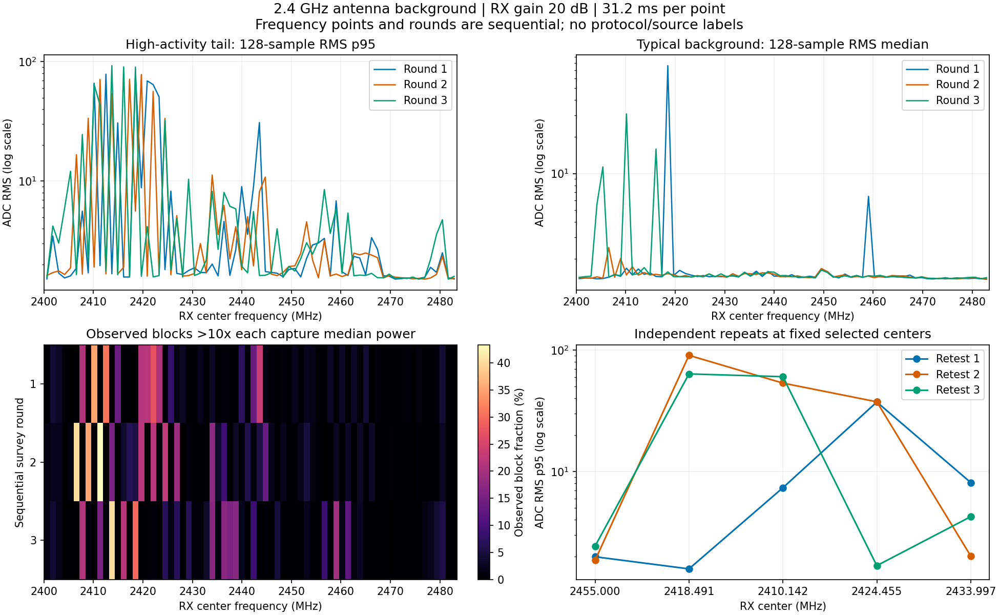
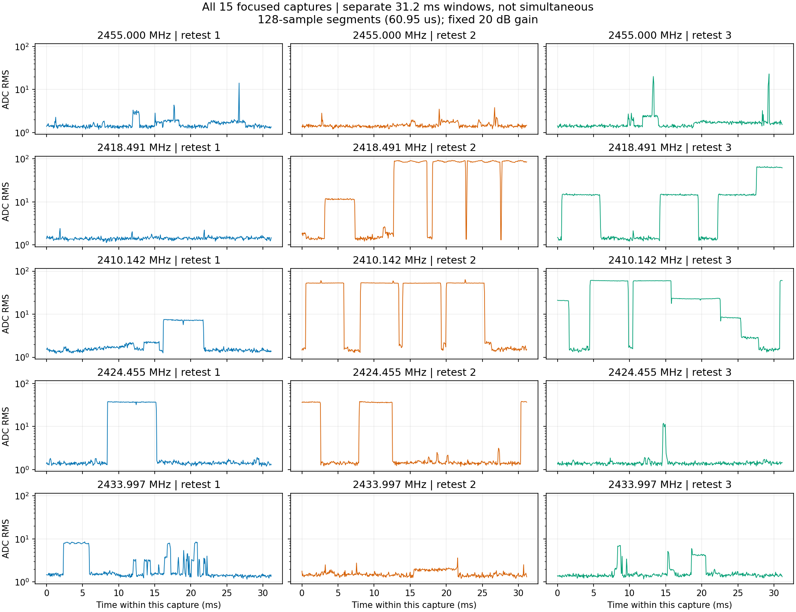

# 2.4GHz背景分布：2410–2424MHz强活动集中，复测证实时变

用户要求“查清干扰分布”，并确认P201 RX1接回原天线，外部N210保持负载和
停发。按[预登记](../evidence/P201_BACKGROUND_MAP_PLAN_2026-09-09.md)完成70点×3轮
全段发现和5点×3次独立复测，共225次有界采样、18次Controller会话。

本轮强活动频点主要集中于约2410–2424MHz；更弱活动也散布在其余频段。
2410.142和2418.491MHz的独立复测显示同一频点可从低背景变为大部分采样
窗口均为高功率。2455MHz仍有短突发，但本轮整体弱于上述强活动区；
2460MHz以上总体较弱，不能由短时未见活动宣称长期空闲或直接选定生产信道。
这里是活动频点分布，不是一个已解码信号的精确占用带宽或特定设备归属。



## 范围、参数与判读

三轮分别按升序扫70个中心：2400.6…2482.9MHz，相邻约1.193MHz，每点
中央±600kHz分析区间合起来覆盖2400…2483.5MHz。所有点用RX1/RX0/A_BALANCED、
2.1MS/s、BW1.5MHz、manual20dB、settle500ms、65535个ci16_le点、capture
deadline1000ms。为强信号余量统一用20dB，而旧三阶段为40dB，幅度不可直接
跨配置比较。没有遇到削顶而放宽门或降增益重采。

每点约31.207ms；三轮发现每个中心合计仅93.621ms，独立复测每个选定中心
另有三份31.207ms。全轮58981500字节IQ、7.021607秒分散样本，Controller
调用起止跨度237.197秒，**不是连续监听整个频段237秒**。频率点和轮次
均顺序执行，图中相邻峰不能当成同时发生；未校准成dBm。

图左上为128点RMS的p95，右上为中位数，显示突发与常态背景的差别。
左下是相对于**每次采样自身中位数功率10倍**的观测块比例，不能用作协议
占空比或正式噪声门：如果整窗大部分都是强活动，中位数也会升高，比例
可能为0。判读必须同时看绝对幅度和时间曲线，不能将这个0当成没有干扰。

AGX另保存1024点Hann分帧PSD，按RATE×sum(window²)归一为ADC²/Hz；中央
1.2MHz内按25kHz频带统计均值/最大帧。原始PSD保留DC，寻找最强频率时
排除中心±10kHz。没有将窄中心线当作协议证据；当前结论主要来自跨轮幅度
分布及独立复测，不依赖对中心线的物理归因。

## 固定选择和独立复测

从三轮发现的raw RMS p95中位数排序，固定保留2455MHz参考，再选4个彼此
至少4MHz间隔的活动中心。选中结果为2418.491304、2410.142029、2424.455072、
2433.997101MHz；先固定选择再跑复测，没有用复测结果重新挑点。

| 复测中心MHz | 三次RMS p50（ADC） | 三次RMS p95（ADC） | 三次RMS最大（ADC） |
| --- | --- | --- | --- |
| 2410.142 | 1.56 / 52.67 / 22.77 | 7.34 / 53.43 / 60.31 | 7.57 / 63.49 / 61.29 |
| 2418.491 | 1.42 / 83.17 / 14.38 | 1.58 / 90.44 / 63.58 | 2.41 / 92.52 / 65.88 |
| 2424.455 | 1.45 / 1.47 / 1.40 | 37.31 / 37.47 / 1.68 | 38.10 / 38.47 / 11.94 |
| 2433.997 | 1.50 / 1.49 / 1.45 | 8.11 / 2.01 / 4.24 | 8.56 / 3.63 / 7.06 |
| 2455.000 | 1.44 / 1.43 / 1.53 | 1.98 / 1.85 / 2.43 | 14.12 / 3.81 / 23.04 |

发现矩阵中，2418.491MHz跨轮p95中位数为78.72 ADC，2410.142为64.49，
2422.070为56.46，2413.720为53.78。未选2422.070/2413.720做独立复测是
预定4MHz间距规则的结果，不是删掉较强或失败证据。所有70点×3轮都保留。



2410/2418/2424MHz存在明显阶跃和毫秒级持续片段，支持“有时出现较强无线
活动”的描述；本轮没有解码，不能据频段和形状认定Wi-Fi、蓝牙或某台设备。
如后续定位来源，应独立登记有控制变量的验证，不能把本轮图形当成标签。

## 实机与验证

源码基线a9a4d73，分支codex/sdr-improvements。复用已安装`sdr-agent`及P201
sdrd，无生产部署或配置修改。P201始终唯一PID5909、同一
`83a661a892b8ab71de3f4e7d64064c9c65030623dc7245eb3d3a1420a696ba4f`。
NX前后核对wheeltec身份、USB B210 serial2508504，无发射进程和USB占用；
这是软件/占用证据，不是功率计测得TX输出零。

AGX采前809747283968字节可用。每点原生报告样本、字节、RX身份、关联
generation/request/sequence、健康、timeout及零已报告drop/overflow/clipping
均通过。18次会话结束均轮询恢复两路全部射频状态和scan/buffer，最终
health通过。70点发现轮在轮末恢复原状态，不把轮内调谐描述为每点恢复；
225个P201瞬时目录逐会话核对消失。未另启collector，无新增取消/失败注入。

覆盖边界/步长、已知幅度/频率的合成单音及PSD积分、128点局部突发和零输入
检查通过。NumPy1.26.4对225点IQ/元数据/原生报告/计划、统计和固定选点进行
逐项精确重放通过。图表从这些统计生成并目视检查，不导入Torch。脚本语法、
库存/父级/摘要哈希和文档链接检查通过。无Rust/UI改动，不做无关构建或浏览器
测试；TX/model/warmup/locked-test均0，recognizer_available=false及独立标签0保持。

```bash
PYTHONDONTWRITEBYTECODE=1 OPENBLAS_NUM_THREADS=1 \
  local-assets/amc-eval/runtime/venv/bin/python -B \
  jetson-agx/sdrharness/scripts/map-p201-background.py --verify
```

## 保留、清理及结果位置

[库存](../evidence/P201_BACKGROUND_MAP_EVIDENCE_2026-09-09.json)登记根
`/var/tmp/sdrharness-dev/p201-background-map-20260909d/`内73文件、64602034字节，
其中原始IQ58981500字节。三份多点SigMF和15份单点SigMF及其计划、报告、
总审计用于重放全分布和独立选择，无额外IQ副本。逐文件登记SHA-256、字节、
来源/采集/会话/请求与sequence、profile/预处理、严格逐文件人工删除方法。
[派生摘要](../evidence/P201_BACKGROUND_MAP_2026-09-09-summary.json)绑定总审计哈希，
图表和摘要在Git内，原始IQ在Git外。

runner、验证和绘图进程均已退出。删除19个非证据文件共123432字节（18个
空日志及绘图库字体缓存），scratch及子目录确认消失；未创建新的运行socket
或NX文件，225个P201瞬时目录已核对不存在。旧三阶段75文件/4837939字节
原封保留。当前P201物理接法为RX1天线，外部N210保持负载和停发。
