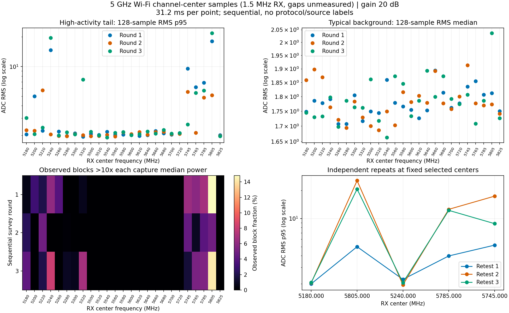
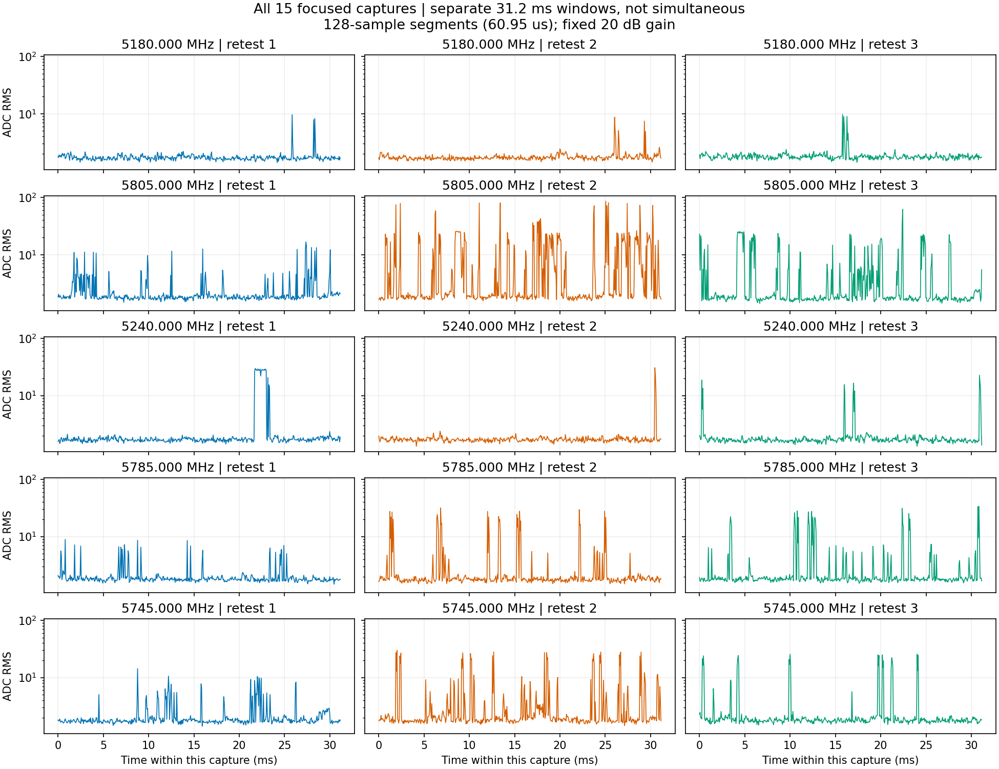

# 5GHz Wi-Fi信道中心背景检查

**部分5GHz中心确有强短时活动，不能概括为整个5GHz持续底噪很高。**
5805MHz复测的128点RMS最大达到85.83 ADC，普通背景中位数仍约1.8–1.9；
5745/5785MHz反复有突发，5240MHz有更短的强片段。5.50–5.72GHz这12个
已测中心的三轮最大RMS均不超过2.80 ADC。完成90次采样与90次恢复。

用户要求检查5GHz Wi-Fi是否也有很强背景，沿用RX1双频天线和外部N210
负载停发。基线9b82a25、分支codex/sdr-improvements，按
[预登记](../evidence/P201_WIFI5_BACKGROUND_PLAN_2026-09-09.md)执行。

## 范围与解释

本轮抽样25个常见20MHz信道中心，三轮各一次，再从发现结果固定选5点
独立复测三次：5.18–5.32GHz的8点、5.50–5.72GHz的12点、5.745–5.825GHz
的5点。每次只接收1.5MHz，频点间有未测空隙，不是完整Wi-Fi信道解码、
无缝全段扫描或全部地区/扩展5GHz信道的覆盖。

统一RX1/RX0/A_BALANCED、2.1MS/s、BW1.5MHz、manual20dB、settle500ms、
65535ci16_le点、capture deadline1000ms，单点Controller调用外部deadline15秒。
发现和复测都使用相同参数，不因失败自行调增益或挑窗重采。调用采用1点
计划，遵守原多点连续覆盖门。沿用raw128 RMS、1024点Hann PSD及固定描述性
相对突发统计；不采用新的噪声/生产阈值。

参数与上一轮2.4GHz的软件设置一致，但跨频段天线、接收链路与传播响应
未校准，ADC幅度不能等同于输入功率dBm，也不能量化两频段发射源强弱之比。
中位数描述普通背景，p95/最大值和时间曲线描述短时活动；不能把短突发
全部称为接收机持续底噪升高。信道位置本身不能提供Wi-Fi协议或设备身份标签。

## 三轮与独立复测结果



发现三轮的p95范围：5.18–5.32GHz为1.94–19.53 ADC，5.50–5.72GHz为
1.91–2.27 ADC，5.745–5.825GHz为1.96–21.82 ADC。各区间仅指登记的离散
中心；例如5825MHz三轮p95为2.01/1.98/1.96，不能把附近5805的强活动
扩展成整个高频段都很强。

按三轮p95中位数固定选点，除5180MHz参考外选中5805、5240、5785、5745MHz。
选定后各复测三次，不用复测结果重新选点。所有表中单位均为raw128点ADC RMS。

| 中心MHz | 三次复测p50 | 三次复测p95 | 三次复测最大 |
| --- | --- | --- | --- |
| 5180 | 1.69 / 1.70 / 1.76 | 2.00 / 2.05 / 2.07 | 9.61 / 8.68 / 9.68 |
| 5240 | 1.71 / 1.69 / 1.68 | 2.23 / 1.95 / 2.06 | 29.78 / 30.73 / 22.71 |
| 5745 | 1.76 / 1.85 / 1.80 | 5.19 / 17.34 / 8.81 | 14.27 / 29.79 / 25.66 |
| 5785 | 1.79 / 1.79 / 1.80 | 3.97 / 12.53 / 12.22 | 8.92 / 31.65 / 33.95 |
| 5805 | 1.83 / 1.94 / 1.76 | 4.99 / 25.43 / 20.63 | 16.67 / 85.83 / 62.25 |

5240MHz在发现时有p95为14.67/2.05/19.53的时变活动，而复测p95接近2，
仍有22.71–30.73的短峰，说明仅看p95也会漏掉很短的突发，需看最大值和
时间曲线。5805三次复测都有活动，但各次峰值和持续情况不同。



本轮现象与接收背景包含间歇无线活动一致，不是全段底噪持续很高。没有
协议解码、来源归属或5GHz负载对照，不能直接指定全部为Wi-Fi；也没有
长期监听，不能将此次较低的DFS区间认定为始终干净的工作信道。

## 验证与复现

使用原安装`sdr-agent`、P201 sdrd，无部署或持久配置变更。5GHz模式仅复用
已存在的单点接收流程，新增注册中心列表、预算、轮次分组和图表的离散轴。
旧2.4GHz225点精确重放在实收前通过，旧封存审计/库存/图表不改写；旧runner
哈希对应9b82a25源码。无Rust/UI修改，无模型、发射、warmup或locked-test操作。

```bash
PYTHONDONTWRITEBYTECODE=1 OPENBLAS_NUM_THREADS=1 \
  local-assets/amc-eval/runtime/venv/bin/python -B \
  jetson-agx/sdrharness/scripts/map-p201-background.py --verify --band 5g
```

图表按离散中心画点，未测频率不连接成连续频谱。相对突发比例是128点块
功率超过本次中位数10倍的比例，不是协议占空比或校准噪声门；整窗很强时
中位数也会很强，比例可能很低。只能结合绝对ADC读数与时间曲线判读。

实际90次共23592600字节/2.808643秒分散有效样本，调用起止跨度434.988秒，
符合450秒预估及1200秒外部deadline；每个发现中心总共93.621ms，不能把
约7分钟墙钟时间称为连续接收。AGX采前可用809683464192字节。

P201前后唯一PID5909，sdrd哈希保持
`83a661a892b8ab71de3f4e7d64064c9c65030623dc7245eb3d3a1420a696ba4f`；
NX前后hostname/user均wheeltec、USB B210 serial2508504，无匹配发射进程
和USB占用。每次原生字节/样本/RX身份/generation/request/sequence/健康/
timeout及零已报告drop/overflow/clipping通过；90次两路完整射频状态和
scan/buffer逐次恢复，最终health通过，90个P201瞬时目录消失。无新增
取消或错误注入实测。总审计保留兼容的survey deadline上限字段300秒；
本轮实际都是单点，代码对每次communicate使用15秒，预登记及执行一致。

90点NumPy1.26.4精确统计/原生关联/选择重放通过，绘图和验证进程均退出，
图表已目视检查。库存、原始及派生哈希、摘要数值、脚本语法和文档链接
核对通过。源码修改没有提升recognizer_available，也不改变独立标签0。

## 证据及清理

[库存](../evidence/P201_WIFI5_BACKGROUND_EVIDENCE_2026-09-09.json)登记
`/var/tmp/sdrharness-dev/p201-wifi5-background-20260909e/`下361文件、26038557字节，
其中90份IQ共23592600字节；其余为SigMF元数据、计划、原生报告和总审计。
保存所有强弱结果以复核分布及独立选择，不另存IQ副本。逐文件记录字节/
SHA-256、source/capture/session/request/sequence、profile/预处理和精确
人工删除命令。[派生摘要](../evidence/P201_WIFI5_BACKGROUND_2026-09-09-summary.json)
绑定总审计哈希，PNG/摘要入Git，原始IQ不入Git。

清理91文件共123432字节（90个空日志、一个字体缓存），scratch及子目录
核对消失，runner/重放/绘图均退出；NX暂存和新socket均0，90个P201路径
逐次确认消失。旧2.4GHz和负载三阶段证据均未改删。最终物理接法仍为P201
RX1天线、N210负载停发；没有软件部署、射频持久修改、发射或模型实验。
