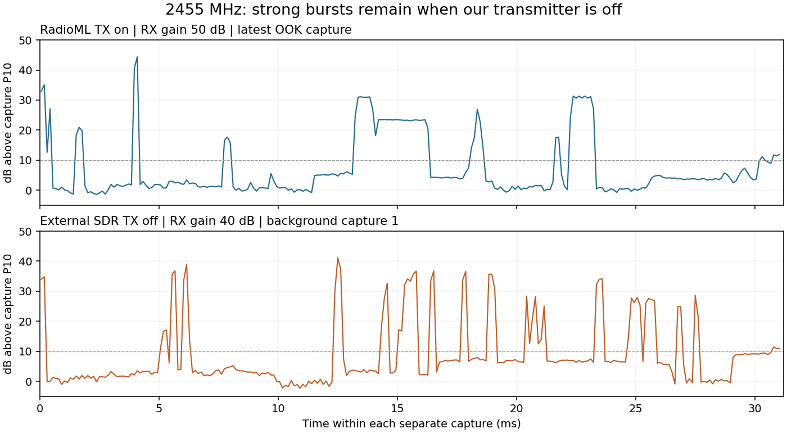
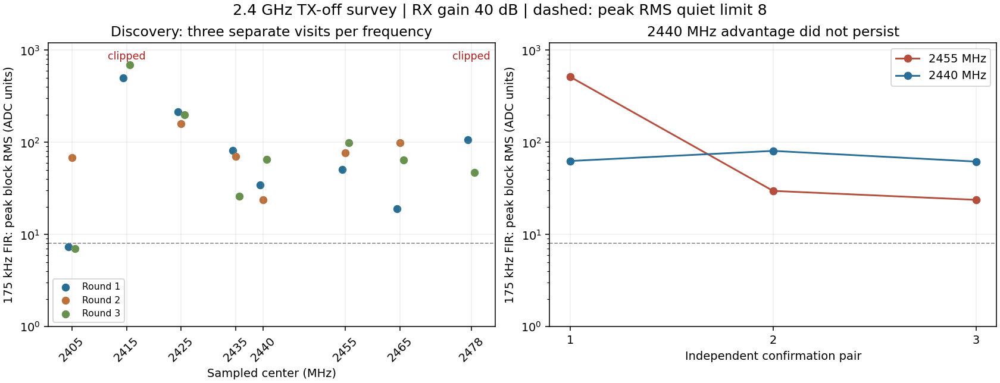
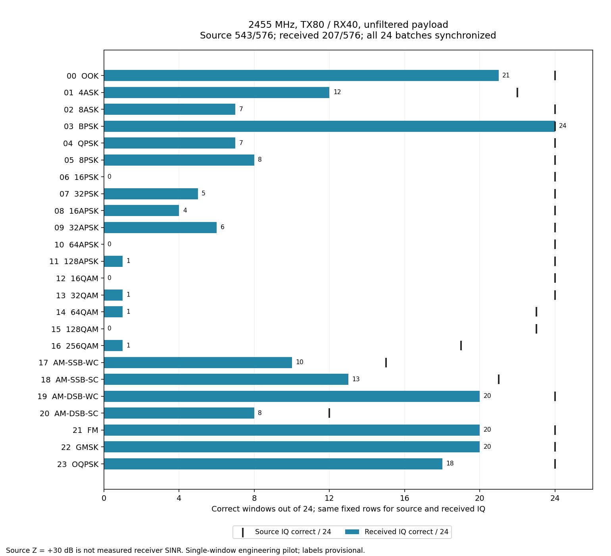

# RadioML2018A 全量脚本：有限先导与未通过的接收质量

[入口](../README.md) · [操作说明](../reference/RML2018A_FULL_RF_CAMPAIGN.md) ·
[保留与清理清单](../evidence/RML2018A_FULL_RF_CAMPAIGN_EVIDENCE_2026-09-10.json)

2026-09-10，分支`codex/sdr-improvements`，基线`02e5cdc`。用户明确要求全部原始
RadioML2018A样本，恢复此范围的冻结模型工程推理，训练/微调仍暂停。
交付边界是全量迭代脚本、有限空口先导、结果关联、取消/续跑和证据；**未执行全库，
接收识别质量未通过**。未部署生产Worker/profile，`recognizer_available=false`。

## 实现与源码检查

新增AGX campaign、NX有限文件TX helper、纯帧/同步合同及12项单元测试。
全库2,555,904行按24条/批覆盖106496批，每行保留原始ID、Y.argmax和Z，
不按类别/低SNR筛掉失败样本。全HDF5字节数、SHA-256及X/Y/Z形状均在plan中核对。
旧test成员只按本任务授权作工程源访问，不重写旧split或独立审计。

实际运行环境没有SciPy、NX没有h5py/Python UHD。实现改用NumPy FFT相关，
NX通过FIFO喂给已安装UHD程序，未新增系统依赖。
发射程序必须收到精确GO；payload哈希/幅度/设备/频率/有限字节不匹配时在UHD前拒绝。
推理每32批使用新的spawn进程，避免Torch线程池二次初始化并在分片后释放CUDA。

12项测试通过：全量/尾批覆盖、峰值与波形保真、篡改和越界拒绝、未知时刻/相位/CFO恢复、
错批/静音/截断拒绝、强带外tone下仅同步滤波且payload不变、尾部标记定位前一完整帧、
RMS保留恒定载波、FIFO有限实际字节流/EOF、GO前断连不送payload、汇总分母、已完成续跑
校验IQ且不重发。尾部标记新增测试先发现滤波边界影响CFO，改为半标记内部取样后通过。
最后命令为运行环境Python `-B -m unittest discover -s jetson-agx/sdrharness/tests
-p test_rml2018a_campaign.py`，TMPDIR为本单元开发scratch；没有Rust/前端修改。

## 真实参数与设备

NX hostname/user均为wheeltec；用户称为N210的设备UHD实际枚举B210，serial2508504，
USB3、A:A/channel0/FE-TX2、TX/RX。P201仅RX1/RX0/A_BALANCED。
沿用用户当前433MHz天线；天线产品型号及具体更换端未另作推定。

中心433.920MHz，TX/RX rate2.1MS/s、BW1.5MHz，TX70/RX50，峰值0.2、TX LO offset+250kHz。
每批TX最多4秒，完整24条帧重复321次，8381952个复数样本。
RX settle500ms、point deadline1000ms、65535个ci16复数样本，最大262140字节。
调用的batch数量、外层deadline见下表；每批audit保存执行前可用空间（约809GB）、
AGX/NX/P201精确路径、两路RX状态及直接停止方法。

P201 sdrd PID5909，实际哈希`83a661a892b8ab71de3f4e7d64064c9c65030623dc7245eb3d3a1420a696ba4f`；
Controller哈希`24b8340dd5c56bcf643a44e1eadbd11450e3b5e528d2ec72dc26103e9f23e25f`；
NX UHD文件TX程序哈希`fe3aebc556c16a5065d63d4e6ef8f02ef277ac01dcf250a35dec58b84eceb5cf`。
未修改已安装二进制、P201持久配置/启动链或生产TX能力。

## 先导结果及失败沿革

各根完整路径均为`/var/tmp/sdrharness-dev/b210-rml2018a-pilot-20260910{a,b,c}`，
原始run-plan、audit和哈希封存于原处，具体文件见库存。

| 根/操作 | batch与源行 | 调用范围/deadline | 结果 |
| --- | --- | --- | --- |
| a acquire | 4267，102408–102431 | 1批/180秒 | 原同步检测失败0.323595；采集及恢复通过；未推理 |
| b run | 同一批/源行，新run标记 | 1批/650秒 | 仅同步检测加固定低通，仍失败0.418432；源24/24正确，实收预测为空 |
| c run | 4267–4268，102408–102455 | 2批/650秒 | 48条全部同步并推理；源48/48正确，实收0/48正确 |
| c 中断acquire | 22016，528384–528407 | 1批/180秒；batch_plan后4.8秒SIGINT | 已TX start，中断退出1；未形成完整capture receipt；NX/P201恢复通过 |
| c retry/run | 22016，同一源行 | 1批/650秒，retry-failed | 旧失败整体移入attempts，新的request/session完成24条；源24/24正确，实收0/24正确 |
| c 重复run | 4267–4268 | 2批/180秒 | 4.171秒结束，9个原批次receipt/audit/prediction哈希不变，无新TX或推理事件 |

根a原始IQ中基带约−589.17kHz窄带分量占主导。根b还存在时变带内分量，早期标记受干扰，
最清晰标记在采集末尾，原实现因后面没有完整payload而排除它。
最终检测采用固定129-tap Hamming 500kHz低通，仅用于标记，不滤payload；从全窗口找标记，
必要时用已知26112点重复间隔取前一完整帧。CFO估计排除FIR边缘瞬态，未降低原质量门。
根a/b只作版本化离线同步复核，得分0.788831/0.692524，记录在c根
`offline-sync-recheck-v1.json`；没有把原始失败改写为成功，也未再推理这些旧RX。

最终c根三批标记得分为0.756716、0.741393、0.720123，估计CFO约657.50、514.35、594.76Hz。
前两批使用尾部标记定位前一完整payload，第三批标记后直接有完整payload。
三批源/实收平均相关度分别0.189643、0.165355、0.189147。
源类别为48条OOK(raw ID0)和24条QPSK(raw ID4)，均为原数据集Z=+30dB；
Z不是空口实收SNR。三批源72/72正确，实收72条全被判为ID17或18，**实收0/72正确**。
这只是2类高SNR小先导，不能外推全库正确率，也不能把同步成功等同于波形保真或准入成功。
−589kHz分量的物理来源仍未确认，不能因先前2.4/5GHz排查而把433MHz当前问题直接称为Wi-Fi。

UHD readback频率/rate/gain/BW/LO锁定通过；日志尾部有`S`，它不是时间戳化的连续发射证明。
实际marker及原生RX元数据提供批次关联，无法证明每次重复发射都无间断。
推理单次平均约37ms；首次新缓存加载/推理隔离窗口约67秒，后续单批窗口约15秒，
Spark都恢复且watchdog停止。没有在同一进程重复构造Torch backend。

## 预算与当前扩量边界

全量RX原生IQ 27,916,861,440字节，加13,958,643,712字节元数据/预测预留，共约39GiB；
累计TX上限425984秒（4.93天）。该TX时间不是整个实验耗时。
最终三批capture audit耗时11.88–12.45秒，尚不含前置检查；相邻批次实际开始相隔约15.38秒。
加上推理/模型分片开销，**全量约三周量级**，仅为小先导外推，未作全库长时验证，
代码初始10秒/批的字段明确标记unvalidated，不能当成已测承诺。

脚本可以按全量行范围执行、停止和批次续跑，但目前质量门不支持有意义的全量RF模型比较。
尚未执行2,555,904行全库，也未执行32批连续推理分片/多日soak；当前只验证了2批及1批真实分片。
下一步应先定位带内/带外分量与接收失真、用有限样本确认波形保真改善，再扩量。
不通过改模型、放宽同步门或把失败样本排除出分母获得成功。

## 停止、恢复与精确清理

正常、失败和主动中断均核对唯一接收所有者、同一sdrd哈希/PID、LO、rate、BW、
两路RX增益模式/增益/端口、全部scan mask和buffer恢复。六次尝试的NX/P201瞬时目录
最后再次核对不存在，NX无TX进程/USB持有者，P201 healthy=true，Spark状态S。
最终只读现场检查在c根`postflight.json`。

NX共删除42个暂存文件、1,347,331字节，每批audit有逐文件清单；P201目录已不存在。
AGX最终清理708个cache/lock/冗余packet文件，共40,492,354字节，三个scratch和本单元dev根已移除。
正常批次的208896字节TX源包由runner随批删除，不另存源IQ。
测试TemporaryDirectory自行清理，早期测试瞬时字节未逐项记账，因此不把最终清理数字说成
涵盖所有历史测试临时写入的精确总数。

保留74个证据文件、1,580,090字节，包括原失败/成功/取消的IQ或占位文件、原生元数据、
版本化离线复核、模型预测和恢复/续跑凭据；无权重/原始源IQ副本入Git。
每文件路径、大小、SHA-256、run/source/request/session、模型/profile/preprocess身份与
人工删除根见库存。清理完成不意味着这些必要证据被删除。

## 2026-09-10：按用户要求复查2.4GHz历史识别方法

本次只读历史文档/源码及已保留IQ，**新增RF采集0、模型推理0**。上一节0/72及旧审计保持。
基线8c51c0d；[离线复核脚本](../../jetson-agx/sdrharness/scripts/diagnose-rml2018a-campaign-filter.py)
输出[版本化逐行统计](../evidence/RML2018A_HISTORICAL_FILTER_COMPARISON_2026-09-10.json)。

先前“波形失真”描述过于笼统：现已量化一个主要问题是**额外窄带分量进入模型输入**。
三份当前实收Hann频谱的最大峰均在基带−589.160kHz，该峰±2kHz占各自全段谱功率
81.92%–83.72%。这是基带频率和窗内谱功率比例，不是Wi-Fi识别、绝对dBm或已测SNR。
分量物理来源仍未定位，也不能据此认定天线故障或ADC削顶。

历史不是“2.4GHz所有样本都成功”：

- [2440MHz早期保真度实验](B210_RX_FIDELITY_VALIDATION_2026-09-06.md)中，源ID0、
  实收ID18；仅CFO/带限均未修复。后来通过[TX LO正负偏移对照](B210_LO_OFFSET_VALIDATION_2026-09-06.md)
  证明当时有随TX LO移动的额外载波，符合LO泄漏/载波馈通。
- [固定泄漏抑制](B210_LO_REJECTION_VALIDATION_2026-09-07.md)使用TX LO+250kHz，
  AGX再用257-tap、175kHz cutoff、Kaiser beta8 FIR滤模型输入，保留DC、丢弃边缘halo；
  该次来源相关显著改善，但背景门失败，模型没有运行。
- [2455MHz 24类×3样本](B210_MULTICLASS_VALIDATION_2026-09-07.md)实际源69/72正确、
  原始实收30/72、固定FIR实收56/72；不是72/72。每条发一个1024点源并循环约10秒，
  RX40dB，固定4096点四窗共享RMS/mean-logit。滤波前验证每条源功率保留≥99%、
  归一化失真≤1%；失败/预测回退也纳入分母。

当前campaign沿用了TX LO+250kHz、TX70及2.1MS/s/BW1.5MHz，但RX50dB，
每批拼接24个不同1024点源、重复约4秒、使用pilot对齐和单窗推理；
**仅同步检测有500kHz FIR，实际模型payload没有175kHz FIR**。因此遗漏了历史有效的
模型输入滤波对照；这不是已经证实的频段或天线单因素失败。

离线复用旧`repair-b210-lo-leakage.py`的同一FIR系数（SHA-256
`d0e12014bedae088b71366497299adc3a1be0a45cf622e9cbb346d4ea0c8c8be`），
固定原audit的payload位置/CFO/相位，不重新找窗、拟合增益或根据预测调参数。
RX使用两端完整128点halo；源保真使用实际24条拼接帧及其邻居/保护区，
而非假装每条在当前TX中独自周期重复。

| 当前batch | 原始复相关均值 | 旧FIR后复相关均值 | payload接收功率被滤除 |
| --- | ---: | ---: | ---: |
| 4267 | 0.189643 | 0.758439 | 93.762% |
| 4268 | 0.165355 | 0.717607 | 94.698% |
| 22016 | 0.189147 | 0.759007 | 93.811% |

72/72源样本达到旧FIR的源保真条件：最小功率保留99.5609%、最大失真功率0.3629%。
复相关是逐1024点的非中心化复相关幅值，与旧记录的中心化四窗来源门不是同一统计量。
滤波使当前约0.18相关提高到约0.75，直接支持额外频带分量是主要污染；
仍不证明余下差异全部来自背景或滤波后分类必然正确。没有为本次滤波结果运行模型。
不能将本先导72条通过源保真推广到全库，特别是不同SNR/带宽及拼接边界。

检查包括父级audit/IQ/source行/TX帧哈希、固定行号与FIFO帧重建、旧FIR系数哈希、
独立FFT卷积对坐标/数值验证（误差小于1e−9），以及旧汇总的69/30/56计数复核。
所有计算在内存完成，无新增IQ/张量/缓存副本或硬件进程，没有开发临时目录需删除；
只增加Git中的脚本与派生统计。原保留清单74份文件全部哈希仍匹配。

复核命令只打印JSON，不更改campaign及旧证据：

```bash
cd /home/jetson/sdrharness
PYTHONDONTWRITEBYTECODE=1 OPENBLAS_NUM_THREADS=1 \
  local-assets/amc-eval/runtime/venv/bin/python -B \
  jetson-agx/sdrharness/scripts/diagnose-rml2018a-campaign-filter.py \
  --root /var/tmp/sdrharness-dev/b210-rml2018a-pilot-20260910c
```

## 2026-09-11：回到2.4GHz与SINR记录合同

基线`53424fd`，分支`codex/sdr-improvements`。用户明确报告已换成2.4GHz并要求代码使用SINR记录，
随后指出原始X已经包含源噪声/损伤，真实收发又叠加环境和硬件影响。本单元只交付参数及记录合同，
新增RF采集0、发射0、模型推理0、生产部署0；用户报告接法不等于已核实天线型号。

- 新campaign schema为`rml2018a-all-row-rf-v2`，固定2455MHz（沿用历史中心，未经本轮背景扫描），
  TX70/RX50、2.1MS/s、BW1.5MHz、峰值0.2及TX LO+250kHz保持。NX从已校验计划取中心频率，
  AGX的计划、原生接收校验和UHD readback使用同一CENTER，消除旧433.92硬编码。
- source及prediction字段`source_snr_db`原样保留Z。X本身含噪声/信道损伤，
  原标签、源/实收相关度以及对已含噪X拟合的残差均不能作为总接收SINR。
  此次不更换数据集、训练模型或添加生成器。
- capture audit及prediction加入`rx_sinr_db=null`、`rx_sinr_status=not_measured`、
  方法/测量带宽null、参考位置及模拟带宽。同步成功仍缺干净参考及已验证分量估计器；
  同步失败另记原因。没有用0dB填缺失，也没有把同步导频质量当作payload SINR。
- 汇总明确`by_source_snr_db`，另列接收SINR已测0、未测原因、待生成逐行质量记录数量及空接收SINR分组。
  当前版本拒绝带伪造数字SINR/已测状态的prediction，以及旧schema结果混入新汇总。
- 旧计划仍因schema/软件身份拒绝复用，不能更新旧plan的哈希来迁移。
  导频生成独立固定v1种子，保证旧433MHz帧仍可供离线重建；历史结果和原证据不改写。

15项`test_rml2018a_campaign.py`测试通过，包括旧433MHz频率/旧schema在UHD前拒绝、
新2455MHz参数传到模拟文件消费者、有限FIFO精确字节及子进程退出、停止/续跑、同步与
旧导频逐字节稳定性；源+30/−20dB、未同步样本均不产生实测SINR，0及30dB伪造值拒绝，
源SNR分组和失败分母保留。测试只用本地模拟文件消费者，没有连接NX/P201或调用UHD。
代码AST、文档链接及diff另经检查。新频点当前接法的实机收发与接收SINR估计均未完成。

测试临时根`/var/tmp/sdrharness-dev/rml2018a-sinr-20260911-sLitie`；各TemporaryDirectory退出前
逐文件统计并删除22个文件、75,413字节（统计最终删除时文件大小，不计覆写/管道流量），
测试FIFO已移除且模拟子进程全部退出。顶层空目录交付前移除，无本单元外部保留文件或IQ副本。
此前74份RF证据1,580,090字节保持原路径和哈希，删除依据仍见原库存；封存证据未重写。

当前建议保留RadioML主对照，先做新频段高源SNR基线再扩档；严格接收SINR曲线另须验证
干净参考/分量估计器和带宽，不能把上述字段实现勾成SINR实测或全库质量通过。

## 2026-09-11：条件有效SINR实现与2455MHz有限验证

基线`ab34c25`，用户已明确换成2.4GHz天线并要求实现SINR。完成campaign v3的
`nominal-source-plus-crossfit-link-error-v1`：在固定pilot对齐窗口上，两半窗交叉拟合复数标量增益，
以留出半窗的完整残差衡量新增链路误差，再按源Z的标称功率比例分解预测X功率。
公式、固定有效性条件和带宽见[合同](../reference/RML2018A_FULL_RF_CAMPAIGN.md#源snr与条件有效sinr估计v3)。
源标签保持原值；没有直接将相关度、EVM或RX-X残差冒充总SINR。

结果明确为**条件有效SINR，包含未建模链路失真**，要求源标称功率比例适用、
窗口内近似标量线性、源信号/噪声同增益、新增干扰与X不相关。实收无法独立证明这些假设；
尤其稳定多径、非线性和相关干扰可能偏置结果。因此`estimated`不等于仪器独立测量，
`measured_rows=0`，没有生产准入/精确物理SINR或置信区间声明。
模型输入未增加滤波、均衡或标签引导选择，RMS前积分整个2.1MHz采样复基带，模拟RX带宽1.5MHz。

源Z继续单独分组。capture audit直接保存逐行估计/invalid/未同步原因，`acquire`也写汇总；
推理沿用封存audit的质量记录，汇总拒绝不一致的prediction。接收估计按固定2dB半开区间分箱，
每箱保留采集、已推理和正确数；无效行不会从全量识别分母中删除。
新增诊断在audit/prediction各保存一次，元数据预留由每批128KiB调整为256KiB；全库元数据
27,917,287,424字节，连同IQ共55,834,148,864字节（约52GiB），累计TX上限不变。

### 检查与同步范围修正

最终23项无硬件测试通过。240次已知分量仿真覆盖源Z −20/0/10/30dB、新增链路比0/10/20dB，
混合白噪声与窄带单音；相对已知真实分量的均值误差0.00854dB，95%绝对误差0.31013dB，
最大绝对误差0.57890dB。这仅验证所模拟的假设，不能作为实机误差上限。
另补200次源+30dB/新增链路比−9dB仿真以覆盖本轮低比值区间：170次估计、30次invalid；
只对170次条件估计统计，均值误差0.09898dB、95%绝对误差0.96500dB、最大1.28019dB。
这也说明高链路比仿真的0.31dB数字不能外推到当前弱链路。
另覆盖零新增误差时不超过源Z、DC干扰计入但合法源DC保留、增益/相位缩放不变性、
增益突变/突发残差/恒定参考/零功率/非法数值拒绝、篡改功率/行记录拒绝、分组分母、
有限FIFO精确字节、停止/续跑，以及+3370/−9100Hz同步与原有错误标记/静音拒绝。

首次2455MHz两批采集仍用了433MHz遗留的±2500Hz搜索/3000Hz细化上限，均失败。
保留IQ后做固定±25kHz的离线诊断，第一批发现CFO约3368.49Hz，原门限下marker可达0.68820。
修正按原433.920MHz相对频偏容限缩放：2455MHz搜索±14.5kHz、500Hz步长，细化后上限17kHz；
初始0.55/最终0.65门限不改。新计划记录范围，旧计划的软件哈希不重写。
[离线复核脚本](../../jetson-agx/sdrharness/scripts/diagnose-rml2018a-campaign-sinr.py)使用最终固定范围，
检查旧audit/IQ/源行及Z/重建TX帧哈希，输出独立`sinr-recheck-v1.json`，不改变初次失败状态。
第一次复查得到6条条件估计、18条invalid、24条未同步；这是事后派生结果，未冒充新采集通过。
其中第一批由尾部marker定位前一重复payload，前一marker得分仅0.03924，解释仍受干扰及连续性限制。

### 两阶段实机执行

两个新campaign分别在根内保存`sinr-validation-plan.json`：每阶段固定batch4267与22016，
各24条、源Z均+30dB、源ID分别0/4；四次采集是同48个源行的重复，不是96个不同样本。
2455MHz，TX70/RX50、峰值0.2、LO+250kHz、2.1MS/s、BW1.5MHz，RX1/RX0/A_BALANCED。
每点65535ci16复数、500ms settle、1000ms点超时；每批最多4秒TX，每次runner deadline180秒。
两阶段合计TX上限16秒，4份IQ共1,048,560字节。开始可用空间809,183,944,704字节。
NX/P201精确瞬时路径在每批GO前记录，直接SIGINT/专用generation取消及原有55/58秒保护保持。

| 阶段/batch | 同步结果 | 条件估计 | invalid | 未测 |
| --- | --- | ---: | ---: | ---: |
| 初次4267 | marker_not_found 0.510534 | 0 | 0 | 24 |
| 初次22016 | marker_not_found 0.396311 | 0 | 0 | 24 |
| 最终新计划4267 | marker 0.695507、CFO3312.626Hz | 4 | 20 | 0 |
| 最终新计划22016 | marker_quality 0.577650，未达0.65 | 0 | 0 | 24 |

最终4条估计分别−7.49932、−5.99010、−6.81423、−8.86810dB；16条增益不稳定、
3条参考低于估计范围、1条残差不平稳，另24条未同步。只报告通过条件的范围，
不把它作为全部48条或整个2.4GHz的SINR分布。最终4267的payload前marker即通过门的marker，
没有使用初次派生记录的弱前marker。最后48条质量记录及同步结果由封存IQ/X/Z重新计算后逐项完全一致。
初次两份UHD日志尾部为`U`，最终两份为`S`；仍不是时间戳化的连续发射证据，
不能由此断言干扰来源为Wi-Fi、天线或LO泄漏。后续应先定位发射连续性、同步和增益波动。

新增模型推理0，未运行训练/独立locked-test/全量数据识别，生产`recognizer_available=false`。
23项测试与有限实收只完成软件和估计路径验证，未完成可靠全类别SINR测量或识别质量验收。

### 恢复、清理与保留

四批均核对同一sdrd、原生RX身份、无掉样/削顶/溢出、LO/rate/BW、两路RX模式/增益/端口、
全部scan mask/buffer恢复。最终NX身份wheeltec/serial2508504、无TX进程/USB持有者，
P201 healthy=true；NX/P201瞬时目录均不存在。没有启动模型或暂停Spark。
各根`sinr-postflight.json`保存只读最终检查。

本单元保留49份证据、1,272,022字节，含4份IQ、初次失败、版本化离线复查、最终采集审计和计划；
逐文件路径/大小/SHA-256、source/request/session、profile/preprocess及精确人工删除方法见
[库存](../evidence/RML2018A_SINR_IMPLEMENTATION_2026-09-11.json)。旧74份RF证据1,580,090字节仍逐文件哈希一致。
NX删除28份暂存文件929,524字节；AGX随批删除4份可重建源packet共835,584字节，
收尾删除11份日志/锁等85,517字节，两根scratch/owner与开发根均不存在。
单元测试TemporaryDirectory及FIFO自行清理，不把收尾数字称为覆盖所有测试历史写入的总量。
无新增IQ副本、权重或构建制品入Git，保留证据没有被说成已清空。

## 2026-09-11：停发背景与实收失败排查

用户要求检查“只有4条估计通过”是否因为没收到或SINR低。基线`104887b`，本单元先复核
此前49份封存证据，再补停发接收；没有新增发射、模型推理、生产部署或修改campaign估计门限。
脚本为[链路诊断](../../jetson-agx/sdrharness/scripts/diagnose-rml2018a-link-quality.py)，
[逐段统计](../evidence/RML2018A_LINK_QUALITY_DIAGNOSIS_2026-09-11.json)记录原始父级哈希及固定方法。

### 已确认的现象

最新OOK批次的24个源样本，实际发送窗口平均功率仅在0.008682–0.012205间变化（峰值缩放后），
接收对应窗口功率却从约22–83升到数千，最高29,122（ADC平方单位）。第13–19个窗口等强突发区间
与估计失败重合；第2、23个窗口也明显升高。不能把所有失败都解释为发送源样本本来更大。
其中15条的诊断相关峰仍在原位置0/−1样本附近，其余9条峰低且位置零散，没有支持统一帧滑移的证据。
这次±1200点局部搜索只用于诊断，未用于选择模型/SINR窗口或修改原始审计。

“gain_not_stable_across_halves”表示两半窗拟合出来的复增益不一致；强干扰、低参考强度、
信道或模型误差都可能造成它，**不能据此宣称硬件增益或AGC在变化**。
旧四份实收报告的clipped/dropped/overflow均为0，只说明当时这四次未报告这些故障。

每256点（约121.9微秒）计算平均功率，保留每次采集自身P10作为较安静时段参考：

| 采集 | RX增益 | 最大块功率相对本次P10 | 超出本次P10 10dB的块比例 |
| --- | ---: | ---: | ---: |
| 先前最新OOK实收 | 50dB | 44.39dB | 23.14% |
| 新停发背景0 | 40dB | 41.12dB | 21.96% |
| 新停发背景1 | 40dB | 37.47dB | 24.31% |
| 新停发背景2 | 40dB | 33.47dB | 23.14% |

P10不是校准热噪声底；上表只作各段内部动态范围比较，不把不同增益/时刻的ADC绝对功率直接对比。
停发时仍有强突发，说明这类污染不依赖我们本次RadioML发射。2.4GHz Wi-Fi是候选来源，
但本次没有协议解码、关闭可疑设备或负载对照，不能确认具体设备，也不完全排除接收内部因素。
原TX日志的U/S只有非时间戳标记，不能证明连续无丢包，发射连续性仍有未测边界。



图中上下不是同时采集，增益不同；纵轴分别相对各自P10归一化，虚线是+10dB统计线，不是模型门限。

### 滤波与带宽重叠

四份旧实收的最强谱线附近±2kHz仅占整段Hann谱功率约0.29%–4.40%，不符合此前433MHz
单根谱线占约82%的情况；不能直接套用“主要就是一根LO泄漏”的解释。
新停发背景约20.1%–22.3%的整段Hann谱功率落在±175kHz内，支持有效带宽内仍有背景污染。

对唯一已同步的最新OOK24条，固定原始位置/CFO，复用257-tap、175kHz Kaiser FIR，
并用实际拼接帧及邻居检查源保真：最小功率保留99.6188%，最大源失真0.2797%。
原始/滤波后平均中心化相关为0.15559/0.34292。滤波确有改善，但仍不足以说明链路已经修复。
滤波后源噪声比例不再能直接按原Z分解，因此未把这一对照写成新的滤波后SINR或识别率。
未对未同步QPSK强行生成24条payload，也未将这24条源保真门推广到全库。

### 停发接收、失败、恢复和保留

P201及NX使用既有技能/受保护凭证；核对NX身份wheeltec、serial2508504、无TX进程/USB持有者，
P201单一sdrd/PID/哈希/监听和空闲mask/buffer。NX仅作只读空闲检查，未初始化UHD或发射。
两个背景计划各注册2455MHz、2.1MS/s、BW1.5MHz、单RX1/RX0/A_BALANCED、每点65535ci16复数、
500ms settle、1000ms点超时、三个频点请求、最大786,420字节、总deadline120秒、预计30秒，
并在运行前保存全部generation、精确P201瞬时路径、AGX根和可用空间（均大于809GB）。
停止走SIGINT/SIGTERM及专用generation cancel，随后核对完整射频状态恢复。

首次RX50仅尝试第一点，即被Controller以`summary_clipped`拒绝；该错误来自对原始ci16的分析，
不是本轮SINR估计器失败。没有有效IQ保留，剩余两点未执行。原audit、错误日志及当时脚本字节
单独保留，未改写为成功。后以新根、RX40重新登记三个短接收，三次均通过原生元数据/身份/
无削顶掉样溢出检查，保留786,420字节IQ。降低增益只避免此次保护拒绝，不证明SINR提升。

四个实际接收尝试（1次保护失败、3次成功）均已恢复；两个audit均保存radio_before/after、
healthy=true和NX空闲检查，全部登记P201路径不存在。失败时未关闭削顶保护或放宽元数据验证。
脚本复用已有Controller及原生检查；没有另起collector，也未修改设备部署配置或实验默认TX增益。

本轮外部保留20份文件、823,070字节，逐文件SHA-256/用途/source-request-session/处理身份/
人工删除方法见[保留清单](../evidence/RML2018A_LINK_QUALITY_EVIDENCE_2026-09-11.json)。
收尾删除开发目录中的4个日志/中间JSON/绘图缓存文件，共190,808字节，开发根已不存在；
NX没有暂存文件，P201瞬时路径已清除。原49份证据全部哈希不变，无新增IQ副本入Git。
JSON/AST/本地链接/diff、原生采集检查及图表视觉检查通过；此诊断单元不重跑模型或无关回归。

当前更合理的下一步是有限扫描2.4GHz占用、选择较空闲位置，或使用足够衰减的受控链路建立基线，
随后再验证固定滤波及识别。仅继续增加增益或换一个数字滤波器，不能解决所有同频突发污染。

## 2026-09-11：八频点背景比较与候选复测

基线`ede5878`。用户“继续”沿用先比较2.4GHz背景、再独立确认候选的单元；
外部SDR始终停发，P201 RX40、2.1MS/s、BW1.5MHz、RX1/RX0/A_BALANCED。
在既有[链路诊断脚本](../../jetson-agx/sdrharness/scripts/diagnose-rml2018a-link-quality.py)增加
`survey`，复用原生Controller/背景元数据校验/统计，不新增collector或生产TX能力。
旧诊断入口与证据保留；之前源码身份可由`ede5878`复原，不改写旧附件哈希。

### 预设范围与选择方法

发现阶段固定2405/2415/2425/2435/2440/2455/2465/2478MHz，正序、倒序、正序各一轮24点。
每点65535个ci16复数（262,140字节）、500ms settle、1000ms点超时；每次仅观察约31.2ms，
每个候选发现阶段合计约93.6ms，不能称连续覆盖或长期占用率。8个1.5MHz接收窗口之间有未测频率。

从有3次有效捕获的替代频点中，按最差175kHz FIR峰值RMS、最差p95、最差原始RMS依次排序。
2455MHz作为当前基准，不作为替代候选。任何一次削顶使该频点不能入选；失败原样保留。
选定后以“基准/候选、候选/基准、基准/候选”6次新接收作确认，不根据确认结果重新挑选。
沿用窄带背景参考条件：三个候选确认都须p95≤5、峰值≤8 ADC RMS（均须大于0）。
这是预设背景安静条件，不是仪器SINR、分类阈值或所有RadioML样本的带宽合同。

两个阶段的完整规则、有限计划、增益/频率/每点generation、精确AGX/P201路径、空闲及空间检查
均在各自audit中于接收前登记。最多30点、IQ上限7,864,200字节，两阶段各600秒deadline；
根分别为`/var/tmp/sdrharness-dev/rml-band-survey-20260911`及同名`-confirm`。
SIGINT/SIGTERM走专用generation取消及原恢复流程。遇到已经结束并恢复的`summary_clipped`
仅记录失败、跳过其IQ并继续预登记列表，其他错误仍中止；没有降低增益或关闭保护混入同组。

### 实际结果

发现24次中22次有效、2次削顶：倒序轮的2478MHz及2415MHz，均被排除。
其他频点按三轮最差滤波峰值从低到高为：2440MHz 65.24、2405MHz 68.31、2435MHz 81.90、
2455MHz 98.59、2465MHz 99.53、2425MHz 213.98 ADC RMS。
2405MHz另两次峰值接近8，但其中一次达68.31，说明不能只取最安静的一次。
发现阶段排名最好的是2440MHz，本身最差值已经高于安静参考；仍按预定规则独立确认。

| 确认对 | 2455MHz滤波峰值RMS | 2440MHz滤波峰值RMS | 候选相对基准峰值降低 |
| --- | ---: | ---: | ---: |
| 1 | 515.67 | 62.79 | +18.29dB |
| 2 | 29.76 | 80.86 | −8.68dB |
| 3 | 23.80 | 61.88 | −8.30dB |

六次确认均未削顶，但2440MHz三次p95为14.08/40.48/13.90，三次峰值都远高于8，
安静条件失败；三对中两对比2455MHz更差。因此本轮**没有得到通过独立复测的稳定替代频点**，
不把实验默认改成2440MHz，也不声称整个2.4GHz没有可用位置。



图中虚线仅为峰值RMS参考8；削顶点没有被画成某个有限测量值。
结果含原始带宽和固定175kHz FIR统计，不能因窄带排名较好就宣称当前未滤波模型payload合格。
本次无发射、无模型推理/训练，未修改冻结profile、SINR估计器或生产部署。

### 验证与清理

3项选频测试覆盖“不能按偶然安静轮入选”、削顶排除、不完整发现拒绝、固定确认顺序、
失败保留和不重新选择。28份有效原始IQ通过既有原生身份/频率/增益/无削顶掉样溢出校验，
所有统计、候选排名和确认结果重新计算完全一致；源码AST、文档链接、JSON/diff及图表视觉检查通过。

两阶段最终均核对原LO/rate/BW、两路RX模式/增益/端口、scan mask/buffer恢复，
同一sdrd、P201 healthy=true、NX wheeltec/serial2508504无TX进程或USB持有者，
全部登记P201瞬时路径不存在；最终检查在确认根的`postflight.json`。

保留150个文件、7,509,332字节，其中28份IQ共7,339,920字节，支持复核跨轮排名和确认；
没有IQ副本。逐文件路径/SHA-256、request/session、预处理身份和精确人工删除方法见
[结果及库存](../evidence/RML2018A_BAND_SURVEY_2026-09-11.json)。
收尾删除开发根内2个日志/绘图缓存文件141,432字节，开发根已不存在；NX未暂存文件，
P201只留瞬时数据并已移除。旧实验记录及原始附件不因这次选频而重写。

下一步优先用足够衰减的受控连接或屏蔽环境建立识别基线；若继续空口选频，应另登记
更长观察时间与覆盖范围，不能无限重复短采集直到碰到一段好结果。

## 2026-09-11：发射增益与接收增益有限对照

基线`30f3c3c`，用户批准“增大发射增益、减少接收增益”，随后继续执行已登记的条件阶段。
频率保持2455MHz，使用用户已确认的2.4GHz天线，型号/性能未核实；P201仍为RX1/RX0/A_BALANCED。
本单元只完成两组增益的短时采集、同步/条件SINR及保真比较，无模型推理/训练或生产部署。

### 设备范围、代码与有限计划

NX上`uhd_usrp_probe --args type=b200,serial=2508504`在30秒timeout内完成，
实际TX前端PGA报告`0.0 to 89.8 step 0.2 dB`。这是驱动格式化增益范围，不是校准输出功率，
不宣称设置80dB等于80dBm。探测未启动TX流，前后核对wheeltec身份、serial及进程/USB空闲。

campaign沿用v3及原同步/质量门，只增加有限增益选项：TX70/80、RX40/50；
`plan`默认70/40，执行命令拒绝增益覆盖。TX helper、UHD实际回读、RX计划/元数据与质量行
沿用同一登记值，summary也保存两个增益。修改软件身份必须新根，不改写旧计划或失败审计。

先登记70/40两批；仅当两批均通过原生无削顶/掉样/溢出与恢复检查，且仍未同步或SINR无效/为负，
才执行80/40两批。`gain-comparison-plan.json`在首次采集前记录全部范围，
`tx80-condition.json`保存进入第二阶段的实际判定。两阶段各用批次4267及22016：
源行102408–102431（ID0/OOK）及528384–528407（ID4/QPSK），原始Z均+30dB，名称仍provisional。
共48条独立源行、96次行观测，不是96条不同源样本。

每批rate2.1MS/s、TX/RX BW1.5MHz、TX峰值0.2、LO偏移+250kHz；
RX65535个ci16复数/262140字节、settle500ms、点timeout1000ms、runner deadline180秒。
全部最多4次捕获、1,048,560字节IQ；每批最多4秒样本量，总16秒/33,527,808个TX样本，
不代表已证明RF连续发射时长。源包瞬时上限208896字节。登记预计约180秒壁钟，
实际跨对话中断及完整源文件哈希耗时另计；登记可用空间809,171,951,616字节，逐批再次检查。
两个AGX根为`/var/tmp/sdrharness-dev/b210-rml2018a-tx70rx40-20260911`及同名`tx80rx40`根。
每批在GO前记录精确NX/P201瞬时路径与generation，SIGINT/SIGTERM走既有专用取消/停止及恢复。

### 实际结果及解释

| TX/RX增益dB | 批次/源类别 | 同步 | 条件SINR估计/无效/未测 | 有效值范围dB | 有效值均值dB |
| --- | --- | --- | --- | --- | --- |
| 70/40 | 4267 / OOK | 失败，marker 0.4440 | 0 / 0 / 24 | — | — |
| 70/40 | 22016 / QPSK | 失败，marker 0.1837 | 0 / 0 / 24 | — | — |
| 80/40 | 4267 / OOK | 成功，marker 0.8784 | 22 / 2 / 0 | −2.598～−0.205 | −1.179 |
| 80/40 | 22016 / QPSK | 成功，marker 0.8703 | 20 / 4 / 0 | −4.520～+0.224 | −1.114 |

80/40共42条估计，六条invalid也保留：三条两半窗拟合增益不一致、两条残差不平稳、
一条参考/残差比低于估计范围。**六条不是未收到：两批已同步，只是这些窗口不能可靠给出当前条件估计。**
70/40也有完整IQ，未找到合格标记，不能解释成接收机没有收到任何射频能量。
QPSK的最佳标记位于尾部，按既有帧长度取前一完整payload，前标记得分0.8570；
两批CFO分别约3552.24/3563.76Hz，未降低同步门或用类别挑选对齐。

对所有已同步窗口（含invalid）按原标记对齐，未滤波源/实收绝对归一化相关度均值为
OOK0.6093、QPSK0.5731；中心化平方相干度均值0.2409/0.3680。
二者仅是波形保真指标，不当作SINR；原始未滤波payload仍有明显误差。
本次80/40观察到更好的同步及更多可用估计，支持提高期望信号强度这一方向，
但两阶段是不同时间、不同run导频的短捕获，不能把差异全部归因于10dB TX设置变化，
也不能把历史70/50当成同时对照来证明降低RX增益改善了SINR。

四次P201捕获均无削顶/掉样/溢出且恢复；UHD日志按批依次有`U/S/S/U`尾部标记。
有限FIFO全部字节写完及子进程退出已核实，但这些不是时间戳连续性证据，发射连续性仍待定位。
当前SINR含信道/硬件失真及新增干扰，不能据负值断言全部来自Wi-Fi；Wi-Fi身份仍未确认。
本轮不足以启动全量识别或宣称接收质量合格；可先复用已同步IQ做固定滤波保真及有限工程识别对照，
再决定是否必须使用有衰减的受控连接/屏蔽环境。

### 验证、恢复与清理

28项相关测试通过，包含新增增益拒绝及TX80有限FIFO精确字节/退出；原SINR240次仿真仍通过。
四份IQ的capture-complete/audit/IQ/元数据/源行哈希、实际TX增益与TX日志哈希均重核；
全部同步成功/失败及逐行条件质量由原始IQ重算完全一致，无源IQ副本。
最终只读核对同一sdrd PID5909及哈希、原LO/rate/BW、两路RX模式/增益/端口、
scan mask/buffer全部恢复，P201 healthy=true，NX无TX进程/USB持有者，全部登记瞬时路径不存在。

外部保留51份文件、1,264,484字节，其中4份IQ共1,048,560字节；包含两阶段计划、
失败及成功audit、驱动范围、质量重算脚本/结果、测试日志与清理记录。
精确路径/SHA-256、source/request/session、profile/处理身份及人工删除方法见
[保留清单](../evidence/RML2018A_GAIN_COMPARISON_2026-09-11.json)。
NX自动删除28份暂存文件931,338字节；AGX自动删除4份源包835,584字节；
收尾删除10份日志/重复输出/空owner锁42,621字节及三个空目录，开发根与scratch/锁均不存在。
测试内部自行删除的瞬时写入流量未计入收尾字节数；旧RF证据不动，保留包不称为全部清理。
本单元代码在AGX实际运行，NX helper仅瞬时暂存，P201/Controller及生产模型配置没有更换。

## 2026-09-11：固定滤波与48条工程识别对照

基线`5fcc093`。沿用用户“继续”与当前执行选择，复用TX80/RX40的两个已同步批次4267/22016，
48条源Z=+30dB，源ID0/OOK及ID4/QPSK各24条。新增TX/RX均为0，无训练、调参或生产部署。
父级51份增益证据保持原字节，诊断结果单独保留；没有把预测写入已封存campaign。

扩展既有`diagnose-rml2018a-campaign-filter.py`支持显式1–3个完整批次和可选派生根推理。
固定历史257-tap、175kHz cutoff、Kaiser beta8系数，SHA-256仍为
`d0e12014bedae088b71366497299adc3a1be0a45cf622e9cbb346d4ea0c8c8be`。
RX在完整捕获上用valid FIR及128点halo，保留原标记确定的位置/CFO/相位；
源保真用实际拼接帧的邻居/保护区，不将每条假装为周期信号，不按标签重新对齐或减DC。

### 波形及模型结果

| 源类别 | 原始/滤波实收相关度均值 | 最小源功率保留 | 最大源失真功率 | 滤除的payload功率 |
| --- | --- | --- | --- | --- |
| OOK | 0.6093 / 0.8653 | 99.6188% | 0.2797% | 70.3191% |
| QPSK | 0.5731 / 0.8613 | 99.6894% | 0.3014% | 83.9371% |

相关度是非中心化复相关幅值，不能作为SINR。48/48源行达到既定保真门（功率≥99%、失真≤1%），
所以按预登记的四组输入执行全部48条单1024窗工程识别，不排除原SINR invalid的6条。
两批原始谱主峰都约+253.596kHz，接近TX LO偏移+250kHz加CFO；这是频率位置相符，
不能由此独立识别该分量的物理来源，也不能证明被滤除的全部功率都是LO泄露。

| 输入 | OOK正确/24 | QPSK正确/24 | 合计正确/48 |
| --- | ---: | ---: | ---: |
| 原始源 | 24 | 24 | 48 |
| 滤波源 | 24 | 24 | 48 |
| 原始实收 | 24 | 17 | 41（85.42%） |
| 滤波实收 | 3 | 0 | 3（6.25%） |

逐条比较：38条由正确变错误、0条由错误变正确、3条两者正确、7条两者错误。
滤波OOK的21条误判为ID2/8ASK；滤波QPSK的13条误判为ID16/256QAM，其余分散在其他ID。
文本名称沿用server-v1、provisional；源行身份来自原Y，结果仅为工程对照。

本轮说明“相关度提高”和“该冻结模型识别改善”并不等价。源滤波控制48/48正确，
但真实接收中仍有未消除的误差，模型对滤波后输入的误判原因尚未确定；
不能直接断言滤波去掉了有用信号、模型依赖干扰或所有滤波都无效。
旧2455MHz的56/72结果采用不同源样本及四窗重复发射流程，不能保证当前单窗拼接流程同样改善。
当前**不将175kHz FIR接入campaign payload**，也不因41/48正确就认定全库或物理链路合格。
较低条件SINR与部分正确识别可以共存；该估计包含链路失真，不是分类的硬性通过门。
滤波改变源噪声功率分配，滤波后SINR保持null，原条件SINR只附在未滤波父级输入记录中。

### 实现、验证和边界

推理前在派生根保存固定批次、源保真门、四输入/192窗口及2warmup、650秒deadline的计划。
任一源行不满足保真门时整组不启动GPU；允许的最多3批对应288实验窗口。
复用冻结epoch-10、FP16 autocast/FP32权重、同一单窗复数RMS；模型身份及每条24维logits、
数字预测、归一化输入SHA-256保存，无confidence阈值/温度拟合。生产recognizer_available=false。
实际192次实验推理及2次warmup完成，GPU租约一次获取/释放，持有约23.43秒；
仅暂停当时空闲的Spark PID1321，原PID/start_ticks已恢复，独立恢复watchdog已停止。
本轮未访问NX/P201，没有声称重新测量射频状态。

4项测试覆盖固定带外tone抑制与类别标签无关的完整行保留（合成测试每批24行）、
宽带源被保真门拒绝、非法/重复批次在IO前拒绝、IQ哈希篡改拒绝。
实际数据复核独立FFT卷积、全部源行/TX帧哈希、原同步重算、192输入哈希和全部预测计数。
初次复核对等价复数相位表达式要求逐位相等而失败，最大差仅2.84e−14 ADC单位；
按1e−10数值容差核对后，原始实收48条归一化模型输入仍与campaign路径**逐字节哈希一致**，
未改变输入、质量门或重跑模型。所有准备统计及四组输入均可从原始证据复现。
交付源码仅进一步修正结果语义文字为“登记批次”，实际执行源码字节单独保留，处理算法未改。

### 保留与清理

派生根`/var/tmp/sdrharness-dev/rml-filter-tx80rx40-20260911`保留9份文件282,817字节，
包括计划、准备统计、预测、GPU恢复、执行源码、复核脚本/结果及测试/清理记录，无IQ或张量副本。
父级51份文件全部大小及SHA-256复核不变；原始实验仍按其原清单保留。
收尾删除4份重复输出/空锁27,801字节和3个目录，开发根、scratch、GPU锁均不存在；
测试内部瞬时流量未计入收尾字节数。精确路径/source/request/session、模型及预处理身份、
哈希/大小与人工删除方法见[本轮保留清单](../evidence/RML2018A_FILTER_INFERENCE_2026-09-11.json)。
下一步先利用既有IQ定位滤波后的误判及残余偏置/相位/归一化影响；不以同批反复调参后的
结果冒充独立验收，扩类/扩源SNR和全库仍须后续有界验证。

## 2026-09-11：滤波误判的有限归因诊断

基线`0d6857d`。用户继续推进“先查滤波后为何误判”，本单元只使用原TX80/RX40的
批次4267、22016，共48条源Z=+30dB、OOK/QPSK各24条。新增射频操作0，不扩大源行、训练、
微调或独立准入。前述41/48未滤波与3/48滤波基线在新进程中复现。

在同一离线脚本增加两种互斥诊断入口，复用原FIR/完整halo/固定同步位置、冻结模型及GPU恢复流程。
每阶段在自己的新根、模型运行前保存固定变体和650秒预算；第一阶段十组共480实验窗口，
发现简单校正仍失败后，第二阶段固定八组共384窗口，各有2次warmup。
共864次实验窗口是同48条的18组派生输入，不是864条独立源样本。
全部行保留，未依据正确率换窗口、滤波参数或剔除原SINR无效行。

### 第一阶段：简单校正不足以恢复识别

对滤波源x与实收y拟合`y=h*x+b`，显式记录源辅助的复增益与偏置。
频偏诊断使用8个固定128点的中心化仿射拟合，按源能量加权拟合展开相位斜率；
超±5kHz记无效并不施加频率校正。本组48条均在范围内，但这不是已独立校准的CFO测量。
源相位、源能量和拟合偏置只有知道发射X才可得到，不能用于生产未知信号识别。

OOK各窗残余CFO诊断中位约51.44Hz、范围−196.66～317.49Hz；QPSK中位28.97Hz、
范围−93.81～82.37Hz。拟合偏置幅值/滤波RMS中位分别5.30%及3.76%。
滤波RMS/原始RMS中位0.6968/0.7143，部分强突发窗更低，不能把整批功率比当作逐窗归一化比例。

| 固定输入变体 | OOK正确/24 | QPSK正确/24 | 合计/48 |
| --- | ---: | ---: | ---: |
| 未滤波实收（基线） | 24 | 17 | 41 |
| 滤波实收（基线） | 3 | 0 | 3 |
| 滤波实收沿用原始RMS | 3 | 0 | 3 |
| 源波形按相同RMS比例缩小 | 11 | 0 | 11 |
| 原始源单位RMS | 24 | 24 | 48 |
| 滤波实收仅修正拟合相位 | 5 | 0 | 5 |
| 仅移除拟合偏置 | 4 | 0 | 4 |
| 修正相位并移除偏置 | 4 | 0 | 4 |
| 仅修正拟合频偏 | 3 | 0 | 3 |
| 修正拟合相位与频偏 | 5 | 0 | 5 |

尺度对照故意保留非单位RMS，经过同一模型接口时不再归一化；合成测试验证不会把尺度变量消掉。
源缩小后的11/48显示冻结模型对输入尺度敏感，支持继续遵守单位RMS合同；
但实收沿用原始RMS仍为3/48，因此不能用这一尺度解释单独修复当前回退。
相位/频偏/偏置也仅改善到3–5/48。这只证明这些固定、简化校正在本组不足，
不能彻底排除复杂时变频率误差或更复杂信道影响。

### 第二阶段：幅度与相位误差的分量对照

固定使用同一已知源拟合h、b，令`yc=(y-b)/h`、`removed=raw-filtered`。
幅度误差单独保留的输入是`abs(yc)*exp(j*angle(x))`，相位误差单独保留是
`abs(x)*exp(j*angle(yc))`，之后各自单位RMS。它们替换了真实接收的一部分信息，
包括使用源在低幅度时的噪声相位，因此只作诊断构造，不是可部署校正。

| 固定分量变体 | OOK正确/24 | QPSK正确/24 | 合计/48 |
| --- | ---: | ---: | ---: |
| 原始源 | 24 | 24 | 48 |
| 滤波实收 | 3 | 0 | 3 |
| 仅FIR互补成分removed | 2 | 0 | 2 |
| 已知滤波源×h加removed | 24 | 20 | 44 |
| 保留实收幅度误差、换回源相位 | 23 | 9 | 32 |
| 保留实收相位误差、换回源幅度 | 22 | 4 | 26 |
| 已知滤波源加b/h | 21 | 23 | 44 |
| 已知滤波源×h加b | 22 | 23 | 45 |

简单仿射源控制仍45/48，而真实实收的时变误差使结果明显更差；幅度/相位分别替换后
均有改善，支持二者共同影响模型的解释，QPSK对照仍明显较差。
不能据此量化二者独立因果贡献、把32/48或26/48当成新接收成绩，或认定物理根因已查清。
removed是固定FIR的互补输出，含信号带外分量、失真及滤波边界响应等，不是纯Wi-Fi/纯LO干扰；
它单独2/48也不能证明模型完全不依赖带外特征。物理来源、多径/硬件非线性与环境干扰尚不能分离。

结论：继续保持未滤波payload和原单位RMS；不加入本轮源辅助校正，不继续在同48条上找最优参数。
下一单元先登记新的24类高源SNR有限先导，使用显式2455MHz、TX80/RX40，保留同步失败和所有分母，
以新行检查当前基线的类别覆盖。全量执行与独立物理SINR校验仍未完成。

### 验证、恢复和保留

8项测试通过，新增测试核对相位/偏置/尺度独立性、固定分块CFO符号/范围与无效no-op、
分量替换和FIR互补输入；原滤波源保真/篡改/批次预算测试继续通过。
864个实际模型输入的SHA-256、shape/dtype/有限性、逐行logits/数字ID及所有计数重核；
两个阶段准备统计/拟合/输入完整重算一致。基线输入哈希及top-1与前次一致，
不同推理序列的FP16 logits最大绝对差0.015625，不能声称所有logits逐位相同。
原60份父级证据逐文件大小/哈希保持；首阶段执行源码已单独封存，后续只扩展分量入口，原算法未改。

冻结epoch-10、FP16 autocast/FP32权重；两次GPU租约均释放，Spark同一PID1321/start_ticks恢复，
两个独立恢复watchdog均停止，无诊断进程残留。未访问NX/P201、没有新IQ/张量副本或生产修改。
两个派生根为`/var/tmp/sdrharness-dev/rml-filter-regression-20260911`及
`/var/tmp/sdrharness-dev/rml-filter-components-20260911`，共保留13份文件1,010,425字节，
用于复核两轮固定计划、预测、源辅助边界、GPU恢复与清理。
收尾删除6份重复输出/空锁7,650字节及5个目录，开发根与两套scratch/GPU锁均不存在；
测试内部自行清理的瞬时流量未计入收尾字节。逐文件路径/SHA-256/source-request-session、
模型/预处理身份和精确人工删除方法见[保留清单](../evidence/RML2018A_FILTER_REGRESSION_2026-09-11.json)。

## 2026-09-11：24类高源SNR有限先导

基线`6fbd815`。用户继续当前执行选择：2455MHz、TX80/RX40、未滤波payload，
从前两类诊断扩展到原始24类，每类固定24条源Z=+30dB，共576条；冻结模型工程对照，
不训练/微调，不作为独立locked-test准入，也不启动全库。

### 预登记及脚本改动

在既有campaign CLI增加`--batch-indices`，允许1–32个不重复批次并保持指定顺序，
不能与非默认连续范围混用或传给plan；连续全库范围及32批GPU分片规则保持。
这使离散类先导可先统一采集，再用一个冻结模型实例识别，避免每类反复加载。
软件身份变化后新建campaign，原plan/失败/诊断记录没有改写。
37项相关测试通过，新增显式列表顺序、越界/重复/空列表/超过32及范围歧义拒绝；
原有限FIFO、同步、SINR、滤波诊断测试保持通过。

完整HDF5 SHA-256及形状/源身份再次核对。固定每类Z30块中点后首个完整24行批次，
直接核对每条Y/Z和X哈希，不看模型输出选行；与现存campaign的72条不同源行无交集。
“新行”仅指未出现在这些已保留campaign source.json成员中，不宣称从未用于历史训练或其他工程实验。
24个批次、全部576行、源哈希及排除依据在首次GO前保存于`pilot-plan.json`。
按原始ID0–23依次执行，类别与时间次序因此混杂，单次每类结果不能当作长期稳定性测量。

新根`/var/tmp/sdrharness-dev/b210-rml2018a-24class-20260911`；rate2.1MS/s、TX/RX BW1.5MHz、
TX峰值0.2、LO offset+250kHz、P201 RX1/RX0/A_BALANCED，用户已确认2.4GHz天线但型号/性能未核实。
每批RX65535个ci16复数262140字节、settle500ms、点timeout1000ms；
最多24次捕获、6,291,360字节IQ，有限TX样本量上限96秒/201,166,848点，单批源包208896字节。
RF阶段deadline900秒、预计含模型约600秒；GPU一片最多1152个源/实收实验窗口加2warmup，
子进程deadline650秒。登记AGX可用空间809,278,160,896字节，逐批再次检查。
每批GO前发出精确NX/P201路径及generation，SIGINT/SIGTERM走专用RX取消与已标识TX owner停止。
同步失败保留并继续固定名单；硬件/原生完整性/恢复错误停止后续射频，不自动重试或改参数。
NX和P201沿用既有技能、严格主机密钥及受保护凭证；没有更换设备制品或生产配置。

### 实际结果

24/24批次均同步成功，576/576条均产生源及实收预测；原生检查无削顶、掉样或溢出。
冻结模型源正确543/576（94.27%），未滤波实收正确207/576（35.94%）。
条件SINR有411条估计、165条invalid，范围−7.467～+5.307dB；未同步/未测0条。
所有invalid行继续进入推理及准确率分母，源Z仍为+30dB，不作为接收端SINR。

| ID / 类别（provisional） | 源正确/24 | 实收正确/24 | 条件SINR估计有效行/24 |
| --- | ---: | ---: | ---: |
| 0 / OOK | 24 | 21 | 20 |
| 1 / 4ASK | 22 | 12 | 17 |
| 2 / 8ASK | 24 | 7 | 6 |
| 3 / BPSK | 24 | 24 | 23 |
| 4 / QPSK | 24 | 7 | 6 |
| 5 / 8PSK | 24 | 8 | 21 |
| 6 / 16PSK | 24 | 0 | 19 |
| 7 / 32PSK | 24 | 5 | 23 |
| 8 / 16APSK | 24 | 4 | 16 |
| 9 / 32APSK | 24 | 6 | 23 |
| 10 / 64APSK | 24 | 0 | 13 |
| 11 / 128APSK | 24 | 1 | 12 |
| 12 / 16QAM | 24 | 0 | 21 |
| 13 / 32QAM | 24 | 1 | 21 |
| 14 / 64QAM | 23 | 1 | 24 |
| 15 / 128QAM | 23 | 0 | 24 |
| 16 / 256QAM | 19 | 1 | 16 |
| 17 / AM-SSB-WC | 15 | 10 | 0 |
| 18 / AM-SSB-SC | 21 | 13 | 0 |
| 19 / AM-DSB-WC | 24 | 20 | 21 |
| 20 / AM-DSB-SC | 12 | 8 | 21 |
| 21 / FM | 24 | 20 | 20 |
| 22 / GMSK | 24 | 20 | 20 |
| 23 / OQPSK | 24 | 18 | 24 |



BPSK24/24、OOK21/24；高阶PSK/APSK及各档QAM多数只有0–6/24，不能用前两类41/48推广全类。
AM-SSB-WC源15/24、AM-DSB-SC源12/24，说明冻结模型在部分源类别上本身也有限制；
不能把所有错误归因于空口干扰。源与实收都使用固定单窗RMS，未增加FIR、源辅助校正或模型调参。
QPSK新24条仅7/24，与前一批17/24的来源/时间不同，不能将差异解释为单因素硬件退化。
这次完成了24类高源SNR工程覆盖，尚无长期/跨日/多SNR重复，也没有事先登记生产准确率准入门；
报告描述实测结果，不追补阈值将其判成生产通过，不完成全量2555904条或独立物理SINR校验。

### 验证、恢复及清理

1152个实际模型输入哈希、24份IQ/元数据/源行/有限TX帧哈希、原同步/CFO、逐行条件质量、
预测logits/数字ID/名称与所有计数重核通过；无额外模型重跑。原始分类矩阵保存在summary及逐批预测中。
冻结epoch-10、FP16 autocast/FP32权重；本轮1152个实验窗口加2warmup，单GPU分片退出。
只在空闲时暂停Spark，最终同PID/start_ticks恢复、独立watchdog停止，GPU租约释放。
最终核对P201同一sdrd PID5909及哈希、原LO/rate/BW、两路RX模式/增益/端口、所有mask/buffer恢复，
healthy=true；NX wheeltec/serial2508504无TX进程/USB持有者，24组两端瞬时路径均不存在。
UHD尾部标记16批为U、8批为S，有限字节全部写完不证明RF时间戳连续性，不能把它写成无发射异常。
原分析/恢复保护未放宽，AGX脚本实际运行，NX仅瞬时暂存helper；Controller/P201/生产模型配置未替换。

保留273份文件9,482,313字节，其中24份原始IQ共6,291,360字节，无源IQ长期副本；
包含计划、行号与排除依据、全部失败/估计无效分母、模型预测、恢复和复核脚本。
逐文件路径/SHA-256、source/request/session、模型/预处理身份、图表哈希及精确人工删除方法见
[先导保留清单](../evidence/RML2018A_24CLASS_PILOT_2026-09-11.json)。
NX自动删除168份暂存文件5,588,424字节；AGX自动删除24份源包5,013,504字节。
收尾删除359份隔离Triton编译缓存、日志、绘图缓存和空锁20,321,999字节，56个目录移除；
开发根、scratch、GPU及owner锁均不存在。测试内自行清理的瞬时流量未计入收尾字节；旧证据不动。
绘图时AMC venv没有matplotlib，改用已安装的系统matplotlib3.5.1，无依赖安装；修正页脚重叠后视觉检查通过。
JSON/AST、文档本地链接、图表数据和Git diff检查通过，生产recognizer_available仍为false。

## 2026-09-11：AGX本机B210天线收发48条

基线`063262f`。用户要求实际发射并确认两边接天线；本次不是衰减器同轴连接。
显式新计划AGX USB、2455MHz、TX80/RX40、2.1MS/s、TX/RX BW1.5MHz、峰值0.2、
TX LO offset250kHz；P201仍为RX1/RX0/A_BALANCED。
复用此前诊断的源行以核验主机迁移后的实际路径，不能把本次当成独立测试集。

执行前登记`pilot-plan.json`，完整数据集SHA-256和运行时/软件身份再次通过：
批次4267（102408–102431，OOK）及22016（528384–528407，QPSK），均Z30，共48条。
每批有限8381952点、321次重复帧，约3.9914秒，总TX上限8秒；
P201每批65535复数ci16，合计524,280字节，settle500ms、每点deadline1000ms。
AGX当时可用809,260,896,256字节，输出预留64MiB；acquire deadline240秒，
推理deadline720秒，最多96个实验输入＋2warmup。精确AGX/P201路径在逐批audit中于GO前登记；
沿用runner信号取消、TX watchdog、逐批唯一所有者和恢复检查，没有扩大增益、重试或改变门限。

| 类别 | 接收/同步 | 原始源识别 | 实收识别 | 条件SINR范围 | 条件SINR中位数 |
| --- | ---: | ---: | ---: | ---: | ---: |
| OOK，ID0 | 24/24 | 24/24 | 24/24 | +0.13～+1.72dB | +1.12dB |
| QPSK，ID4 | 24/24 | 24/24 | 21/24 | −6.76～+2.09dB | +0.38dB |
| 合计 | 48/48 | 48/48 | 45/48（93.75%） | −6.76～+2.09dB | — |

48条全部通过条件SINR估计器有效性检查，invalid/未同步为0；这不是48条都高质量。
QPSK行528392、528393、528394误判为8PSK，其条件SINR分别约−5.38、−5.41、−6.76dB。
错误集中在这段低条件SINR窗口，但不能仅凭此认定Wi-Fi或其他特定物理来源。
两批RX均无报告削顶、丢样、溢出；导频分数约0.888/0.892，CFO约+3.273kHz。
有限TX每批67,055,616字节写完、child正常停止，但UHD尾部分别有`S`/`U`，
仍无RF时间戳连续性证据；不能把本轮记为全库质量通过、独立物理SINR校验或有线验收。
本轮没有主动注入取消故障，不代替AGX实际取消路径验收。

复核脚本只读重算两份IQ/元数据/源帧哈希、同步/CFO和48条质量，
检查96个模型输入哈希、logits数字ID/名称及计数，通过；无额外RF或模型重跑。
冻结epoch10、FP16 autocast/FP32权重、未滤波payload；Controller/P201/生产配置均未替换。
实测P201同一sdrd PID5909及哈希、LO/rate/BW、两路增益模式/增益/端口和mask/buffer恢复，
health健康；AGX B210 USB3无持有进程，两批AGX/P201暂存路径不存在，NX未参与。
Spark PID1321/start_ticks1515恢复，watchdog停止、GPU租约释放，本单元进程退出。

保留32文件922,403字节，其中两份IQ524,280字节，含预登记、预测、恢复与复核记录。
精确路径、SHA-256、source/request/session和人工删除命令见
[本轮证据清单](../evidence/RML2018A_AGX_ANTENNA_PILOT_2026-09-11.json)。
AGX自动删除14份TX暂存466,067字节及2份源包417,792字节；
收尾删除353份缓存/空锁20,143,234字节和54目录，scratch及owner锁确认不存在。
共享数据集与旧实验保留包不动，未新增源IQ长期副本，生产recognizer_available保持false。
